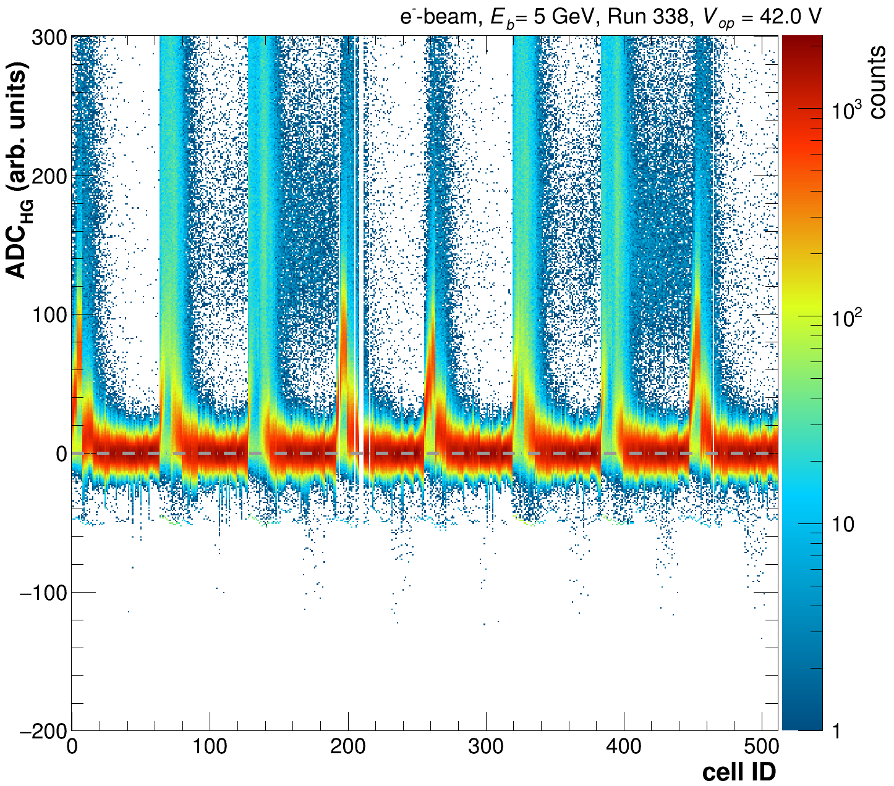
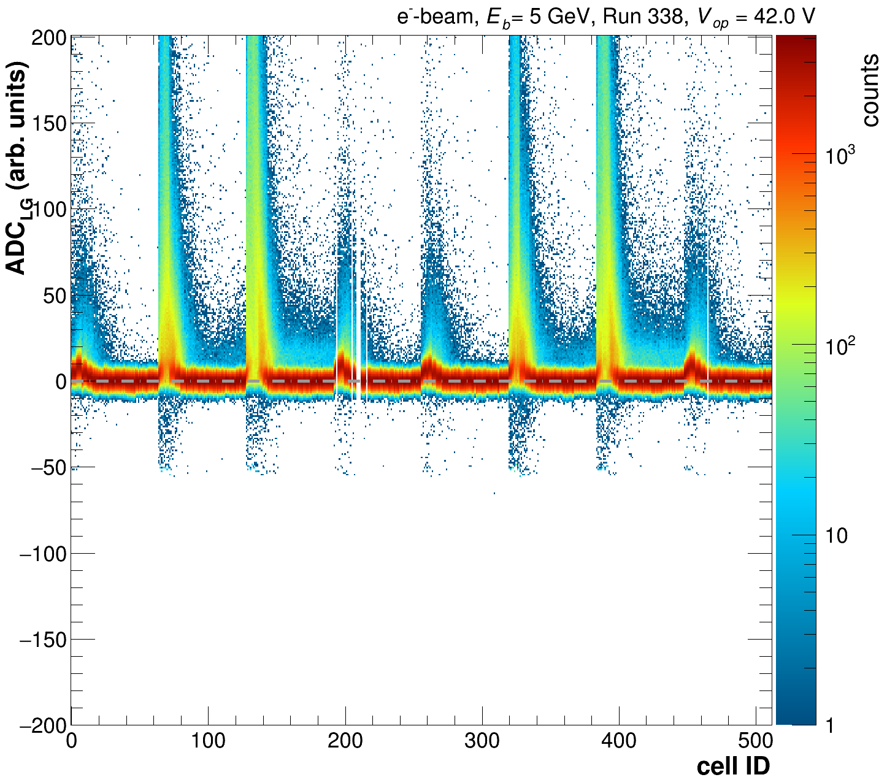
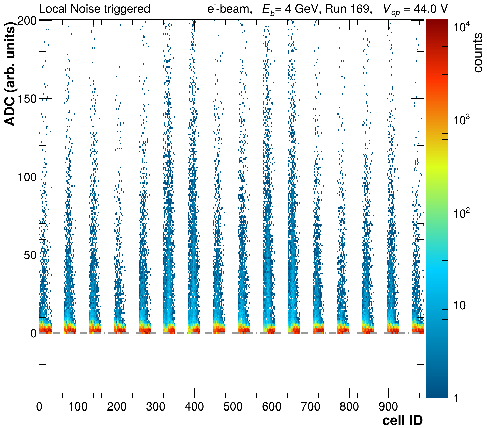
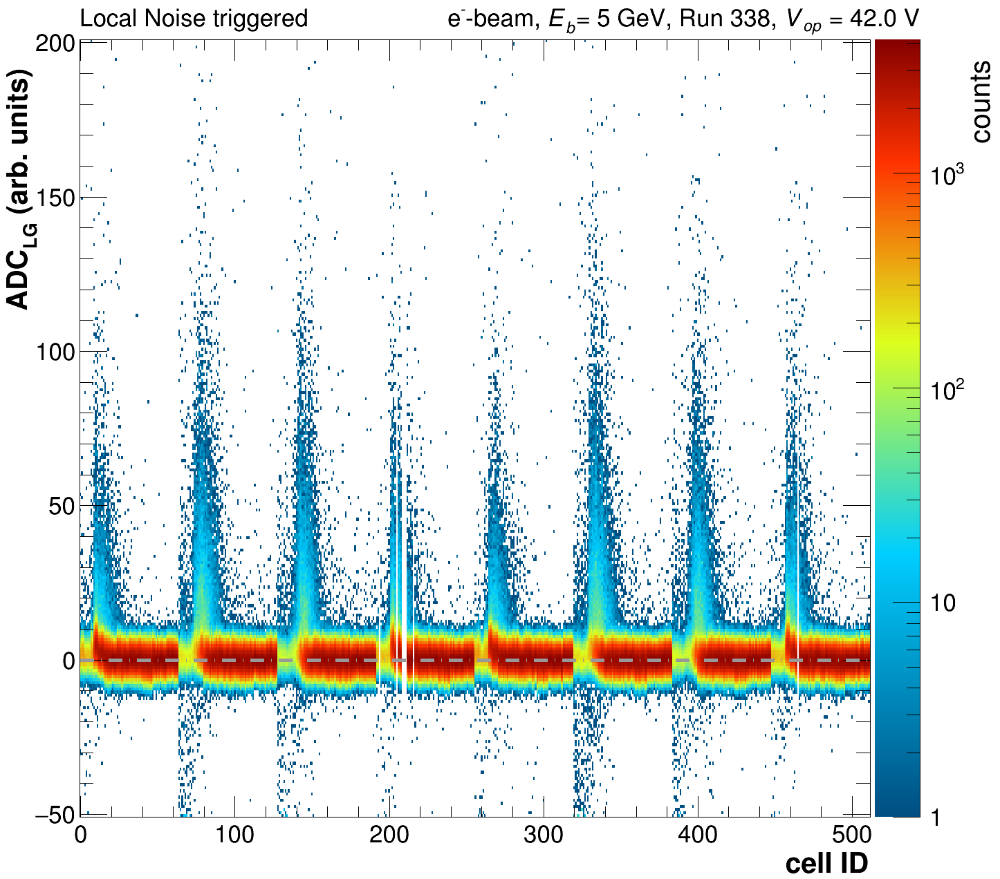
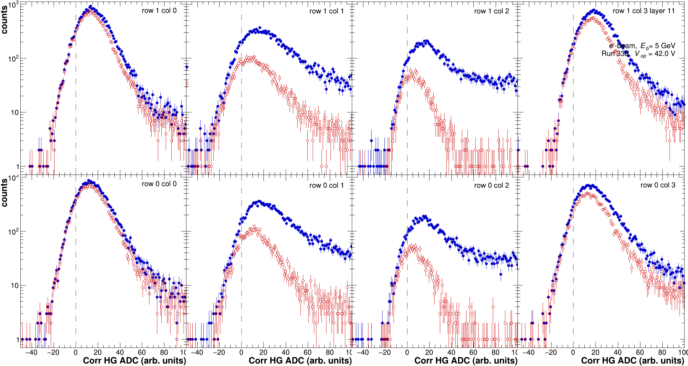
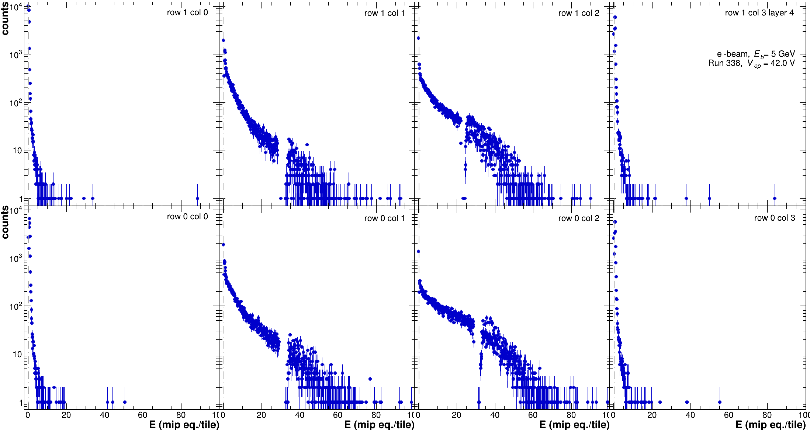

# Apply Calibrations

## CAEN data

Our current philosophy for the application of the calibrations is to keep the original raw values for the HG & LG ADC, but provide in addition an energy (E) for each tile calibrated to mip scale per tile. The pedestal corrected ADC values can always be obtained by calculating:

```cpp
double hgCorr = aTile->GetADCHigh()-calib.GetPedestalMeanH(aTile->GetCellID());
double lgCorr = aTile->GetADCLow()-calib.GetPedestalMeanL(aTile->GetCellID());
```

Which leaves the data as much with their original content as possible.

For convenience and reducing the storage needs the calibration objects can be copied out of any file using the following command and stored in a separate file.

```
./DataPrep -a -i $ORGFILEWITHCALIB.root -A $NEWCALIBFILEONLY.root
```

Once more the `-a` option triggers the writing of the calibrations also to a txt file with the same name as `$NEWCALIBFILEONLY.root` ending in `_calib.txt.`

The original calibrations contained in the input root file can be overwritten as usual with the option `-k $CALIBTXTFILE.`

### Calibrating a single run

Calibrating a single run can be a time intensive procedure, due to the fact that we are calculating the local trigger primitives for each tile & event in the same process. Consequently it might be advisable to separate the trigger calculation and actual calibration (if this might need repeating).

The trigger primitives are calculated in the same manner as for the [MIP calibration step](mip-calibration.md#step-1), depending on the data set size this can take multiple hours. In addition the local trigger bits are set accordingly:

```cpp
aTile->SetLocalTriggerPrimitive(event.CalculateLocalMuonTrigg(calib, rand, aTile->GetCellID(), localTriggerTiles, avLGHGCorr));
bool localMuonTrigg   = event.InspectIfLocalMuonTrigg(aTile->GetCellID(), averageScale, factorMinTrigg, factorMaxTrigg);
bool localNoiseTrigg  = event.InspectIfNoiseTrigg(aTile->GetCellID(), averageScale, factorMinTriggNoise);
aTile->SetLocalTriggerBit(0);
if (localMuonTrigg) aTile->SetLocalTriggerBit(1);
if (localNoiseTrigg) aTile->SetLocalTriggerBit(2);
```

We recommend running it as follows:

```sh
# evaluate trigger first
./DataPrep -f -d 1 -T $CALIBFILE.root -i raw_$RUNNR.root -o rawWithLocTrigg_$RUNNR.root 
```

Where `-T` results in calling the

`bool Analyses::RunEvalLocalTriggers(void)` in [Analyses.cc](https://github.com/eic/epic-lfhcal-tbana/blob/main/NewStructure/Analyses.cc).

This process will run for a while (hours) but in principle is suffient do be done once, of the LG-HG correlation factors weren't incorrectly applied. This process won't create any plots.

Afterwards, the calibration can be run directly on that raw-file wiht the trigger primitives. Which is a rather quick procedure and could be repeated multiple times if need be.

```sh
# apply same calibrations to file with local trigger eval
./DataPrep -t -e -f -d 1 -a -C $CALIBFILE.root -i rawWithLocTrigg_$RUNNR.root -o calibrated_Run_$RUNNR.root -O $PLOTDIR -r $RUNLIST
```

The option `-C` results in the calibration application based on `$CALIBFILE.root` and calculation of the energies for each tile, while the option `-t` suppresses the trigger-calculation.

Alternatively everything can be done in one go by:

```sh
# apply calibration and evaluate triggers
./DataPrep -e -f -d 1 -C $CALIBFILE.root -i rawW_$RUNNR.root -o calibrated_Run_$RUNNR.root -O $PLOTDIR -r $RUNLIST
```

The calibration function can be found in

`bool Analyses::Calibrate(void)` in [Analyses.cc](https://github.com/eic/epic-lfhcal-tbana/blob/main/NewStructure/Analyses.cc).

and will create a separate hist output root in addition to several plots.

<div><figure><figcaption><p>HG spectra for all cells as function of cell ID.</p></figcaption></figure> <figure><figcaption><p>LG spectra for all cells as function of cell ID.</p></figcaption></figure></div>

<div><figure><figcaption><p>Pedestal corrected HG spectra for all cells as function of cell ID.</p></figcaption></figure> <figure><figcaption><p>Pedestal corrected LG spectra for all cells as function of cell ID.</p></figcaption></figure></div>

<div><figure><figcaption><p>Pedestal corrected HG spectra for all cells as function of cell ID. Zoomed in close to pedestal.</p></figcaption></figure> <figure><figcaption><p>Pedestal corrected LG spectra for all cells as function of cell ID. Zoomed in close to pedestal.</p></figcaption></figure></div>

<div><figure><figcaption><p>Pedestal corrected HG spectra for all locally noise triggered cells as function of cell ID. Zoomed in close to pedestal.</p></figcaption></figure> <figure><figcaption><p>Pedestal corrected LG spectra for all locally noise triggered cells as function of cell ID. Zoomed in close to pedestal.</p></figcaption></figure></div>

For monitoring purposes the uncorrected, pedestal corrected as well as noise trigger pedestal corrected spectra are plotted. In order to identify possible problems with the pedestal subtraction or possible pedestal shifts due to common mode noise/cross-talk.

<figure><figcaption><p>HG spectra plotted together for all triggers and noise triggered tiles.</p></figcaption></figure>

The detailed layer by layer plots will only be drawn if option `-e` is specified.

<figure><figcaption><p>Total energy within the event (E_cell > 0.3 E_mip) vs nr. of active cells with E_cell > 0.3 E_mip.</p></figcaption></figure>

In the Etot vs NCells distribution the contamination to the electron beam can be clearly identified:

* blob at Etot = 400: electrons
* lower blob and diagonal: muons
* blob around Etot = 700: mult part (i.e 2 electrons)
* diag to electron blob: hadrons

This can be exploited later to do basic event selections, together with the more general distribution within the LFHCal module.

<figure><figcaption><p>Calibrated cell energy as function of cell ID.</p></figcaption></figure>

In the per cell energy distributions, discontinuities can be found, where we are switching from HG to the LG signal. This feature is under investigation and might originate from a change in the run-by-run LG-HG correlation values.

<figure><figcaption><p>Single layer energy distributions.</p></figcaption></figure>

### September 2023 data

No scripts have been created yet.

### October 2023 data

No scripts have been created yet.

### August 2024 data

The primary script for the application of the calibrations of this data set is `applyCalibration_2024.sh`, in order to apply the calibrations for a specific scan the following commands need to be executed in order. The next command should only be executed if the outputs of the previous step have been checked.

```sh
# run trigger eval only
bash applyCalibration_2024.sh $USERNAME ScanA trigg

# apply calibrations
bash applyCalibration_2024.sh $USERNAME ScanA calibNoTrigg

#IF YOU WANT TO DO BOTH IN ONE GO
bash applyCalibration_2024.sh $USERNAME ScanA full
```

The 2nd argument defines which scan it is, please check which are currently available and expand where necessary.

## HGCROC Data

### August 2024


### November 2025

The primary script for the application of the calibrations of this data set is `applyCalibrationHGCROC_2025.sh`, in order to apply the calibrations for a specific scan the following commands need to be executed in order. The next command should only be executed if the outputs of the previous step have been checked.

```sh
# run trigger eval only
bash applyCalibrationHGCROC_2025.sh $USERNAME FullScanA trigg 
# run trigger eval only: for skimmed output with muons from the calibration set only 
# -> will not reevaluate the trigger primitives
bash applyCalibrationHGCROC_2025.sh $USERNAME FullScanA triggMuon 

# apply calibrations
bash applyCalibrationHGCROC_2025.sh $USERNAME FullScanA calibNoTrigg

#IF YOU WANT TO DO BOTH IN ONE GO
bash applyCalibrationHGCROC_2025.sh $USERNAME FullScanA full
```

The 2nd argument defines which scan it is, please check which are currently available and expand where necessary.
