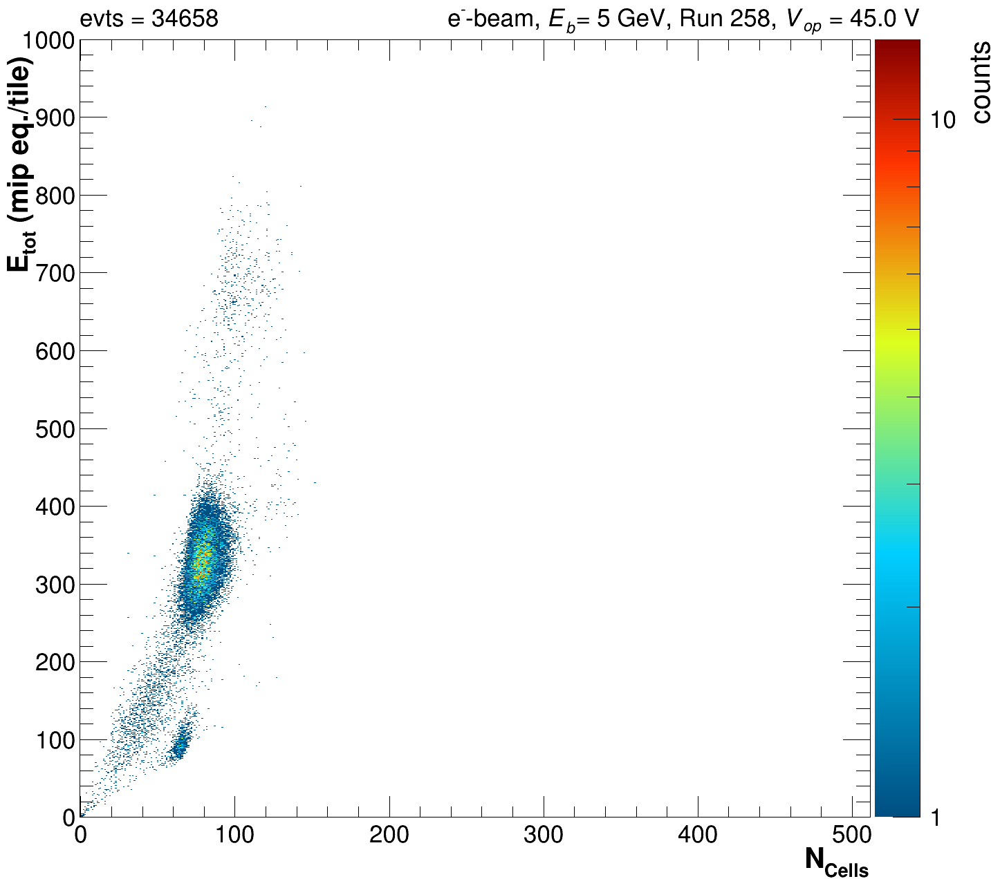
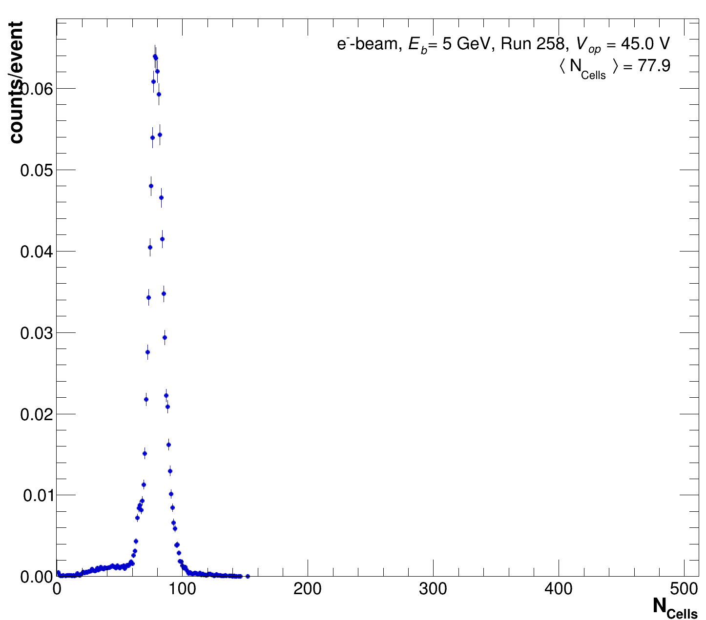
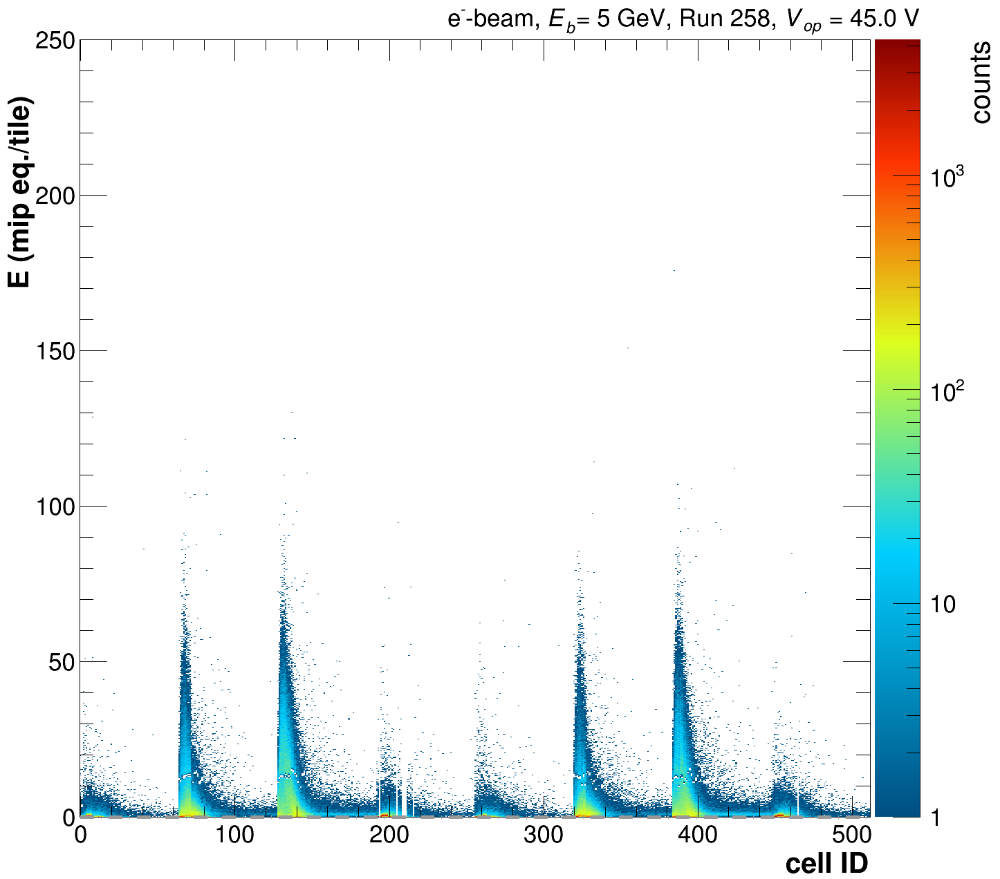
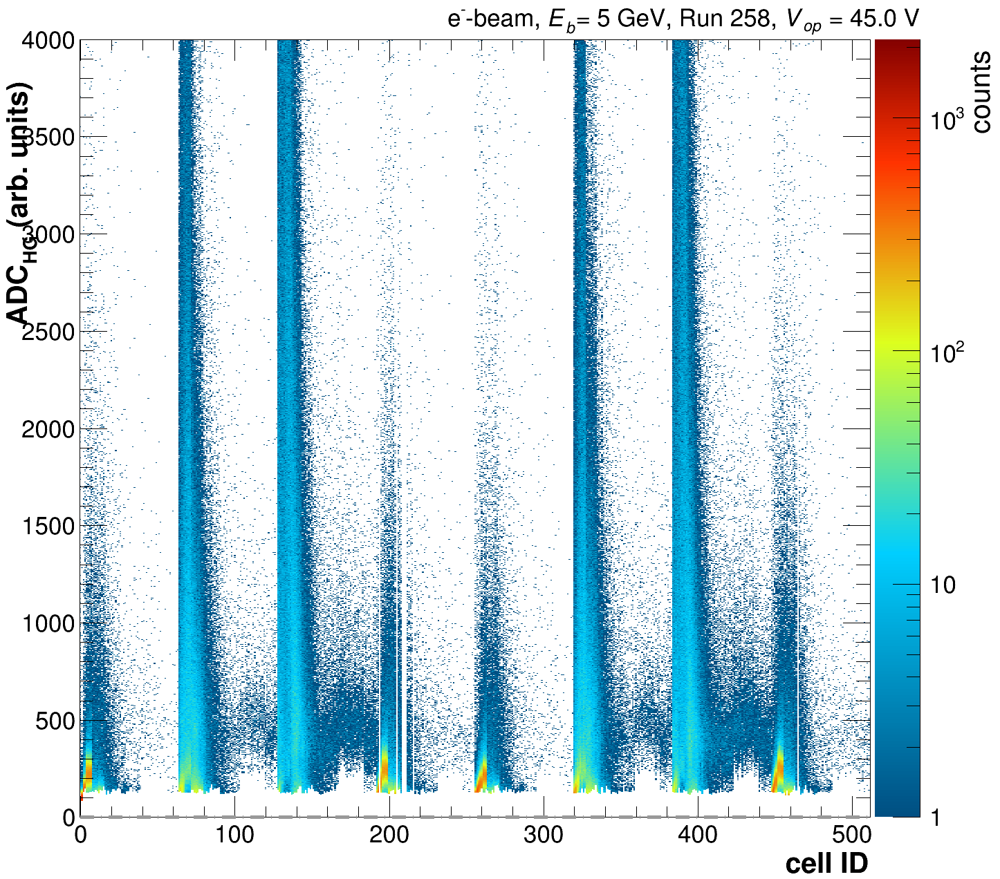
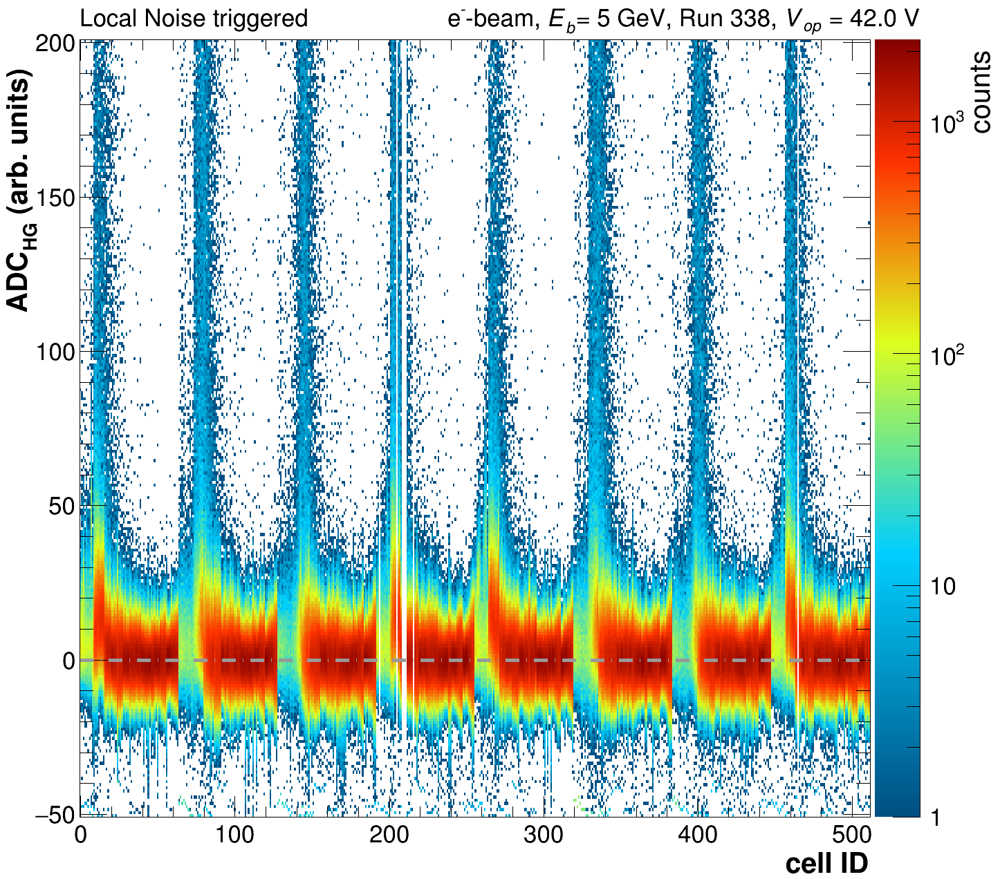

# Apply Calibrations

## General Philosophy & operation

Our general philosophy:

1. Keep the raw data available to the as much as possible!
2. Allow easy access to derived quantities, i.e. calibrated Energy (E), corrected time...
3. Keep calibration and setup objects in the same output file&#x20;

Calibrating a single run can be a time intensive procedure, due to the fact that we are calculating the local trigger primitives for each tile & event in the same process. Consequently it might be advisable to separate the trigger calculation and actual calibration (if this might need repeating).

The trigger primitives are calculated in the same manner as for the [MIP calibration step](mip-calibration.md#step-1), depending on the data set size this can take multiple hours. In addition the local trigger bits are set accordingly:

```cpp
aTile->SetLocalTriggerPrimitive(event.CalculateLocalMuonTrigg(calib, rand, aTile->GetCellID(), localTriggerTiles, avLGHGCorr));
bool localMuonTrigg   = event.InspectIfLocalMuonTrigg(aTile->GetCellID(), averageScale, factorMinTrigg, factorMaxTrigg);
bool localNoiseTrigg  = event.InspectIfNoiseTrigg(aTile->GetCellID(), averageScale, factorMinTriggNoise);
aTile->SetLocalTriggerBit(0);
if (localMuonTrigg) aTile->SetLocalTriggerBit(1);
if (localNoiseTrigg) aTile->SetLocalTriggerBit(2);
```

We recommend running it as follows:

```sh
# evaluate trigger first
./DataPrep -f -d 1 -T $CALIBFILE.root -i raw_$RUNNR.root -o rawWithLocTrigg_$RUNNR.root 
```

Where `-T` results in calling the

`bool Analyses::RunEvalLocalTriggers(void)` in [Analyses.cc](https://github.com/eic/epic-lfhcal-tbana/blob/main/NewStructure/Analyses.cc).

This process will run for a while (hours) but in principle is sufficient do be done once, if nothing has been changed which should affect the trigger primitives calculation. This process won't create any plots.

Afterwards, the calibration can be run directly on that raw-file with the trigger primitives. Which is a rather quick procedure and could be repeated multiple times if need be.

```sh
# apply same calibrations to file with local trigger eval
./DataPrep -t -e -f -d 1 -a -C $CALIBFILE.root -i rawWithLocTrigg_$RUNNR.root -o calibrated_Run_$RUNNR.root -O $PLOTDIR -r $RUNLIST
```

The option `-C` results in the calibration application based on `$CALIBFILE.root` and calculation of the energies for each tile, while the option `-t` suppresses the trigger-calculation.

Alternatively everything can be done in one go by:

```sh
# apply calibration and evaluate triggers
./DataPrep -e -f -d 1 -C $CALIBFILE.root -i rawW_$RUNNR.root -o calibrated_Run_$RUNNR.root -O $PLOTDIR -r $RUNLIST
```

The calibration function can be found in

`bool Analyses::Calibrate(void)` in [Analyses.cc](https://github.com/eic/epic-lfhcal-tbana/blob/main/NewStructure/Analyses.cc).

and will create a separate hist output root in addition to several plots.

**Keep in mind that during the calibration step we are also removing tiles which do not exceed a minimum threshold energy defined by `minMipFrac` .**&#x20;

<div><figure><figcaption><p>Total energy within the event (E_cell > 0.3 E_mip) vs nr. of active cells with E_cell > 0.3 E_mip. CAEN data August 2024, 1 8M module, 64 layers.</p></figcaption></figure> <figure><figcaption><p>Total energy within the event (E_cell > 0.3 E_mip) vs nr. of active cells with E_cell > 0.3 E_mip. HGCROC data November 2025, 2 8M modules, 32 layers.</p></figcaption></figure></div>

In the Etot vs NCells distribution (CAEN data, August 2024) the contamination to the electron beam can be clearly identified:

* blob at Etot = 400: electrons
* lower blob and diagonal: muons
* blob around Etot = 700: mult part (i.e 2 electrons)
* diag to electron blob: hadrons

This can be exploited later to do basic event selections, together with the more general distribution within the LFHCal module. With the different geometry and readout used in the 2025 TB campaign this is possible as well, however the separation isn't quite as obvious.

<div><figure><figcaption><p>Total energy per event as measured for the HGCROC data from 2025.</p></figcaption></figure> <figure><figcaption><p>Active number of cells per event as measured for the HGCROC data from 2025.</p></figcaption></figure></div>

<div><figure><figcaption><p>Calibrated cell energy as function of cell ID from the CAEN data from August 2024 (1 8M module)</p></figcaption></figure> <figure><figcaption><p>Calibrated cell energy as function of cell ID from the HGCROC data from November 2025 (2 8M module)</p></figcaption></figure></div>

In the per cell energy distributions, discontinuities can be found, where we are switching from HG to the LG signal. This feature is under investigation and might originate from a change in the run-by-run LG-HG correlation values.

<figure><figcaption><p>Single layer energy distributions, CAEN data, August 2024, 1 8M module.</p></figcaption></figure>

In the current implementation for the HGCROC data the total energy is solely extracted from the maximum ADC value, hence no range switching should be observed.

<figure><figcaption><p>Single layer energy distributions, HGCROC data, November 2025, 2 8M modules.</p></figcaption></figure>

The detailed layer by layer plots will only be drawn if option `-e` is specified.

### Separating calib-object & raw data

For convenience and reducing the storage needs the calibration objects can be copied out of any file using the following command and stored in a separate file.

```bash
./DataPrep -a -i $ORGFILEWITHCALIB.root -A $NEWCALIBFILEONLY.root
```

Once more the `-a` option triggers the writing of the calibrations also to a txt file with the same name as `$NEWCALIBFILEONLY.root` ending in `_calib.txt.`

The original calibrations contained in the input root file can be overwritten as usual with the option `-k $CALIBTXTFILE.`

### CAEN data specific information

For the CAEN data, the primary variable changed during the calibration procedure (besides the trigger primitives) is the energy of each cell. It is calculated as follows during the calib process:

```cpp
// defined constants
double minMipFrac = 0.3;
int corrHGADCSwap = 3500;
// per tile calculated corrected ADC values
double energy = 0.;
double corrHG = aTile->GetADCHigh()-calib.GetPedestalMeanH(aTile->GetCellID());
double corrLG = aTile->GetADCLow()-calib.GetPedestalMeanL(aTile->GetCellID());
// calculation of the energy scaled to to the mip equivalent
if(corrHG<corrHGADCSwap){
  if(corrHG/calib.GetScaleHigh(aTile->GetCellID()) > minMipFrac){
     energy=corrHG/calib.GetScaleHigh(aTile->GetCellID());
  }
} else {
  energy=corrLG/calib.GetCalcScaleLow(aTile->GetCellID());
}
```

Here the `corrHG` and `corrLG` reflect the pedestal corrected high gain and low gain ADC values of the CAEN readout, while `corrHGADCSwap` is the predefined value where we go from high gain to low gain. <mark style="color:$danger;">Only tiles with an energy surpassing the</mark> <mark style="color:$danger;"></mark><mark style="color:$danger;">`minMipFrac`</mark> <mark style="color:$danger;"></mark><mark style="color:$danger;">will be stored in the final output.</mark>

The following plots will be produced and should be looked at for the CAEN data to ensure everything went as intended.

<div><figure><figcaption><p>HG spectra for all cells as function of cell ID.</p></figcaption></figure> <figure><figcaption><p>LG spectra for all cells as function of cell ID.</p></figcaption></figure></div>

<div><figure><figcaption><p>Pedestal corrected HG spectra for all cells as function of cell ID.</p></figcaption></figure> <figure><figcaption><p>Pedestal corrected LG spectra for all cells as function of cell ID.</p></figcaption></figure></div>

<div><figure><figcaption><p>Pedestal corrected HG spectra for all cells as function of cell ID. Zoomed in close to pedestal.</p></figcaption></figure> <figure><figcaption><p>Pedestal corrected LG spectra for all cells as function of cell ID. Zoomed in close to pedestal.</p></figcaption></figure></div>

<div><figure><figcaption><p>Pedestal corrected HG spectra for all locally noise triggered cells as function of cell ID. Zoomed in close to pedestal.</p></figcaption></figure> <figure><figcaption><p>Pedestal corrected LG spectra for all locally noise triggered cells as function of cell ID. Zoomed in close to pedestal.</p></figcaption></figure></div>

For monitoring purposes the uncorrected, pedestal corrected as well as noise trigger pedestal corrected spectra are plotted. In order to identify possible problems with the pedestal subtraction or possible pedestal shifts due to common mode noise/cross-talk.

<figure><figcaption><p>HG spectra plotted together for all triggers and noise triggered tiles.</p></figcaption></figure>

### HGCROC data specific information

For the HGCROC data we are touching significantly more variables during the calibration process and only the waveforms themselves reflect the raw data. The current tile energy estimates are based solely on the maximum ADC values scaled by the respective mip response. The calculation is done as follows:

```cpp
// get pedestal values from calib object
double ped = calib.GetPedestalMeanL(aTile->GetCellID()); // ped based on waveform fit
if (ped == -1000){  
  ped = calib.GetPedestalMeanH(aTile->GetCellID());      // ped based on first sample fit
  if (ped == -1000){
    ped = aTile->GetPedestal();              // event-by-event first sample
  }
}
// reevaluate waveform
waveform_builder->set_waveform(aTile->GetADCWaveform());
waveform_builder->fit_with_average_ped(ped);
aTile->SetIntegratedADC(waveform_builder->get_E());
aTile->SetPedestal(waveform_builder->get_pedestal());

double adc = aTile->GetIntegratedADC();
double tot = aTile->GetRawTOT();
double toa = aTile->GetRawTOA();

// obtain toa shift corrected values
Int_t nSampTOA  = aTile->GetFirstTOASample();        
double toaNs      = (double)aTile->GetLinearizedRawTOA()*aTile->GetTOATimeResolution();
double toaCorrNs  = toaNs;
if (calib.GetToAOff(aTile->GetCellID()) != -1000.){
  // correct ToA sample and return correct nSampleTOA
  nSampTOA      = aTile->SetCorrectedTOA(calib.GetToAOff(aTile->GetCellID())); 
  toaCorrNs     = (double)(aTile->GetCorrectedTOA())*aTile->GetTOATimeResolution();;
}
// energy calibration 
double tempE = adc/calib.GetScaleHigh(aTile->GetCellID());
// only set energy if above min mip threshold
if (tempE > minMipFrac)
  energy=tempE;
```

In this routine, besides the energy calculation:

1. the pedestals are reset,&#x20;
2. the integrated ADC is reevaluated and&#x20;
3. the TOA offset is corrected for&#x20;

The steps 1-3 are handled in the same manner as during the [Transfer-Calib routine](mip-calibration.md#transferring-the-pedestal-calibrations-to-a-different-run) and the same QA plots are created for the TOA offset correction. For all intents and purposes the Transfer-Calib routine should only be necessary to run for the muon runs, while all other runs would be calibrated using the full calibration procedure described here.

In addition, the following HGCROC specific plots are produced and should be checked for their correctness. Layer dependent plots will only be enabled if the extended plotting option is enabled `-e` or `-E [0-3]` , depending on how much detail you'd like to produce. When running consider that those options might be small as they produce rather large and detailed outputs.

<div><figure><figcaption><p>Max adc vs cellID for all events.</p></figcaption></figure> <figure><figcaption><p>TOT vs cellID for all events.</p></figcaption></figure> <figure><figcaption><p>Frequency of reaching saturation of the ADC range vs cellID.</p></figcaption></figure></div>

<div><figure><figcaption><p>Max ADCs vs cellID for cells which were triggered by the local noise trigger. </p></figcaption></figure> <figure><figcaption><p>TOT vs cellID for cells which were triggered by the local noise trigger. If this plot has entries, something went seriously wrong!</p></figcaption></figure></div>

<figure><figcaption><p>Max ADC distribution for one single layer of the HGCROC data obtained in November 2025 (2 8M modules).</p></figcaption></figure>

<figure><figcaption><p>TOT distribution for one single layer of the HGCROC data obtained in November 2025 (2 8M modules).</p></figcaption></figure>

<figure><figcaption><p>Max ADC vs TOT distribution for one single layer of the HGCROC data obtained in November 2025 (2 8M modules). Profile distribution reflecting the mean is overlaid in red dots.</p></figcaption></figure>

## Scripted Operation

### CAEN Data

#### September 2023 data

No scripts have been created yet.

#### October 2023 data

No scripts have been created yet.

#### August 2024 data

The primary script for the application of the calibrations of this data set is `applyCalibration_2024.sh`, in order to apply the calibrations for a specific scan the following commands need to be executed in order. The next command should only be executed if the outputs of the previous step have been checked.

```sh
# run trigger eval only
bash applyCalibration_2024.sh $USERNAME ScanA trigg

# apply calibrations
bash applyCalibration_2024.sh $USERNAME ScanA calibNoTrigg

#IF YOU WANT TO DO BOTH IN ONE GO
bash applyCalibration_2024.sh $USERNAME ScanA full
```

The 2nd argument defines which scan it is, please check which are currently available and expand where necessary.

### HGCROC Data

#### August 2024

No scripts have been created yet.

#### November 2025

The primary script for the application of the calibrations of this data set is `applyCalibrationHGCROC_2025.sh`, in order to apply the calibrations for a specific scan the following commands need to be executed in order. The next command should only be executed if the outputs of the previous step have been checked.

```sh
# run trigger eval only
bash applyCalibrationHGCROC_2025.sh $USERNAME FullScanA trigg 
# run trigger eval only: for skimmed output with muons from the calibration set only 
# -> will not reevaluate the trigger primitives
bash applyCalibrationHGCROC_2025.sh $USERNAME FullScanA triggMuon 

# apply calibrations
bash applyCalibrationHGCROC_2025.sh $USERNAME FullScanA calibNoTrigg

#IF YOU WANT TO DO BOTH IN ONE GO
bash applyCalibrationHGCROC_2025.sh $USERNAME FullScanA full
```

The 2nd argument defines which scan it is, please check which are currently available and expand where necessary.
