# MIP calibration

In order to have a first calibration of each cell/tile within the calorimeter to the same physical level, a MIP (minimum ionizing particle) calibration needs to be performed. This ideally is done using cosmic or beam muons. On average a muon will leave the same amount of energy in each tile. However, these values are not discrete but rather follow a Landau-Gauss distribution, where the maximum of that distribution reflects the "MIP"-scale. By estimating the MIP scale on a channel by channel basis, small differences in the response of the SiPM, coupling of the Tile to the SiPM, losses ... can be corrected for and a uniform response for each tile can be reached. Using the mip scale also data among different readout systems can be compared as each of them afterwards can be expressed in mip/tile energy for instance.

When we are taking taking data we are reading out every channel for every event, regardless whether the channel was hit by a particle or not (meaning w/o zero or pedestal suppression). This can introduc some difficulties for the our fitting algorithms, as the pedestal peak could be larger in amplitude than the actual signal distribution one is after. In order to still allow automized fitting to some degree for the MIP calibration at different Vop, we devised a local muon trigger strategy. For this we are using the fact that a muon on average will always leave approximately the same signal in every tile (a minimum ionizing signal), hence we can use adjacent tiles to trigger on the average mip response in for instance the 2 tiles before and the two tiles after the tile one is currently investigating.

<figure><figcaption></figcaption></figure>

***

## CAEN data

### Transferring the pedestal calibrations to a different run

The extraction of the MIP scale is a somewhat iterative process, as it get easier the cleaner your sample is, meaning if the pedestal (with its additional noise) is very close to the actual MIP peak its getting more difficult to fit the MIP-peak correctly in an automated fashion. Thus ideally the pedestal calibration (where it is & how wide it is) are taken from dedicated runs which have no other signals in them. As described in the section [Pedestal extraction](pedestal-extraction.md). The corresponding calibration obtained like that can then be applied to the muon or cosmics run as follows:

```sh
./DataPrep -d 1 -e -f -P PedestalCalib_$RUNNR1.root -i raw_$RUNNR2.root -o rawPed_$RUNNR2.root -O $PLOTSDIR -r $RUNLIST
```

The calibration file obtained from a different run `PedestalCalib_$RUNNR1.root` is being applied to the input file `raw_$RUNNR2.root.` As before the data is then copied in full to a separate output file (`rawPed_$RUNNR2.root` )  together with the calib-object from the provided calibration file. To check the correct application of the file several QA plots are produced.&#x20;

The calibration object can be printed to an external text file using the option `-a`, which will write the calib-object to a file with the same name as defined in `-o`, but ending in `_calib.txt.`&#x20;

It is also possible to overwrite the calibration which is being loaded from `PedestalCalib_$RUNNR1.root` by adding the option `-A $EXTCALIB.txt` and providing a text file of that name in the same format as the output of the `-a` option.

During the transfer of the pedestal calibrations it is also possible to either evaluate the bad channels or apply an external bad channel map.

```
#calculate bad channel (not fully developed yet)
./DataPrep -b -d 1 -e -f -P PedestalCalib_$RUNNR1.root -i raw_$RUNNR2.root -o rawPed_$RUNNR2.root -O $PLOTSDIR -r $RUNLIST 
#read an external bad channel from $BADCHANNELMAP
./DataPrep -d 1 -e -f -P PedestalCalib_$RUNNR1.root -i raw_$RUNNR2.root -o rawPed_$RUNNR2.root -B $BADCHANNELMAP -O $PLOTSDIR -r $RUNLIST 
```

An example of such a bad channel map and its format can be found [here](https://github.com/eic/epic-lfhcal-tbana/blob/main/configs/badChannelMap_TBSetup_CAEN_202408.txt)

```
#module Nr  layer   row     column  BC flag
0   2  0   3   2
0   13  0   3   0
0   17  0   3   1
0   17  1   3   0
0   18  0   3   0
0   19  0   3   0
0   24  0   3   0
```

The various BC flags are encoded as follows:&#x20;

* `0`: bad
* `1`: always lower mip
* `2`: sometimes lower mip
* `3`: good

All channels not listed in the BC map will be assumed to be good and the calib-object created accordingly. _Please read what is written printed as info in the shell during execution this is normally useful and will give you an idea whether things are running correctly._  If a bad channel map was supposed to be calculated or has been provided the following plot will be created.

<div align="center"><figure>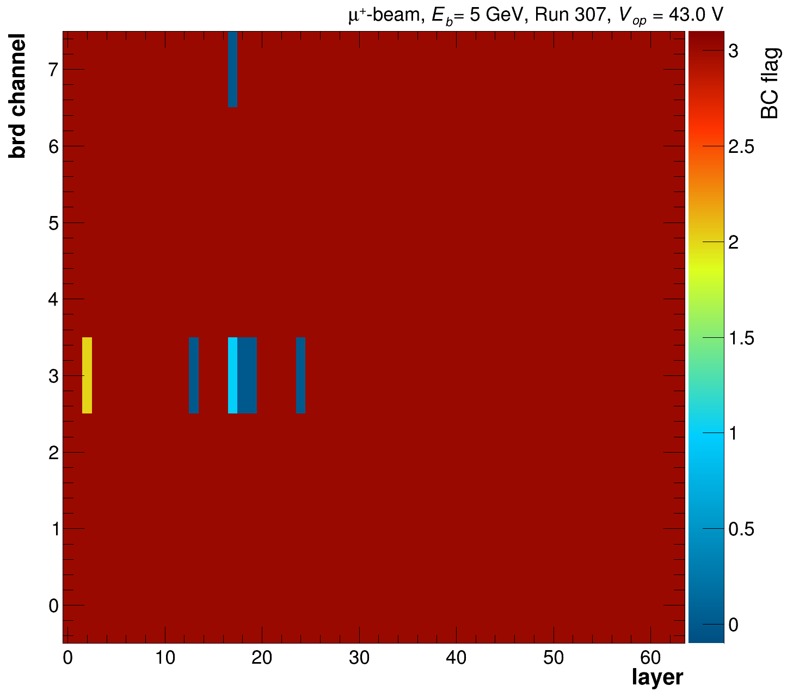<figcaption><p>Bad channel map: red (3): good channels, yellow (2): semi-good channels, light blue (1): mostly bad channels, dark blue (0): dead channel.</p></figcaption></figure></div>

The option `-e` allows you to force the executable to draw more plots for your information, like the individual spectra of each channel per layer.&#x20;

<div><figure>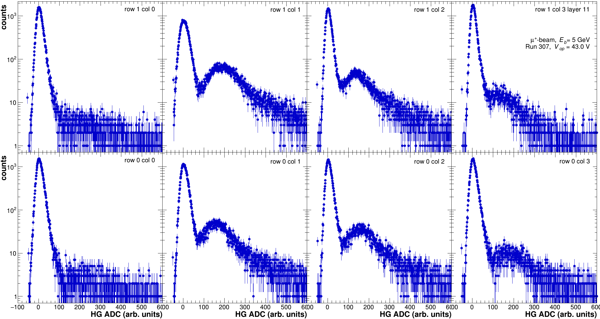<figcaption><p>HG spectra for layer 11.</p></figcaption></figure> <figure>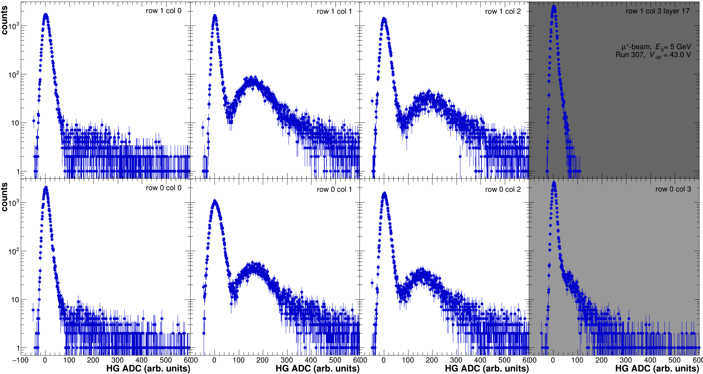<figcaption><p>HG spectra for layer 17. Different shades of gray indicate different Bad Channel flags (the darker the worse). </p></figcaption></figure> <figure>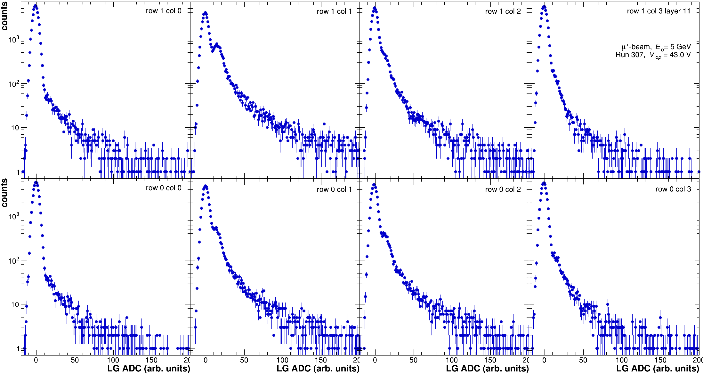<figcaption><p>LG spectra for layer 11.</p></figcaption></figure> <figure>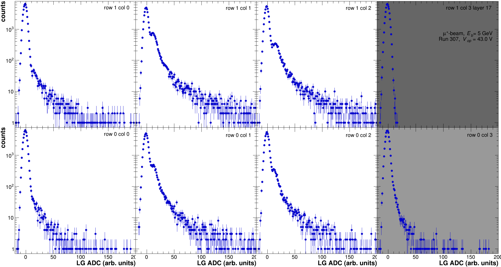<figcaption><p>LG spectra for layer 17. Different shades of gray indicate different Bad Channel flags (the darker the worse). </p></figcaption></figure></div>

The original data per tile & event will not be modified in this process, it is a true copy process. The corresponding routine being executed can be found here:

`bool Analyses::CorrectPedestal(void)` in [Analyses.cc](https://github.com/eic/epic-lfhcal-tbana/blob/main/NewStructure/Analyses.cc).

If your muon runs were for instance done with multiple positions of the beam and you plan to apply the same pedestals to them you can simply `hadd` the raw files and afterwards run the calibration transfer, i.e.:

```sh
hadd -f raw_muonScanA1_45V.root raw_244.root raw_250.root
```


***

### Estimation of MIP scale for a single run

#### Step 1

The estimation of the mip scale can be an iterative process, the first step towards a correct mip-calibration object can be executed as follows:

```sh
./DataPrep -f -d 1 -s -i rawPedWBC_$RUNNR.root -o rawPedAndMuonWBC_$RUNNR.root -O $PLOTSDIR -r $RUNLIST
```

This should ideally be done on using a `$rawPedWBC_$RUNNR.root` file which already contains the flagging for the bad channels in order to reduce the amount of time fitting channels which are dead or not fully working. In addition to the defined output file it also produces a rather extensive histogram output file, named as usual by the same name ending in `_hists.root.` The option `-s` is the primary trigger to start the estimation of the mip-scale for each cell. It is implemented in:

`bool Analyses::GetScaling(void)` in [Analyses.cc](https://github.com/eic/epic-lfhcal-tbana/blob/main/NewStructure/Analyses.cc).

This function processes the full event tree twice and tries to fit the MIP peak in two different versions. In the first iteration over the data for each cell a histogram is filled for both HG and LG without any kind of trigger selection correcting the ADC values for their respective pedestal values.&#x20;

Afterwards a Landau-Gauss-function is fit to every HG-spectrum and if the fit succeeds a first value for the maximum of the Landau-Gauss as well as its width is stored in the calibration object which is read from the input file. Should the fit fail for instance because the pedestal (noise) peak is too large or too close, no values are stored in the calib-objects. Overview plots showing the respective values during the first iteration are also generated

<div><figure><figcaption><p>FWHM of the fits of the Landau-Gauss distribution, after the first iteration.</p></figcaption></figure> <figure>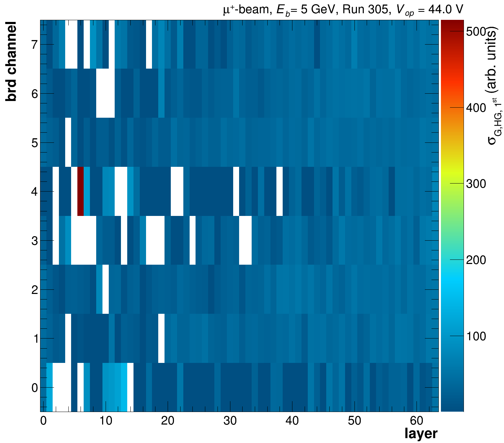<figcaption><p>Gaussian sigma of the Landau-Gauss distribution, after the first iteration.</p></figcaption></figure> <figure>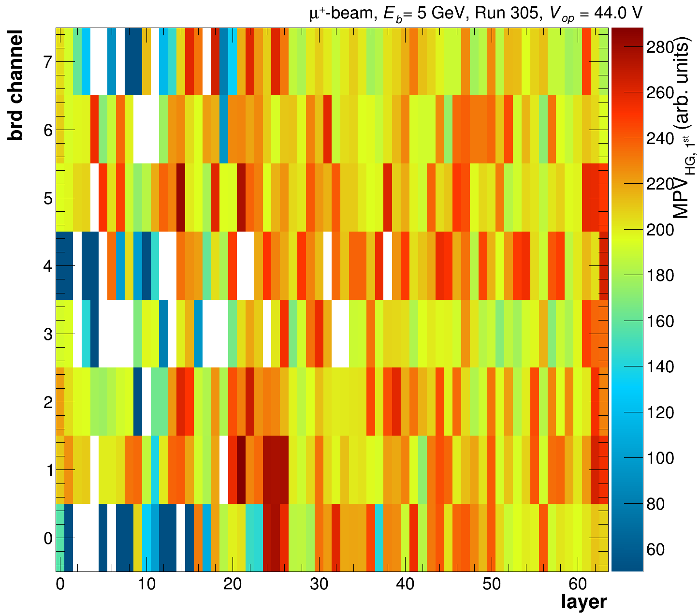<figcaption><p>Most probable value of the Landau distribution after the first iteration.</p></figcaption></figure> <figure>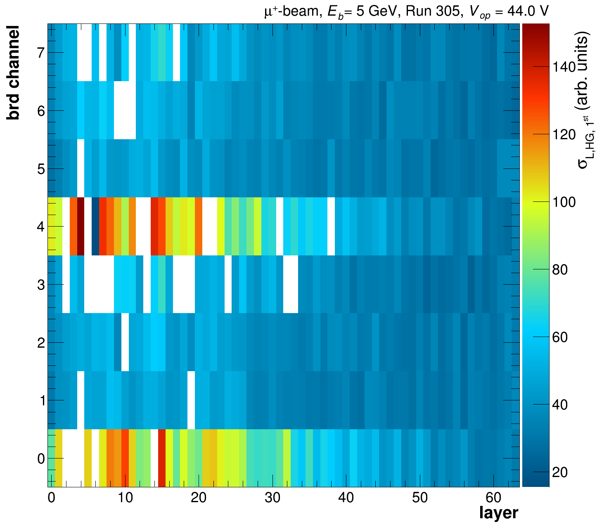<figcaption><p>Width of the Landau distribution, after the first iteration.</p></figcaption></figure></div>

<figure><figcaption><p>Maximum of the Landau-Gauss distribution after the first iteration. White "bin" indicate fit failures in the first iteration. The average value for all channels is given in the top left corner (&#x3C;MaxHG> = 214).</p></figcaption></figure>

In addition the linear relation between the LG & HG is evaluated and its slope stored in the calibration objects.&#x20;

<figure>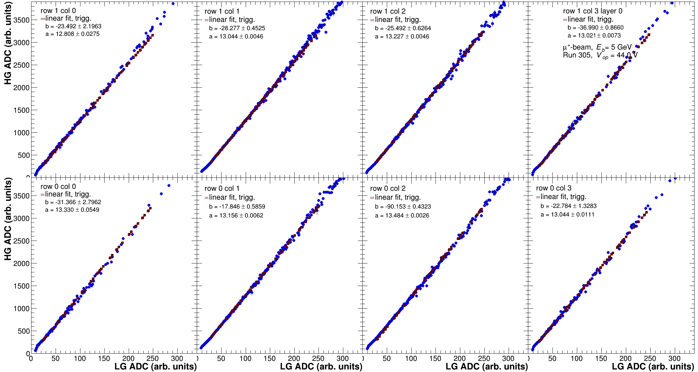<figcaption><p>LG-HG correlation for each cell in layer 0 for cross-calibration of the two read-out scales.</p></figcaption></figure>

<div><figure>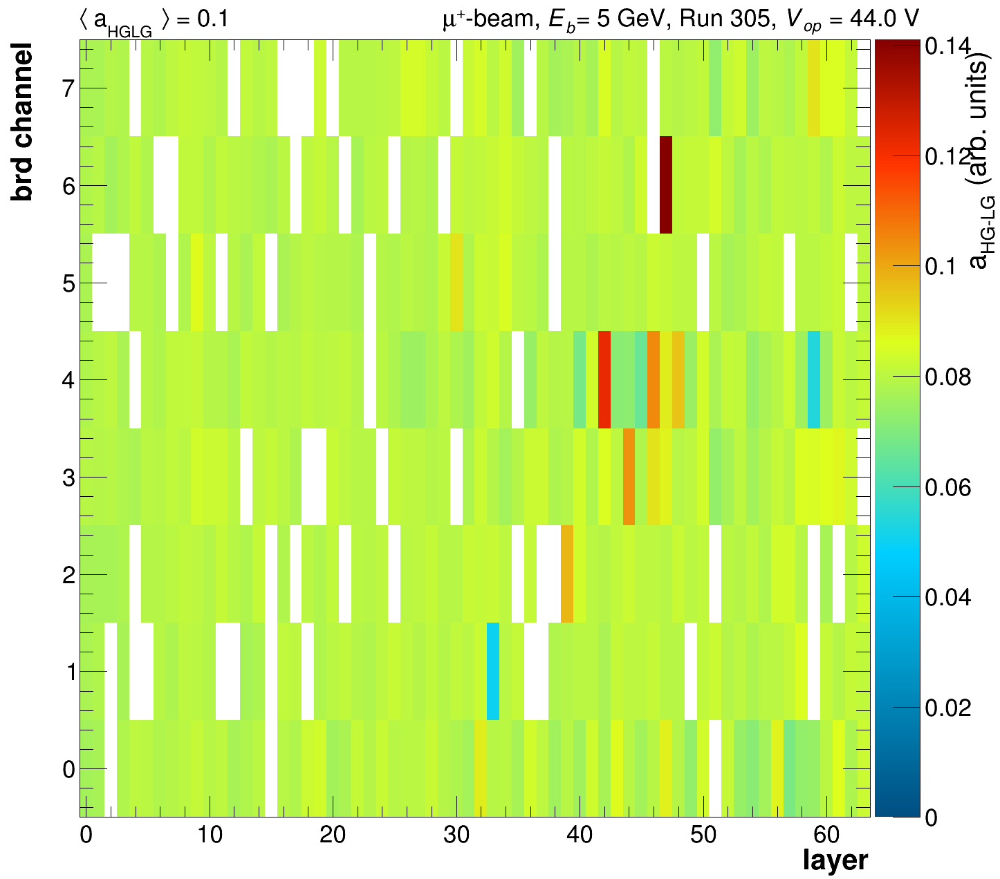<figcaption><p>Summary plot of the slope of the HG-LG correlation.</p></figcaption></figure> <figure>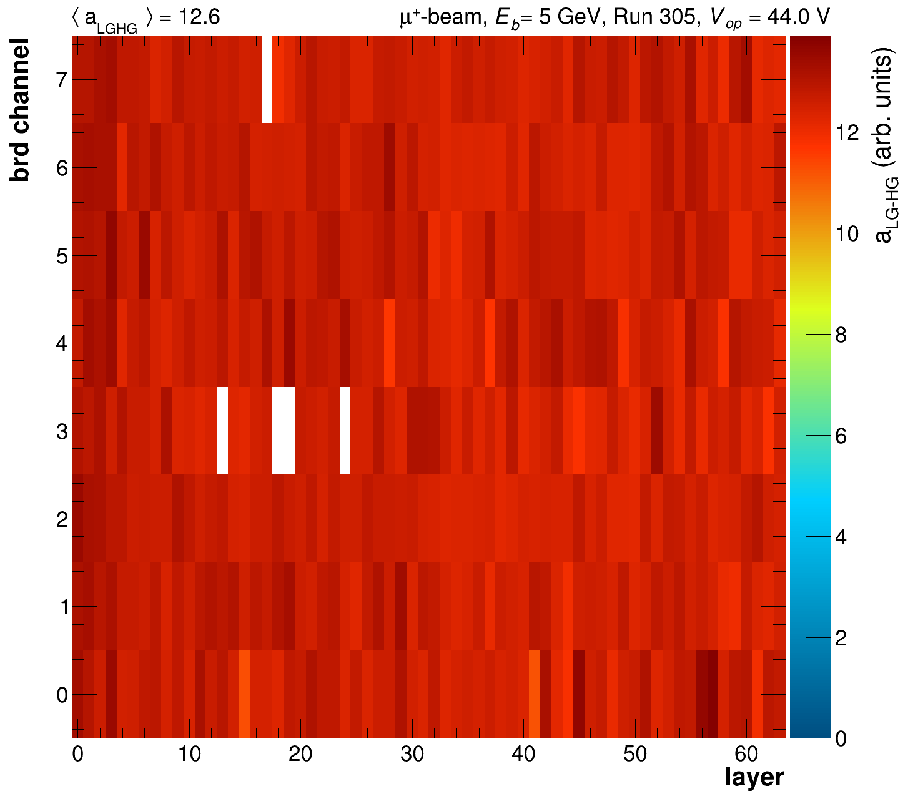<figcaption><p>Summary plot of the  slope of the LG-HG correlation</p></figcaption></figure></div>

In the second part of the routine the data tree is processed once more now knowing for a significant fraction of the tiles how LG and HG are related as well as what the average MIP position ought to be.&#x20;

Using this information local trigger primitives are being calculated. Taking into account the signals in `n` layers before and after the current cell (same row & column, different layer).  The basis for the trigger primitive calculation can be found here:

`double CalculateLocalMuonTrigg(Calib, TRandom3*, int, int, double)` in [Event.cc](https://github.com/eic/epic-lfhcal-tbana/blob/main/NewStructure/Event.cc)

It combines the information based on the ADC value in the HG (low energy) and LG (high energy) and forming a combined average signal of `n*2` tiles in a row. The tile under investigation is then flagged as local muon triggered tile if  `facMin*avMIP < ADC HG < facMax*avMIP`.  A rather loose selection is done in this step as potentially the `avMIP` is still biased, if not all channels could be fit reliably in the first iteration. For the 2024 data the respective factors are:

```cpp
double factorMinTrigg   = 0.5;
double factorMaxTrigg   = 4.;
```

This suppresses the pedestal peak by a rather large amount and allows for a more stable fitting of the mip-peaks for the correspondingly selected tile-events. While leaving the mip-signal region largely undisturbed.

<figure>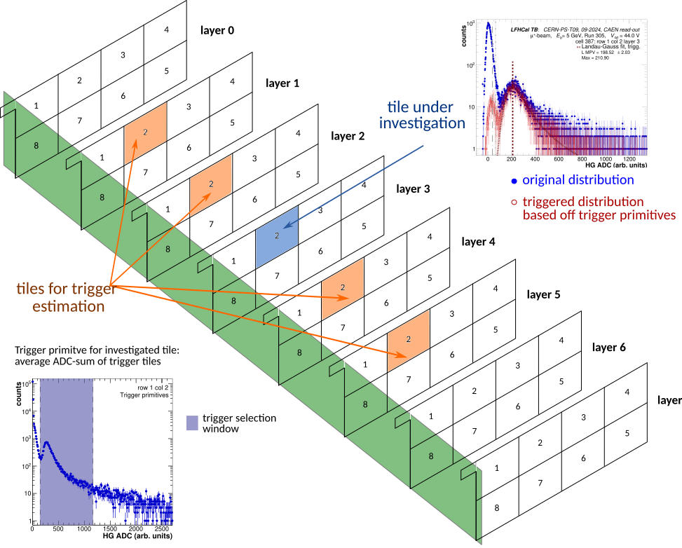<figcaption></figcaption></figure>

<div><figure>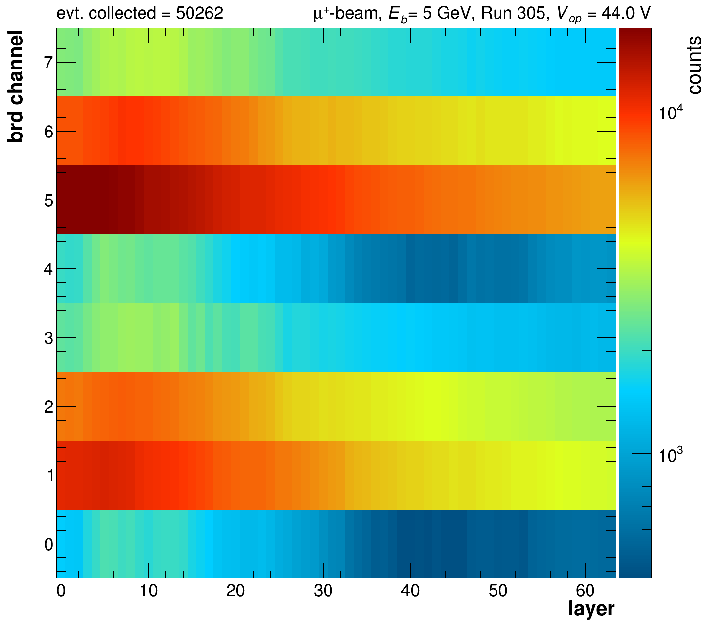<figcaption><p>Number of local muon triggers in each tile, total number of events collectd in the run shown in the top left corner.</p></figcaption></figure> <figure>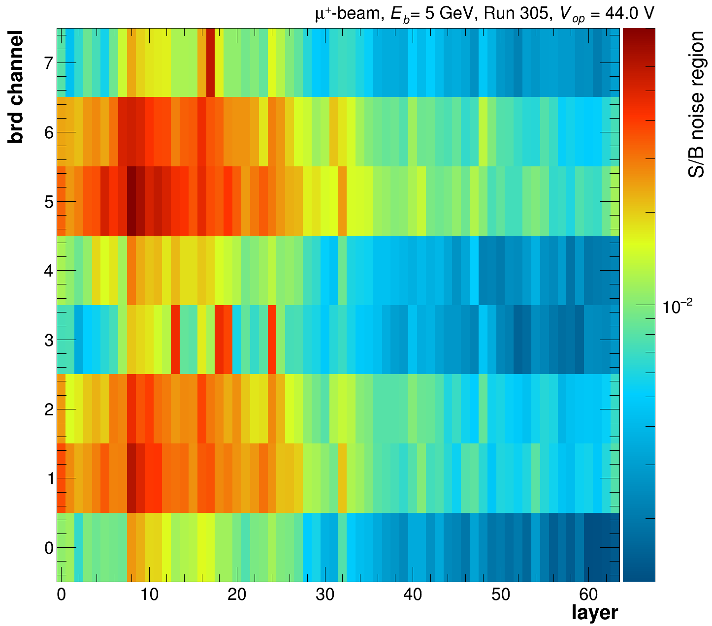<figcaption><p>Suppression of the pedestal peak around 0.</p></figcaption></figure> <figure>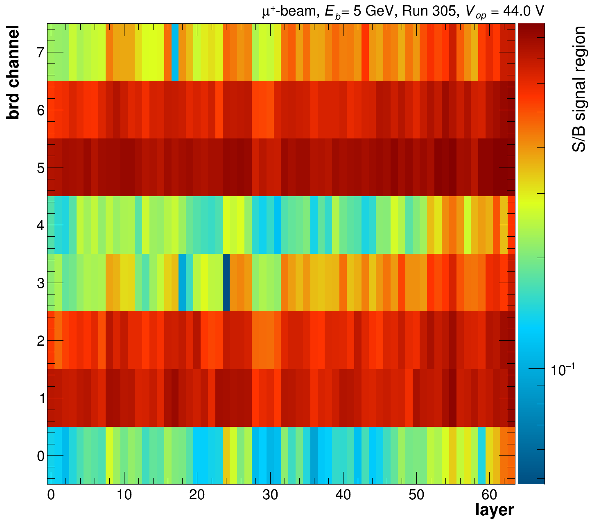<figcaption><p>Suppresion of the signal peak in the signal region. </p></figcaption></figure></div>

<figure>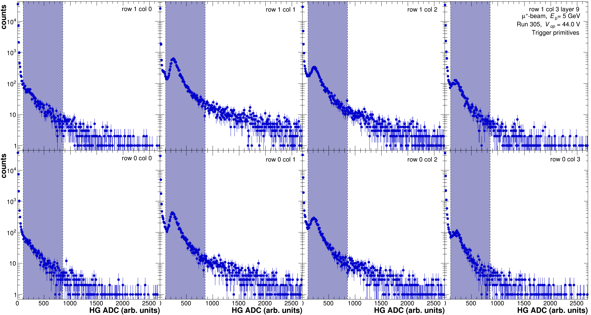<figcaption><p>Trigger primitive distribution for the cells in layer 9, shaded area indicates muon triggered events. </p></figcaption></figure>

The evaluated trigger primitives are stored in the new output for event and tile, allowing to reevalulate the trigger in subsequent iterations with stricter seletion criteria.

The corresponding HG and LG spectra for the locally muon triggered events are then fitted again with a Landau-Gauss function and if successful the corresponding calibration values are updated.&#x20;

<figure>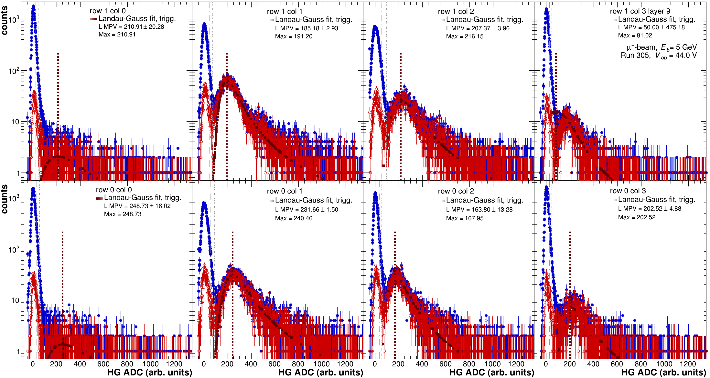<figcaption><p>HG spectra for all events (blue) and locally muon triggered events (red) together with the fitted Landau-Gauss function in case the fit did not fail. Fits are displayed in either dark blue (fit of muon triggered failed, but full distribution succeeded) or in dark red (fit of muon triggered succeeded). </p></figcaption></figure>

As the selection of the triggers is rather course still the fits might still not perfectly describe the mip-signal region. This particularly applies for tiles which the beam wasn't directly pointing at (edges). The same monitoring plots for the fit parameters are created in the 2nd iteration as well and the equivalent LG plots as well.

<div><figure><figcaption><p>Maximum of the Landau-Gauss distribution for the HG signal after the first iteration. White "bins" indicate fit failures in the first iteration. The average value for all channels is given in the top left corner (222.4)</p></figcaption></figure> <figure><figcaption><p>Maximum of the Landau-Gauss distribution for the LG signal after the second iteration. White "bin" indicate fit failures in the first iteration. The average value for all channels is given in the top left corner (16.6)</p></figcaption></figure></div>

The respective fitting routines for the Landau-Gauss functions can be found in

```cpp
bool TileSpectra::FitMipHG(double*, double*, int, int, bool, double, double )
bool TilesSpecta::FitMipLG(double*, double*, int, int, bool, double ) 
```

in [TileSpecta.cc](https://github.com/eic/epic-lfhcal-tbana/blob/main/NewStructure/TileSpectra.cc).&#x20;

#### Step 2

The second step relies on the output objects of Step 1 (which include the trigger primitives for each cell). It can be started as follows:

```sh
./DataPrep -f -d 1 -S -i rawPedAndMuonWBC_$RUNNR.root -o rawPedAndMuonWBCImp_$RUNNR.root -O $PLOTSDIR -r $RUNLIST
```

This file again will copy each time the original data tree from `rawPedAndMuonWBC_$RUNNR.root` and updates the calib objects which are provided in the same file, writing the original data tree and new calib object to `rawPedAndMuonWBCImp_$RUNNR.root`. &#x20;

It follows the same procedure as the second part of step 1, basing trigger selection criteria on the inputed calib objects and their respective average mip scale, however the minimum and maximum factors for the trigger selection are significantly tightened. For the 2024 data the respective factors are:

```cpp
double factorMinTrigg   = 0.8;
double factorMaxTrigg   = 2.5;
```

This allows for a significantly better noise suppression and thus easier fitting.&#x20;

The detailed implementation can be found in:

`bool Analyses::GetImprovedScaling(void)` in [Analyses.cc](https://github.com/eic/epic-lfhcal-tbana/blob/main/NewStructure/Analyses.cc).

The step 2 can be repeated as often as necessary on the output created in the previous iteration of step 2, until the fitting converges for a maximum of cells. To ease this judgement the following lines can be found in the shell output:

```sh
average input HG mip: 375.625 LG mip: 33.0965 act. ch: 505
average updated HG mip: 375.797 LG mip: 33.0965 act. ch: 505
```

Indicating the average mip values for HG and LG before and after the current iteration as well as the calibratable channels. If the before and after are close enough it can be assumed that the fitting cannot be improved without manual intervention.&#x20;

Otherwise a very similar set of plots is produced as for the second part of Step 1, which should be looked at in detail to ensure good quality of fits.

***


### September 2023 data

No scripts have been created yet.


### October 2023 data

No scripts have been created yet.


### August 2024 data

The primary script for the muon calibration of this data set is as for the pedestal `runCalibration_2024.sh`, in order to obtain the calibrations for a specific scan the following commands need to be executed in order. The next command should only be executed if the outputs of the previous step have been checked.&#x20;

```sh
# merge the muon files correctly (comment out which set you need)
bash runCalibration_2024.sh $USERNAME mergemuons

# transfering the pedestal calibration to the merged muon file of interest with external bad channel map applied
bash runCalibration_2024.sh $USERNAME muoncalibA1 transferWithBC

# MIP extraction: STEP 1
# run first step of mip extraction with external bad channel map applied
# THIS WILL TAKE A WHILE (~4h for 200K events)
bash runCalibration_2024.sh $USERNAME muoncalibA1 defaultWithBC

# MIP extraction: STEP 2
# run 1st iteration of 2nd step
bash runCalibration_2024.sh $USERNAME muoncalibA1 improvedWBC
# run 2nd iteration of 2nd step
bash runCalibration_2024.sh $USERNAME muoncalibA1 improvedWBC2nd

# the remaining steps are optional and should only be done if it didn't converge in the previous iteration
bash runCalibration_2024.sh $USERNAME muoncalibA1 improvedWBC3rd
bash runCalibration_2024.sh $USERNAME muoncalibA1 improvedWBC4th
bash runCalibration_2024.sh $USERNAME muoncalibA1 improvedWBC5th
# so far no further iteration were needed

```

Please have a look which options for the 2nd argument are available to select different data sets.

