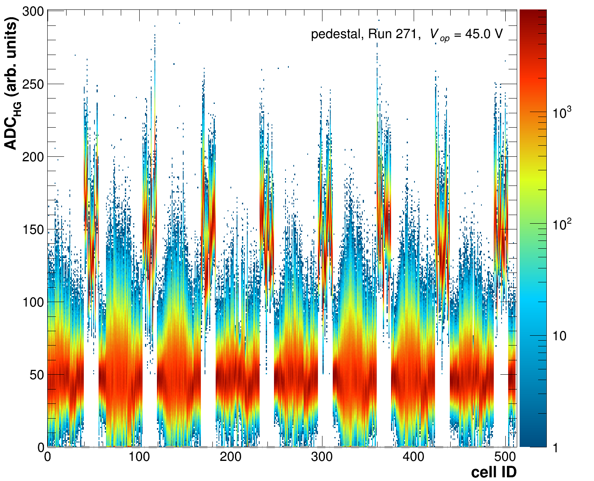
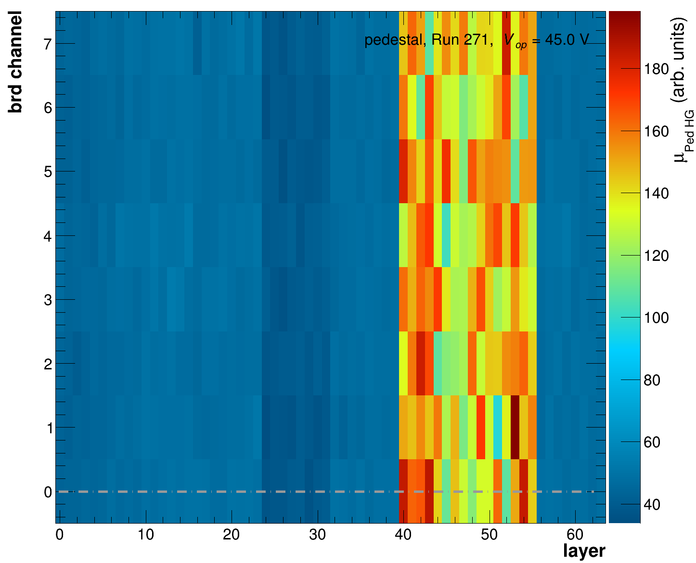
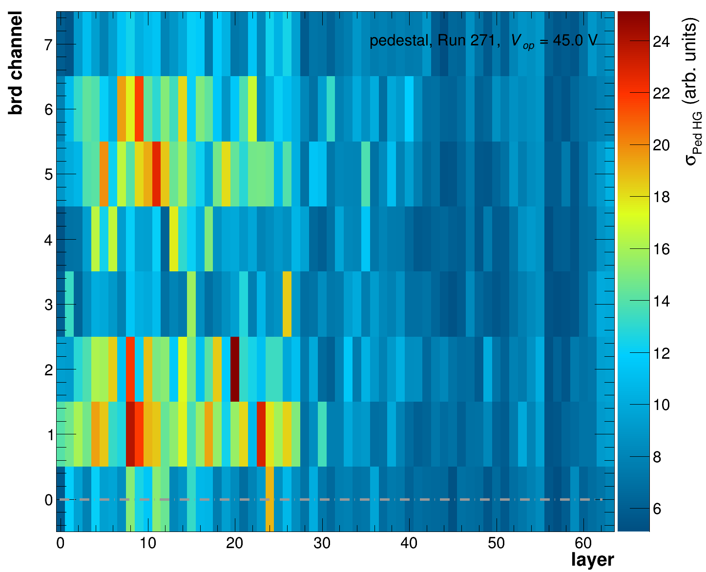

# Pedestal extraction

Any test beam analysis starts with the understanding of the data and possible shifts observed in the baseline. A pedestal is commonly referred to as a minimum setable value above which the actual signal is extracted. However, as all electronics also have electrical noise this value can fluctuate slightly for each event around the set value.&#x20;

It is of key importance to understand what is the pedestal mean and width (tells us something about the noise levels) for your data.&#x20;

## CAEN data

For the data taken with the CAEN DT5202 during the test beam campaings in 2023 & 2024 the intended pedestal value should have been 50 ADC for both HG and LG for each channel. However, as the read-out electronics isn't ideal and we were running often with multiple CAEN DT5202 units the channel-by-channel observed values often aren't at 50 ADC. Thus for the October 2023 & August 2024 dedicated pedestal runs have been taken, which were internally triggered by the DT5202 with random triggers. Based on these data the corresponding pedestal means and width for each channel and HV setting can be extracted. Ideally these should stay stable if no major changes in the cabling and/or settings have been done.

### Extraction of Pedestal for a single run

The extraction of the pedestals for a single run can be started as follow:

```sh
./DataPrep -f -d 1 -p -i raw_$RUNNR.root -o PedestalCalib_$RUNNR.root -O $PLOTDIRECTORY -r $RUNLISTFILE
```

The option `-p` is the key to trigger the extraction of the Pedestals based on the raw-file (`raw_$RUNNR.root`), defined by `-i raw_$RUNNR.root`. The destination of the root output is defined by `-o PedestalCalib_$RUNNR.root` and Plots will be created in `$PLOTDIRECTORY`, as given by `-O`.  In order to have the plots correctly labeled the run list needs to be given with `-r`, as for the conversion of the data and `-f` and `-d` are used in the same manner as for `./Convert`. In addition to the output as defined by `-o`, a file with histograms will be stored for later use, the file name is the as for the `-o` option replacing replacing `".root"` with `"_hists.root".`

During this process the original data will be copied to the new file and the existing (empty) calibration objects contained in $raw\_$RUNNR.root will be expanded for each tile/cell to contain the respective pedestal position and width for HG and LG. All other values of the calibration will be initiated with their respetive default values. More details on the actual calib- object structure and various access functions can be found in [Calib.h](https://github.com/eic/epic-lfhcal-tbana/blob/main/NewStructure/Calib.h). Below you can find the default values for a single TileCalib-object.&#x20;

```cpp
TileCalib{
  double PedestalMeanH  = -1000.;     // pedestal mean HG ADC (CAEN) or first sample ADC (HGCROC)
  double PedestalMeanL  = -1000.;     // pedestal mean LG ADC (CAEN) or average pedestal ADC (HGCROC)
  double PedestalSigH   = -1000.;     // width of pedest HG ADC (CAEN) or width of first sample ADC distribution (HGCROC)
  double PedestalSigL   = -1000.;     // width of pedest LG ADC (CAEN) or width of average pedestal ADC distribution (HGCROC)
  double ScaleH         = -1000.;     // Max Mip in HG ADC (CAEN) or ADC (HGCROC) 
  double ScaleWidthH    = -1000.;     // FWHM of Mip in HG ADC (CAEN) or ADC (HGCROC) 
  double ScaleL         = -1000.;     // Max Mip in LG ADC (CAEN) 
  double ScaleWidthL    = -1000.;     // FWHM Mip in LG ADC (CAEN) 
  double LGHGCorr       = -64;        // slope of correlation between LG (x axis) & HG (y axis) for CAEN data 
  double LGHGCorrOff    = -1000.;     // intercept of correlation between LG (x axis) & HG (y axis) for CAEN data 
  double HGLGCorr       = -64;        // slope of correlation between HG (x axis) & LG (y axis) for CAEN data
  double HGLGCorrOff    = -1000.;     // intercept of correlation between HG (x axis) & LG (y axis) for CAEN data
  short BadChannel      = -64;        // bad channel flag: 0 - off, 1 - bad, 2 - funky, 3 - good
} ;
```

The executable will produce a variety of control plots for each cell and overview plots for the full ensemble of cells in order to monitor the correct execution of the program. Make sure you actually check those! A few example plots are given below.

<div><figure><figcaption><p>Raw HG  ADCs for each cell. </p></figcaption></figure> <figure><figcaption><p>Raw LG ADCs for each cell.</p></figcaption></figure></div>

Above you find the HG or LG ADCs for each tile/cell as function of the cell ID. They are displayed in the region where the pedestal would be expected (0 < ADC < 300). For this particular run a full 8M LFHCal module with 64 layers was read out by 8 CAEN units. In principle the pedestal offset for all of these had been set to ADC = 50. However, it can be seen that for some of the read-out units a significantly different offset seems to have been applied. The individual spectra for each cell are plotted in overview plots per layer together with the corresponding Gaussian fits to assess the pedestal mean and  width.&#x20;

<figure><figcaption><p>Single Tile HG spectra for Layer 15 together with the respective Pedestal fit. The mean and sigma for each tile are indicated in the legend of each panel. If no fit is drawn the corresponding fitting routine failed.</p></figcaption></figure>


<figure><figcaption><p>Single Tile LG spectra for Layer 15 together with the respective Pedestal fit. The mean and sigma for each tile are indicated in the legend of each panel. If no fit is drawn the corresponding fitting routine failed.</p></figcaption></figure>

Overview plots displaying the fitted values in a 2 dimensional version as function of the layer and the respective channel within the layer are also produced.&#x20;

<div><figure><figcaption><p>HG pedestal mean for each layer and channel on the board. The brd channels 0-3 reflect the lower row of the assembly, while 4-7 reflect the upper row of each assembly.</p></figcaption></figure> <figure><figcaption><p>HG pedestal width for each layer and channel on the board. The brd channels 0-3 reflect the lower row of the assembly, while 4-7 reflect the upper row of each assembly.</p></figcaption></figure></div>

<div><figure><figcaption><p>LG pedestal mean for each layer and channel on the board. The brd channels 0-3 reflect the lower row of the assembly, while 4-7 reflect the upper row of each assembly.</p></figcaption></figure> <figure><figcaption><p>LG pedestal width for each layer and channel on the board. The brd channels 0-3 reflect the lower row of the assembly, while 4-7 reflect the upper row of each assembly.</p></figcaption></figure></div>

By default all plots will be generated as pdf files, allowing you to merge pdfs into one single pdf by running:

```sh
 pdfunite *.pdf summary.pdf
```

in the respective plots folder. Alternatively the output format can be changed using the option:`-F png`  added to the original call of the executable. Most common graphics formats are available as outputs within root i.e. `png, pdf, eps, jpg`.

Before continuing with the analysis make sure your pedestals are well fitted and correctly describe the data. If for whatever reason the fits aren't working please have a look at&#x20;

`bool Analyses::GetPedestal(void)` in [Analyses.cc](https://github.com/eic/epic-lfhcal-tbana/blob/main/NewStructure/Analyses.cc) and&#x20;

`bool TileSpectra::FitNoise(double*, int, bool )` in [TileSpecta.cc](https://github.com/eic/epic-lfhcal-tbana/blob/main/NewStructure/TileSpectra.cc)

which are implementing the processing of the pedestals and the fitting respectively.&#x20;

For some of the data no proper pedestal runs have been taken and consequently the pedestal extraction isn't this trivial for those cases the pedestal can be extracted first on the muon/hadron sample and then after a first pass of the mip extraction a dedicated local noise triggered sample can be generated and refitted. Below you find an example for the 2023 September campaign, where this was the case. The key option here is `-n`, however prior to running this a first attempt to extract the mip values needs to be done and stored in `rawPedAndMuon_$RUNNR.root`.&#x20;

```sh
./DataPrep -f -d 1 -y 2023 -n -i rawPedAndMuon_$RUNNR.root -o rawPedAndMuonNoise_$RUNNR.root -O $PLOTOUTPUT -r $RUNLISTSEPT2023
```

For the local noise trigger `n` cells before and after the current cell are evaluated (same row and column, different layer) and their raw-initial pedestal corrected signals summed and averaged. If the resulting `TriggerPrimitive` is below `frac*avMIP,` the corresponding cell is flagged as noise triggered for this event. An example of this implementation can be found in:

`bool GetNoiseSampleAndRefitPedestal(void)`  in [Analyses.cc](https://github.com/eic/epic-lfhcal-tbana/blob/main/NewStructure/Analyses.cc) and&#x20;

`double CalculateLocalMuonTrigg(Calib, TRandom3*, int, int, double)` in [Event.cc](https://github.com/eic/epic-lfhcal-tbana/blob/main/NewStructure/Event.cc)

`bool InspectIfNoiseTrigg(int, double, double)` in [Event.cc](https://github.com/eic/epic-lfhcal-tbana/blob/main/NewStructure/Event.cc)

Skimming of just the cells containing noise obtained in this manner can be achieve by running with the `-N` option:

```sh
./DataPrep -f -d 1 -N -i rawPedAndMuonNoise_$RUNNR.root -o raw_pedonly_$RUNNR.root 
```

For some of the data set again scripts have been prepared to run them in an ordered fashion, if possible use those.

### September 2023 data

A basic calibration script has been prepared. Similar to the [Converter-scripts](../tb-analysis/converting-the-data.md#caen-data-conversion) please add your user name and respective data location respectively.

To extract a first pass of the pedestal run:

<pre class="language-sh"><code class="lang-sh"><strong>bash runCalibration_Sept2023.sh $USERNAME pedestal
</strong></code></pre>

Afterwards run the mip extraction as described in the next chapter and then:

<pre class="language-sh"><code class="lang-sh"><strong>bash runCalibration_Sept2023.sh $USERNAME pedestalRe
</strong></code></pre>

Feel free to comment in and out run numbers and partial data sets in these scripts as needed.

### October 2023 data

No script has been prepared yet.

### August 2024 data

The scripts for the 2024 data taking campaign are developed the furthest. In order to extract the pedestal run:

<pre class="language-sh"><code class="lang-sh"><strong>bash runCalibration_2024.sh $USERNAME pedestal
</strong></code></pre>

Feel free to comment in and out run numbers and partial data sets in these scripts as needed. The run numbers for the different campaings for the muon and pedestal runs for this data set are defined with

```bash
muonHVScan_42V='309'
pedHVScan_42V='308'

muonScanA_45V='244 250 282 283'
pedScanA_45V='271 277'
```

and similar variable for convenience.

## HGCROC data

The general idea of the pedestal evaluation is similar to that when analyzing the CAEN data, however as we are using the H2GCROC chip esssentially as a waveform sampling chip, we have multiple ways to evaluate the pedestal value. The internal pedestal values are set to an average desired pedestal value i.e. 80 or 100 ADC as described in the [online calibration section of the TB tutorial](../hgcroc-setup-test-beam/getting-started-hgcroc-and-calibrations.md#pedestal-calibration).

<div><figure><figcaption><p>Waveform for signal events.</p></figcaption></figure> <figure><figcaption><p>Waveform for internally generated random events (pedestal run). With corresponding fit averaged over all samples of waveform.</p></figcaption></figure> <figure><figcaption><p>Fit to first sample of all events for signal events. Same distribution expected for pedestal run &#x26; first sample.</p></figcaption></figure></div>

For the extraction of the pedestal values one now has multiple options:&#x20;

1. Take a purely random internally triggered run (pedestal run):
   1. Extract the position and width of the pedestal using a Gaussian fit to the first sample ADC values for all events (left plot).&#x20;
   2. Extract the position of the pedestal using a linear fit to all samples for all events (middle plot).
2. Use the signal runs (whatever triggers you like):
   1. Extract the position and width of the pedestal using a Gaussian fit to the first sample ADC values for all events (left plot).&#x20;
   2. Use on an event-by-event basis the first sample as pedestal value.&#x20;

Each of these options has their up and down sides: Option 1a) and 1b) ideally should result in identical values and are implemented as standard options in the pedestal extraction code which can be run as follows:

```bash
./DataPrep -f -d 1 -p -i rawHGCROC_$RUNNR.root -o PedestalCalib_$RUNNR.root -O $PLOTDIRECTORY -r $RUNLISTFILE
```

The same options as described for the [CAEN running](pedestal-extraction.md#extraction-of-pedestal-for-a-single-run) are used but they are interpreted slightly differently. Within the calibration object option 1a is stored as `PedestalMeanH`  while option 1b is stored as `PedestalMeanL`. In the plots they are denoted as mu\_(0th sample) or mu\_(HG) and  mu\_(wave), respectively. Both of which by default are initialized to -1000. In the further calibration, by default the `PedestalMeanH` is used to correct the signal, should that fit have failed and hence it remains at -1000 it defaults to `PedestalMeanL`. Should that fit have equally failed the option 2b is used.&#x20;

```cpp
double PedestalMeanH  = -1000.;     // pedestal mean HG ADC (CAEN) or first sample ADC (HGCROC)
double PedestalMeanL  = -1000.;     // pedestal mean LG ADC (CAEN) or average pedestal ADC (HGCROC)
double PedestalSigH   = -1000.;     // width of pedest HG ADC (CAEN) or width of first sample ADC distribution (HGCROC)
double PedestalSigL   = -1000.;     // width of pedest LG ADC (CAEN) or width of average pedestal ADC distribution (HGCROC) 
```

In principle it is also possible to run the pedestal extractions code on files which contain valid triggers, in that case however in particular the `PedestalMeanL,`  might be heavily biased and ideally should not be used. The `PedestalMeanH`  on the other hand might still proof to be significantly more stable than the event-by-event evaluated pedestal. This is particularly true of the trigger was aligned such that only 1 waveform should have been equivalent to the pedestal.&#x20;

In case of the HGCROC processing the following additional QA plots are produced by default:

<div><figure><figcaption><p>ADC values for all samples filled per cell ID. </p></figcaption></figure> <figure><figcaption><p>ADC values filed only for the first and hence 0th sample, which should ideally be just a noise sample.</p></figcaption></figure></div>

<div><figure><figcaption><p>Fitted mean of the 0th sample of all events using a gaussian function (option 1a/2a). Average over all active cells is denoted in the top right corner, white areas denote failed fits.</p></figcaption></figure> <figure><figcaption><p>Fitted width of the 0th sample of all events using a gaussian function (option 1a/2a). Average over all active cells is denoted in the top right corner, white areas denote failed fits.</p></figcaption></figure></div>

<div><figure><figcaption><p>Fitted mean of the full waveform of all events using a constant function (option 1b), this should only be used for true pedestal runs. Average over all active cells is denoted in the top right corner, white areas denote failed fits.</p></figcaption></figure> <figure><figcaption><p>Correlation of fitted pedestal values extracted based on the 0th sample (x-axis) and full waveform fit (y-axis) on a cell-by-cell basis. For pure pdestal runs this should be a 1-1 correlation.</p></figcaption></figure></div>

Before continuing with the analysis make sure your pedestals are well fitted and correctly describe the data. If for whatever reason the fits aren't working please have a look at&#x20;

`bool Analyses::GetPedestal(void)` in [Analyses.cc](https://github.com/eic/epic-lfhcal-tbana/blob/main/NewStructure/Analyses.cc) and&#x20;

`bool TileSpectra::FitNoise(double*, int, bool )` in [TileSpectra.cc](https://github.com/eic/epic-lfhcal-tbana/blob/main/NewStructure/TileSpectra.cc)

`bool TileSpectra::FitPedConstWave(int verbosity)`  in [TileSpectra.cc](https://github.com/eic/epic-lfhcal-tbana/blob/main/NewStructure/TileSpectra.cc)

which are implementing the processing of the pedestals and the fitting respectively.&#x20;

Besides the aforementioned summary plots, each layer will be plotted with as physically installed during the TB. &#x20;

<div><figure><figcaption><p>All Sample ADCs for layer 1 in the same configuration as for the 2025 TB.</p></figcaption></figure> <figure><figcaption><p>Oth Sample ADCs for layer 1 in the same configuration as for the 2025 TB together with the respective Gaussian fits used to evaluate the mean and width of the pedestal ( <code>PedestalMeanH</code> ).</p></figcaption></figure> <figure><figcaption><p>Full waveforms for layer 1 in the same configuration as for the 2025 TB together with the constant fit used to evaluate the waveform mean ( <code>PedestalMeanL</code> ).</p></figcaption></figure></div>

By default all plots are produced as pdfs and it is highly recommended to execute&#x20;

```bash
 pdfunite *.pdf summary.pdf
```

in the output folder in order to create 1 scrollable pdf. Should you wish to create the plots in a different output format you can append `-F $FILENENDING` to the running command. Root supports reasonable graphics engines for `eps, pdf, png & jpg` as plotting outputs.

### August 2024 data

A starting point for the 2024 data taking campaign processing can be found in:&#x20;

```sh
bash runHGCROCCalibration_2024.sh $USERNAME [pedestalM|pedestalE|pedestalMtrunc]
```

Please keep in mind that the 2024 HGCROC data is a little bit tricky in its handling as we were still developing the understanding of how to efficiently operate the HGCROC read-out. Hence for instance only one true pedestal run exists (run 337). The full run list can be found in our [tabulated logbook](https://docs.google.com/spreadsheets/d/1XaiSmG4jBaBOyjbjdiNuSeehjeZC03_2A7Ccoq0nIbI/edit?usp=sharing) under the HGCROC tab.

### November 2025 data

The script for the calibration of the 2025 data taking campaign is currently under construction and can be used in a similar manner as the corresponding converter script. Please remember to add your username and the paths to the data on your respective device.&#x20;

```sh
bash runHGCROCCalibration_2025.sh $USERNAME [pedestalRef|pedestalE|pedestalMuon]
```

Currently three alternative options are prepared for running the pedestals over true pedestal runs (`pedestalRef`), muon runs (`pedestalMuon`) or electron runs (`pedestalE`). Please make sure to comment in only the runs you would like to process in the respective options. The full list of runs can be found in out [tabulated logbook](https://docs.google.com/spreadsheets/d/1XaiSmG4jBaBOyjbjdiNuSeehjeZC03_2A7Ccoq0nIbI/edit?usp=sharing) and a summary of the various sub-campaigns/set can be found on our dedicated [wiki](https://wiki.bnl.gov/EPIC/index.php?title=LFHCal_Fall_2025_Test_Beam).
