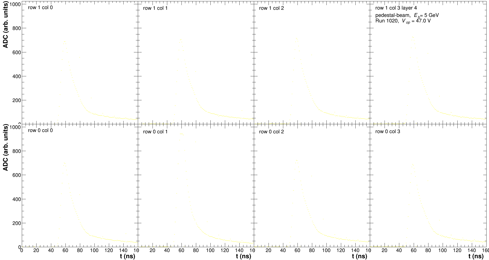
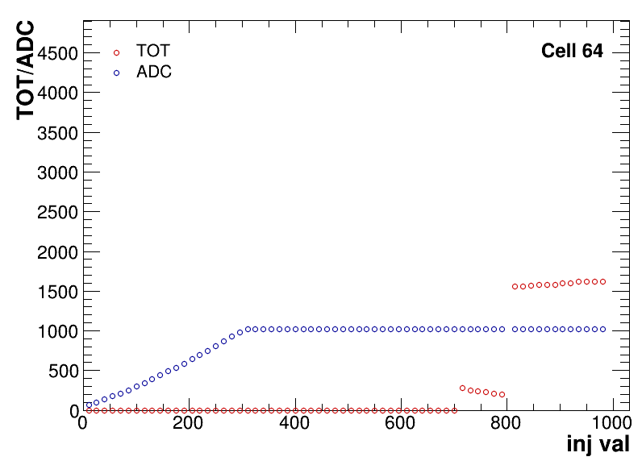

# Reading HGCROC online calibrations

## Running the calib parser

The calib parser is meant as an option to convert the online calibration files as produced by the [H2GCalib](../hgcroc-setup-test-beam/getting-started-hgcroc-and-calibrations.md) into a format which the analysis software can digest. This is meant to enable comparisons of the pedestals and waveforms obtained with the online calibration and their measured counter parts.

### Pedestal extraction from `.json` files&#x20;

Macro used to read in the pedestal values from `.json` file (1st step of online calibration), and overwrite it in the usual calib object. Because of that, it requires the output of the first step of the usual pedestal calibration of the HGCROC "pedestal" run with the calib object to overwite.

Example:

```
./ParseCalibSamples -i $InputFile -c $InputCalibFile -m $InputMapping -o $OutputPath -r $RunListFile -n $RunNumber
```

Required input:

* `InputFile` - input file in this case is a `.txt` file containing:
  * first line: number of dead/calibration channels, and all the dead/calib channels listed
  * second line: KCU number, the path to the `.json` file

```
8,0,37,38,75,76,113,114,151
0,/home/ewa/EIC/DATA/HGCROCData/PedestalRun_PairWithRun051/103_PedestalCalib_pedecalib_20251029_182545.json
```

* `InputCalibFile` - output of the first iteration of pedestal calibration, `.root` file
* `InputMapping` - a path to the file with mapping
* `RunListFile` - a file with the run information
* `RunNumber` - the run number to analyze (should be contained in the `RunListFile`)

Optional input:

* `OutputPath` - setting the directory and name of the output `.root` file, otherwise the file will be save in the same place as the config file with the same name as the config file

### Extract Waveforms from Injection Scan&#x20;

Macro used to parse the output from the HGCROC calib to the LFHCAL software-friendly format. The output is saved in `.root` file as a `TTree`. Plotting of the waveforms can be enabled. This running option parses `.csv`  output from the Injection Scan (last step of online calibration) for a specific DAC value.&#x20;

Example:

```
./ParseCalibSamples -i $InputFile -m $InputMapping -o $OutputPath -p $OutputPlots -r $RunListFile -n $RunNumber
```

Required input:

* `InputFile` - input `./csv` file
* `InputMapping` - a path to the file with mapping
* `RunListFile` - a file with the run information
* `RunNumber` - the run number to analyze (should be contained in the `RunListFile`)

Optional input:

* `OutputPlots` - plotting directory, providing the directory enables plotting
* `OutputPath` - setting the directory and name of the output `.root` file, otherwise the file will be save in the same place as `.csv` file with the same name as `.csv` file

<figure><figcaption></figcaption></figure>

### Compare ADC and TOT vs DAC based on Injection Scan

Takes the `.root` output of the previous macro for various DAC values. It is advised to run the previous macro with the run list file in which injection is treated as a run number.

Example:

```
./CompareHGCROCCalib -i $InputFileList -p $PlottingDirectory 
```

Required input:

* `InputFileList` - txt file with the list of `.root` files to compare
* `PlottingDirectory` - plotting directory


<figure><figcaption></figcaption></figure>
