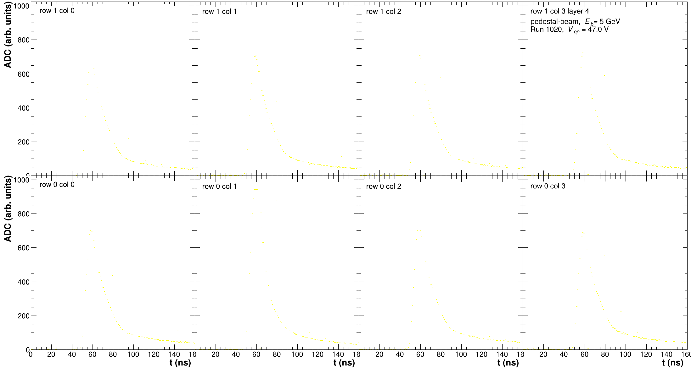
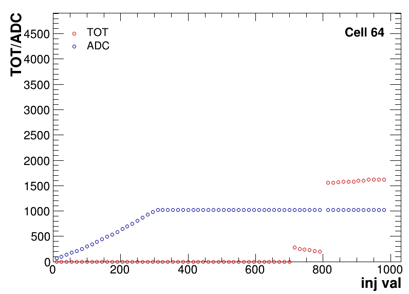

# Reading HGCROC online calibrations

## Parsing the Calibration outputs

The [calib parser](https://github.com/eic/epic-lfhcal-tbana/blob/main/NewStructure/ParseCalibSamples.cc) is meant as an option to convert the online calibration files as produced by the [H2GCalib](../hgcroc-setup-test-beam/getting-started-hgcroc-and-calibrations.md)  or [H2GCalibX](https://gitlab.cern.ch/sjia/h2gcalibx/-/tree/dev-1v5?ref_type=heads) into a format which the analysis software can digest. This is meant to enable comparisons of the pedestals and waveforms obtained with the online calibration and their measured counter parts. You have to make sure you are using the right commands to parse the output format of the different version of the **H2GCalib**. Keep in mind they have changed drastically over the years and might not be compatible among each other.


```bash
./ParseCalibSamples -h
Usage:
./ParseCalibSamples [-option (arguments)]
Options:
-c        path to .root file with calib object (mandatory for pedestal calib)
-d [0-n]  switch on debug info with debug level 0 to n
-D        switch on the calibX dac injection parsing
-i uuu    path to the input file: either .csv or config file with .json files for pedestal calib (mandatory)
-I        switch on the calibX injection parsing
-m        path to the mapping file (mandatory)
-n        run number to analyze (mandatory)
-o        output root filename, default same as input file
-p        setting the plot directory (for .csv file) (mandatory for plotting)
-r        path to the run list file (mandatory)
-s        setting the plots format (default .pdf)
-t        switch on the ToA calib file parser (required .csv file)
-h        print help
Examples:
./ParseCalibSamples -i input.csv -o output/

```


The following options are implemented at the moment:

**HGCCalib - output**

* pedestal extraction
* injection scan analysis

**HGCCalibX - output**

* injection scan analysis

In general the following options are needed for most running options, _**most of them are mandatory**_:

* `-i $InputFile`  a input text file base name or base name. Example formats will be given in the respective sections as they differ for each of the different running options.&#x20;
* `-m $MappingFile`  The mapping file which is to be used to assign the individual channels to the correct cell ID. This should be the same as you would use for the standard analysis as well. If the calibrations were ran during one of the TB campaigns.&#x20;
* `-r $RunList`  This is similar to the run list files we have for normal analysis. In these run lists we document the exact settings of the calibrations for the injection runs ([example](https://github.com/eic/epic-lfhcal-tbana/blob/main/configs/FOCalTest2026/DataDB_InjectionTestFocal_202604.csv)). Keep in mind that for the calibration by default no run number is assigned, so this can be chosen arbitrarily. But make sure its consistent and you document where the data can be found.&#x20;
* `-n $RunNr`  Arbitrarily assigned run rumber. This is needed for comparisons afterwards. Should be consistent with documentation in `$RunList` regarding the settings.
* `-o $OutputFileName`  or `$OutputPath`  Where will the output root file go?
* `-p $PlottingDirectory`  Where shall the plots be stored.
* `-d` is followed by a debug option \[1-3], enabling different levels of couts in the code. _This option is optional!_

## Parsing output from HGCCalib

### Pedestal extraction from `.json` files - HGCCalib&#x20;

Macro used to read in the pedestal values from `.json` file (1st step of online calibration), and overwrite it in the usual calib object. Because of that, it requires the output of the first step of the usual pedestal calibration of the HGCROC "pedestal" run with the calib object to overwrite.&#x20;

Example:

```bash
./ParseCalibSamples -i $InputFile -c $InputCalibFile -m $MappingFile -o $OutputPath -r $RunListFile -n $RunNumber
```

Required input:

* `InputFile` - input file in this case is a `.txt` file containing:
  * first line: number of dead/calibration channels, and all the dead/calib channels listed
  * second line: KCU number, the path to the `.json` file

```csv
8,0,37,38,75,76,113,114,151
0,/home/ewa/EIC/DATA/HGCROCData/PedestalRun_PairWithRun051/103_PedestalCalib_pedecalib_20251029_182545.json
```

* `InputCalibFile` - output of the first iteration of pedestal calibration, `.root` file
* `InputMapping` - a path to the file with mapping
* `RunListFile` - a file with the run information
* `RunNumber` - the run number to analyze (should be contained in the `RunListFile`)

Optional input:

* `OutputPath` - setting the directory and name of the output `.root` file, otherwise the file will be save in the same place as the config file with the same name as the config file

### Extract Waveforms from Injection Scan - HGCCalib

Macro used to parse the output from the HGCROC calib to the LFHCAL software-friendly format. The output is saved in `.root` file as a `TTree`. Plotting of the waveforms can be enabled. This running option parses `.csv` output from the Injection Scan (last step of online calibration) for a specific DAC value.

Example:

```bash
./ParseCalibSamples -i $InputFile -m $InputMapping -o $OutputPath -p $OutputPlots -r $RunListFile -n $RunNumber
```

Required input:

* `InputFile` - input `./csv` file
* `InputMapping` - a path to the file with mapping
* `RunListFile` - a file with the run information
* `RunNumber` - the run number to analyze (should be contained in the `RunListFile`)

Optional input:

* `OutputPlots` - plotting directory, providing the directory enables plotting
* `OutputPath` - setting the directory and name of the output `.root` file, otherwise the file will be save in the same place as `.csv` file with the same name as `.csv` file

<figure><figcaption></figcaption></figure>

### Compare ADC and TOT vs DAC based on Injection Scan

Takes the `.root` output of the previous macro for various DAC values. It is advised to run the previous macro with the run list file in which injection is treated as a run number.

Example:

```
./CompareHGCROCCalib -i $InputFileList -p $PlottingDirectory 
```

Required input:

* `InputFileList` - txt file with the list of `.root` files to compare
* `PlottingDirectory` - plotting directory

<figure><figcaption></figcaption></figure>

## Parsing Output from HGCCalibX

The newer HGCCalibX can also compare the data internally, however it cannot correctly label them. Hence a reprocessing can be beneficial.

### Converting the calib-outputs - HGCCalibX <a href="#converting-the-calib-outputs" id="converting-the-calib-outputs"></a>

A first introduction to the CalibParser can also be found [there](https://friederikebock.gitbook.io/epiclfhcaltb-ana/calibration/reading-hgcroc-online-calibrations). As the outputs we will be processing are based of the [H2GCalibX](https://friederikebock.gitbook.io/focaltb/readout-setup/setting-up-daq-pc#software-installation) please use the following commands:

```
mappingFile=../configs/FOCalTest2026/mapping_injectionTest.txt
runList=../configs/FOCalTest2026/DataDB_InjectionTestFocal_202604.csv

./ParseCalibSamples -i $InputTextBase -d 1 -I -m $mappingFile -r $runList -n $RunNr -o $RootOutputFileName -p $PlottingDirectory
```

The `ParseCalibSamples` program take multiple options:

* `-i` is followed by the input text file base name. These tend to have the following format:



You would wanna give the file path and name without `_val0.csv` . Make sure the file has the correct header (should start with `#ch` or `row`) in the first line. If it doesn't please fix them using the following script.




```bash
bash FixInjectionsFormat_add_header_and_ids.sh 205_Injection_asic4_injdac400_mg7_pack8_chn76_val0.csv
```


* `-I` triggers the reading of the `H2GCalibX` inputs from the injection scans. IMPORTANT!
* `-m $mappingFile` is required to define how the channels are related to the real readout geometry and an example file can be found in [../configs/FOCalTest2026/mapping\_injectionTest.txt](https://github.com/eic/epic-lfhcal-tbana/blob/main/configs/FOCalTest2026/mapping_injectionTest.txt)
* `-r $runList` is necessary for correct labeling and an example of such run list can be found in [../configs/FOCalTest2026/DataDB\_InjectionTestFocal\_202604.cs](https://github.com/eic/epic-lfhcal-tbana/blob/main/configs/FOCalTest2026/DataDB_InjectionTestFocal_202604.csv)v the run numbers are here freely chosen, as the injections in principle don't store this information


```bash
year 2026 
month 04 
readout HGCROC 
facility CERN 
beam-line injection 
#Run Number,type,bias Voltage,V_br,machine gun,dead time,phase,nrKCU,nrAsic,RF,CF,CC,CFcomp,mode,value,location,comments 1,injection,0,38.3,7,0,1,0,4,4,8,4,8,0,250,FOCALTests-DefSettingsShihai-ORNL04-05/test_wo_detector/302_ToTCalib_Target400/205_Injection_Low/205_Injection_20260424_165941/205_Injection_asic4_injdac250_mg7_pack8_chn76, 2,injection,0,38.3,7,0,1,0,4,4,8,4,8,0,100,FOCALTests-DefSettingsShihai-ORNL04-05/test_wo_detector/302_ToTCalib_Target400/205_Injection_Low/205_Injection_20260424_153821/205_Injection_asic4_injdac100_mg7_pack8_chn76,
```


It is important to add all relevant information, i.e. what it is type="injection", as well as all the information you can gather on the setting for the `RF, CF, CFcomp, CC,` high or low injection (mode), the injection value and where it can be found for your own convenience.

* `-n $RunNr` defines what run number you assign, it has to be contained in the runList you have given before. Otherwise it will crash.
* `-o $RootOutputFileName` defines the root output file name for everything which is stored
* `-p $PlottingDirectory` defines where the plots go and enables the plotting. This is also necessary in case you want to later make any comparison plots.

For all asics the following overview plots will be created:







### Comparing the calibration outputs - HGCCalibX <a href="#comparing-the-calibration-outputs" id="comparing-the-calibration-outputs"></a>

Once you converted the calib outputs according to the previous instructions you can now compare them using the following command

```bash
./CompareInjection -d 1 -e 1 -E 1 -f -H -I comparisonInjections_RFVaried.txt -o testingPlots/newInjection.root -O testingPlots/RFVaried/ -r ../configs/FOCalTest2026/DataDB_InjectionTestFocal_202604.csv
```

The helper function explains the options:

```bash
./CompareInjection --help
Usage:
./CompareInjection [-option (arguments)]
Options:
-d [0-3] Debugging mode
-e [0-1] extended plotting
-E [1-X] histo reading options for expanded file list
-f       Force to write output if already exist
-F fff   set explicit plot extension explicitly, default is pdf 
-H       switch to HGCROC output
-i uuu   Input file list
-I uuu   expanded input file list
-L [1-63]restrict max layer plotting
-o vvv   Output file name (mandatory)
-O kkk   Output directory name for plots (mandatory)
-r rrr   Name of run list file  2024 PS TB [../configs/DataTakingDB_202409_CAEN.csv] 
-R       Trending plots versus run #
-V       Trending plots versus Vop
-h       this help
```

We are here uisng the expanded histo reading option (`-E 1`) as we don't only wanna compare the calib parameters which are stored. `-H` switches to the HGCROC outputs. This allows to produce among other thes following plots:









If only one parameter for RF, CF, CFComp or CC is varied the labeling will be automatically be picking up the primary variation and instead of the run labels the correct values will be displayed for the respective parameter. An example configuration file is given below.


