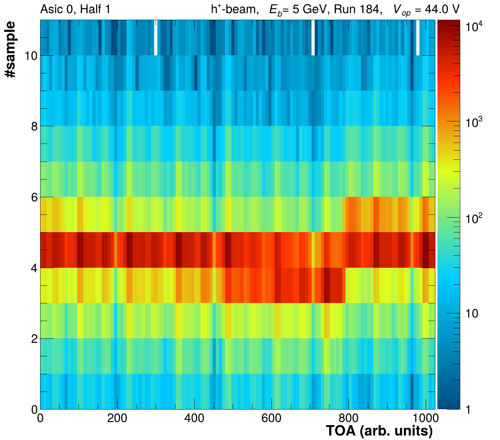
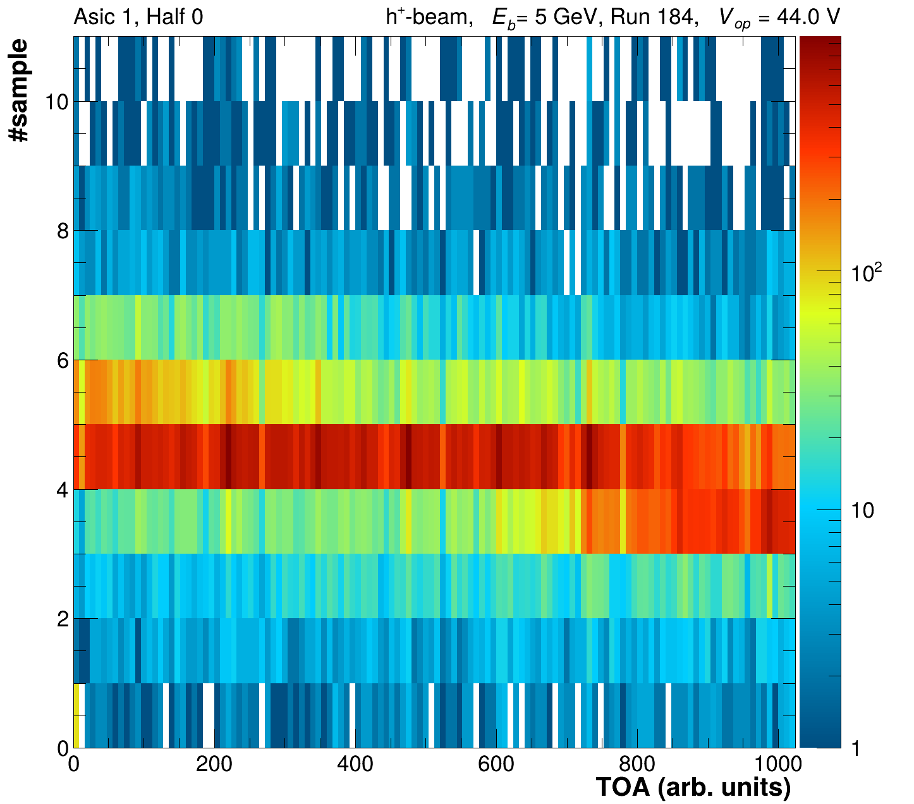
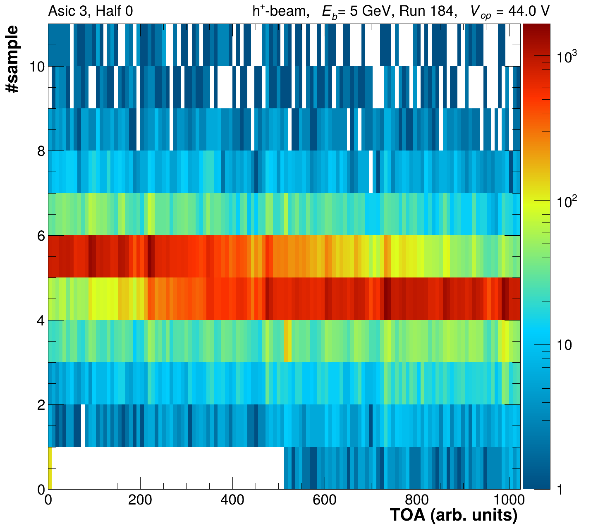
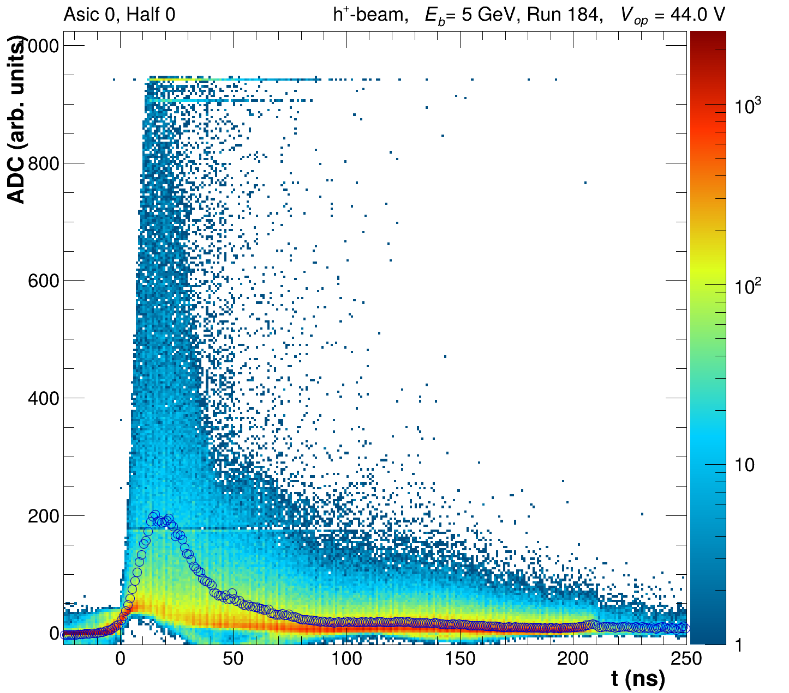
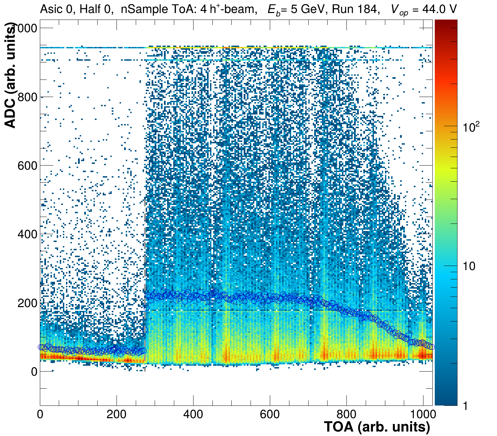
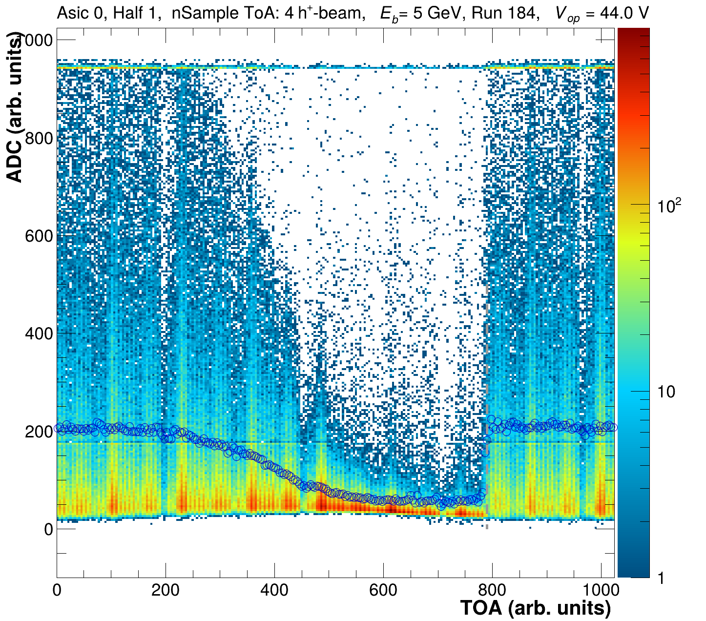
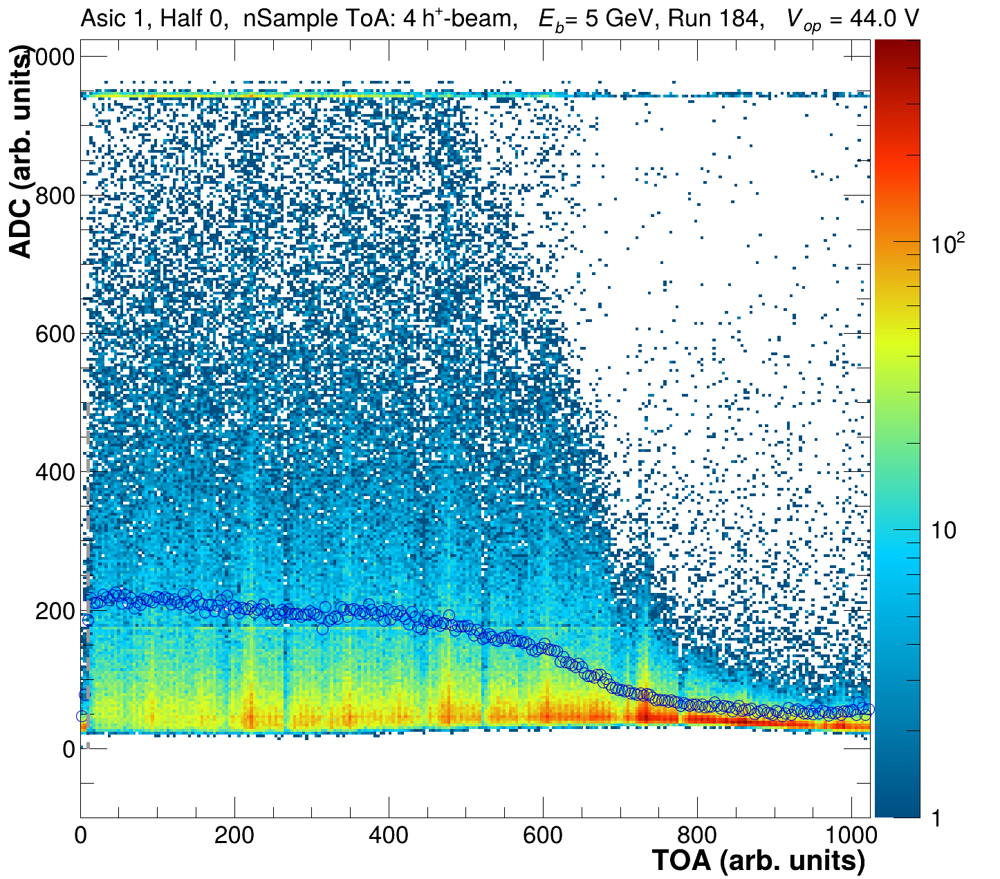
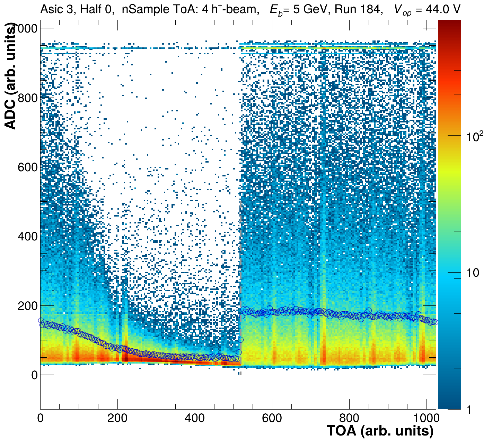

# ToA Phase extraction

## Determining the Phase

The HGCROC in the mode we are using provides can be pieced together as a waveform which contains `n` samples for `ADC, TOA` and  `TOT`, respectively. While the `ADC` will always contain a value (i.e the pedestal) the `TOA` and `TOT` values will only be filled when a certain threshold is surpassed. That value is configurable and is set in the online calibration on a channel by channel basis. Below you see an example waveform:

```
#Waveform data format:
S.Nr   0    1    2    3    4    5    6    7    8    9    10
ADC    80   80   80   150  800  120  100  80   80   80   80     
TOA    0    0    0    0    50   0    0    0    0    0    0
TOT    0    0    0    0    0    500  0    0    0    0    0    
```

<figure><figcaption></figcaption></figure>

One sample reflects a 25 ns wide evaluation intervals. Both ToA and ADC are 10bit numbers and are evaluated in the same 25 ns interval. This means in an ideal case a delta\_toa of 1 reflects a real time difference of `25ns/1024 = 24.4ps.` Unfortunately this isn't entirely true in reality and we would need to run a full fledged TOA calibration as described in the following presentation by one of our CMS colleagues, in order to have them truely reflecting the same width.&#x20;



For now we don't plan to implement this calibration as we aren't planning to use the ToA for physics analysis in the near term future. However, knowing when a minimum threshold was surpassed allows to improve the knowledge of actual waveform to a finer granularity than is provided by the 25ns samples. Hence we need to understand the `TOA` response nonetheless to first order.

A TOA value should be written to the next sample after the threshold had been surpassed. However, it is sampled of a 160MHz clock, which is derived from our 40 MHz clock. This clocks might not be fully aligned and could have 4 different phases, which can vary for each half of the HGCROC chip. Below you find examples of the `TOA` vs the sample nr it was recorded in as well as the waveforms shifted by the linearized `TOA`.

<div><figure><figcaption></figcaption></figure> <figure><figcaption></figcaption></figure> <figure><figcaption></figcaption></figure> <figure><figcaption></figcaption></figure></div>

<div><figure><figcaption></figcaption></figure> <figure><figcaption></figcaption></figure> <figure><figcaption></figcaption></figure> <figure><figcaption></figcaption></figure></div>

The linearized `TOA` calculation can be found in [HGCROC.cc](https://hgcroc.cc):

```cpp
int Hgcroc::GetLinearizedRawTOA(){
  int rawTOA    = (int)GetRawTOA();
  if (rawTOA == 0)
    return -10e5;
  int nSampTOA  = (int)GetFirstTOASample();
  
  return (-1)*nSampTOA*1024-rawTOA;
}
```

It can clearly be seen that the waveforms aren't correctly pieced together for the respective half asics and each of them is experiencing a different shift. It can also be seen that the `TOA` predominantly fires in sample `4`. Looking closer at the `TOA` vs sample Nr. clear breaks in the distributions can be identified, which if the first part is shifted to `nSample+1` would allow for a continuous distribution as function if the TOA would be linear as defined with the linearized `TOA` above. The discontinuities reflect the 4 possible phases, they are located around: `0, 270, 520 & 790`. They might vary by half asic and can in principle be different after each power cycle or reconfiguration of the chip.&#x20;

These shifts are easiest to extract from the TOA-ADC distribution for the dominant fixed TOA sample for runs with high ADC values & ideally signal in all HGCROCs (i.e. hadron runs). Below you can see the overlay of the 2D dimensional distributions for TOA sample 4 with a TProfile reflecting the mean of the distribution. The drastic step occurs at value we would like to extract. &#x20;

<div><figure><figcaption></figcaption></figure> <figure><figcaption></figcaption></figure> <figure><figcaption></figcaption></figure> <figure><figcaption></figcaption></figure></div>

The phase shift is extracted from the blue TProfile, by finding the largest positive deviation. The found values are reflected by the gray dashed vertical lines.  As its apriori not clear which of the samples is most likely the evalulation is done for the 2nd - 6th sample and it is up to the user to choose the one which works best. For each sample the following table will be printed to the shell and out of which the optimal one should be copied to a separate configuration file defining the offsets, i.e. `../configs/TB2025/ToAOffsets_TB2025_HadRun.csv` .&#x20;

```
************************************************
TOA offset estimate: 
nSample ToA: 4
nCells in sample: 5.47408e+06
************************************************
0	0	274
0	1	790
1	0	10
1	1	10
2	0	778
2	1	262
3	0	518
3	1	790
4	0	518
4	1	10
5	0	10
5	1	270
6	0	22
6	1	786
7	0	522
7	1	10
```

The corresponding routines can be found in&#x20;

`bool Analyses::EvaluateHGCROCToAPhases(void)` in [Analyses.cc](https://analyses.cc).

### Single file running

```bash
 ./DataPrep -d 1 -f -i $RAWINPUTFILE.root -o $OUTPUTFILENAME.root -O $PLOTTINGDIRECTORY -r $runNrFile -g $PEDESTALCALIBFILE.root 
```

Similar to the pedestal extraction the TOA phase extraction is being handled by the `DataPrep`  its primary call option is `-g $PEDESTALCALIBFILE.root` . In addition it needs the `-i $RAWINPUTFILE.root`  as well as the `-o $OUTPUTFILENAME.root` . Contrary to the pedestal calib this routine will not copy the orginal data tree or create a calibration object itself. Its primary output are plots as well as the aforementioned table. The $`OUTPUTFILENAME` will be amended with `_hist`  and the same TProfiles and 2D-hists as shown above will be stored for every half asic. Similar to the pedestal running the `-O` and `-r` option are also necessary defining where the plots are to be stored and which runlist its supposed to parse for labeling and creating the plots correctly.

As described above please choose the sample Nr. with highest statistics and extract the offset configuration from that. This step should be repeated for every set of runs (i.e. Full Set B, Hadron Depth Set 1, Hadron Depth Set 2,...  of the 2025 campaign). Should the determination fail due to the unavailabilty of hadron runs. The muon runs can be used too, however manual adjustments in the configuration file might be necessary due to fluctuations and hence a more difficult automatic extraction.

### HGCROC data

#### August 2024 data

#### November 2025 data

Similar to the pedestal running a scripted version with the expected filename structure has been created it can be run as follows

```bash
bash runHGCROCCalibration_2025.sh fbockTB toaPhase [Hadron|Muon]
```

Currently two options for the run selection are prepared `Hadron` and `Muon`, however the `Hadron` gives the more reliable results. Feel free to add your desired run-numbers to the script as necessary.
