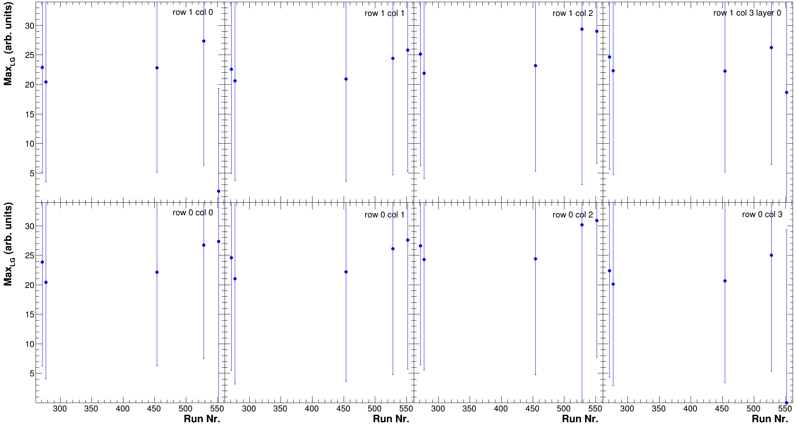

# Compare Calibrations

## CAEN

In order to compare the different results from the calibrations you an use the `Compare` program. In order to do so make sure you actually build the latest version and check out its most recent options

```bash
CompareCalib -h
Usage:
./CompareCalib [-option (arguments)]
Options:
-d [0-3] Debugging mode
-e [0-1] extended plotting
-E [1-X] histo reading options for expanded file list
-f       Force to write output if already exist
-F fff   set explicit plot extension explicitly, default is pdf 
-i uuu   Input file list
-I uuu   expanded input file list
-L [1-63]restrict max layer plotting
-o vvv   Output file name (mandatory)
-O kkk   Output directory name for plots (mandatory)
-r rrr   Name of run list file  2024 PS TB [../configs/DataTakingDB_202409_CAEN.csv] 
-R       Trending plots versus run #
-V       Trending plots versus Vop
-h       this help

Examples:
./CompareCalib (-f) -o TrendingOutput.root -i input_list.txt (-f to overwrite existing output)
./CompareCalib (-f) -o TrendingOutput.root InputName*.root InputName2.root (-f to overwrite existing output)

```

The `CompareCalib` program can be run in multiple ways in terms of inputs

1. with an auto-expanded list using `-i calibFiles*.root`
2. with a file list containing in each line the calibration files you want to use `-i calibFileList.txt` . This list has should end with `.txt` otherwise it might not be correctly detected
3. with a file list containing in each line a calibration file & the histo-output of the a specific calibration step. It can be used with `-I calibFileListExtended.txt` . This list has should end with `.txt` otherwise it might not be correctly detected.
   1. Treatment of different histogram outputs is foreseen and can be steered with `-E [1-X]` currently implemented are:
      1. `-E 1` (default if `-I` is called) format of [step 2](../calibration/mip-calibration.md#step-2) output
      2. `-E 2` format of [step 1](../calibration/mip-calibration.md#step-1) output

Likewise the `CompareAna` program can be run interchangably with the following inputs 3. with a file list containing in each line a calibration file & the QA output. It can be used with `-I anaFileList.txt` . This list has should end with `.txt` otherwise it might not be correctly detected.

1. Treatment of different histogram outputs is foreseen and can be steered with `-E [1-X]` currently implemented are:
   1. `-E 4` creates the deltatime overlay. This is currently the only option in the `ComparAna` function.

Similar to the other programs the options `-d` & `-e` will enabled various debugging options and more plots. In the current way two main ways of evaluating the data are implemented:

1. As a function of run number using the `-R` option
2. As a function of operational voltage using the `-V` option

Each of them is useful for different things. Below you find a few sample plots which are being created by the code. The output root file and plotsFolder have to be given after `-o` and `-O` respectively, without them the program will crash

```bash
# example for running Voltage dependence with extended output:
./CompareCalib -F png -e 1 -d 1 -f -V -i calibFileList.txt -o ../Trending/TrendingAllCalibs_Volt.root -O ../Trending/VoltDep -r -r ../configs/DataTakingDB_202409_CAEN.csv

# example for running run dependence without extended output & a file including the hist output:
./CompareCalib -F png -d 0 -e 0 -f -R -I calibFileList_45V_expanded.txt -o ../Trending/TrendingAllCalibs_Runs45V.root -O ../Trending/RunDep_45V -r ../configs/DataTakingDB_202409_CAEN.csv
```

<div><figure><figcaption><p>HG pedestal mean comparison at 45V.</p></figcaption></figure> <figure><figcaption><p>HG pedestal width comparison at 45V</p></figcaption></figure> <figure><figcaption><p>LG pedestal mean comparison at 45 V.</p></figcaption></figure> <figure><figcaption><p>LG pedestal width comparison at 45 V.</p></figcaption></figure></div>

<div><figure><figcaption><p>HG-LG slope compared for all runs at 45V.</p></figcaption></figure> <figure><figcaption><p>LG-HG slope compared for all runs at 45V.</p></figcaption></figure></div>

<div><figure><figcaption><p>HG mip equivalent values for all runs at 45V.</p></figcaption></figure> <figure><figcaption><p>HG mip width values for all runs at 45V.</p></figcaption></figure></div>

<div><figure><figcaption><p>LG mip equivalent values, calculated based on the HG/LG-HG corr values, for all runs at 45V.</p></figcaption></figure> <figure><figcaption><p>LG mip equivalent values, as determined by the fit of the LG histos, for all runs at 45V.</p></figcaption></figure> <figure><figcaption><p>LG mip width values for all runs at 45V.</p></figcaption></figure></div>

If the extended plotting is enabled also the following individual layer plots will be produced.

<div><figure><figcaption></figcaption></figure> <figure><figcaption></figcaption></figure> <figure><figcaption></figcaption></figure> <figure><figcaption></figcaption></figure> <figure><figcaption></figcaption></figure> <figure><figcaption></figcaption></figure></div>

<div><figure><figcaption></figcaption></figure> <figure><figcaption></figcaption></figure> <figure><figcaption></figcaption></figure> <figure><figcaption></figcaption></figure> <figure><figcaption></figcaption></figure> <figure><figcaption></figcaption></figure></div>

<div><figure><figcaption></figcaption></figure> <figure><figcaption></figcaption></figure></div>

Enabling the lowest debug option will also give you some statistics for each run, resulting in the following output in the shell for each of them:

```bash
***********************************************************************************************************************
Run Nr.: 552	 total entries: 512
	 --> LG pedestal:	 mean:	76.493		RMS:	45.517		0	 out of bounds
	 --> LG pedestal sigma:	 mean:	2.997		RMS:	0.257		0	 out of bounds
	 --> HG pedestal:	 mean:	71.639		RMS:	43.972		0	 out of bounds
	 --> HG pedestal sigma:	 mean:	11.489		RMS:	5.541		0	 out of bounds
	 --> LG scale:		 mean:	27.401		RMS:	7.381		10	 out of bounds
	 --> LG scale calc:	 mean:	27.871		RMS:	6.617		6	 out of bounds
	 --> LG scale width:	 mean:	27.449		RMS:	11.967		10	 out of bounds
	 --> HG scale:		 mean:	321.794		RMS:	75.844		5	 out of bounds
	 --> HG scale width:	 mean:	290.540		RMS:	125.518		6	 out of bounds
	 --> LG-HG corr:	 mean:	11.609		RMS:	0.476		4	 out of bounds
	 --> HG-LG corr:	 mean:	0.087		RMS:	0.008		56	 out of bounds
***********************************************************************************************************************
```

Where each of the lines represent the mean and RMS of the above shown individual run histos for the calibration values (i.e., the HG pedestal). The integer before the "out of bounds" indicates how many cells of the total entries (512 in this case) were contained in the over or under-flow bin of the respective histograms. These values for sure otherwise would have been nonsense, however, even within the histogram range some of the parameters might have reached their bounding conditions and the fits my have failed, just not in a manner which would have triggered the respective exclusion conditions defined by the various calibration routines.

Running with expanded output will produce the following plots in addition.

<div><figure><figcaption></figcaption></figure> <figure><figcaption></figcaption></figure> <figure><figcaption></figcaption></figure></div>

<div><figure><figcaption></figcaption></figure> <figure><figcaption></figcaption></figure> <figure><figcaption></figcaption></figure></div>

<div><figure><figcaption></figcaption></figure> <figure><figcaption></figcaption></figure></div>

<div><figure><figcaption></figcaption></figure> <figure><figcaption></figcaption></figure> <figure><figcaption></figcaption></figure></div>
