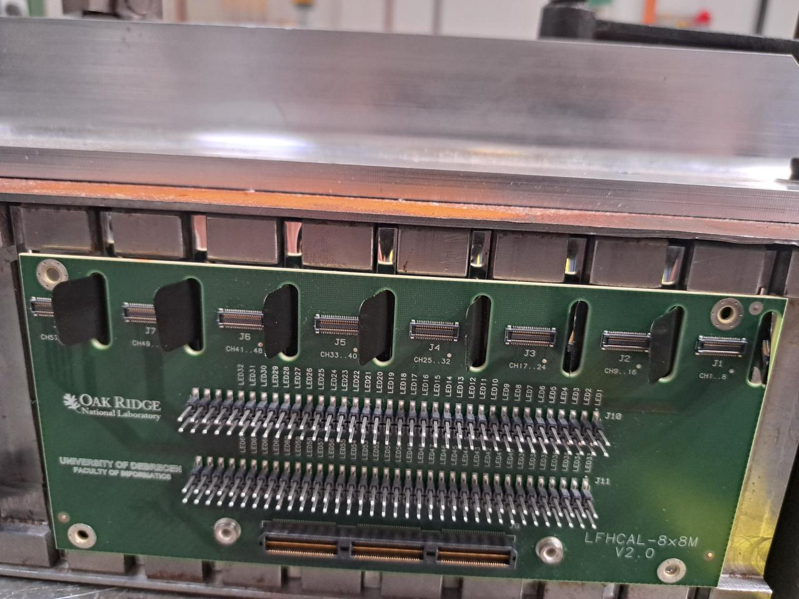
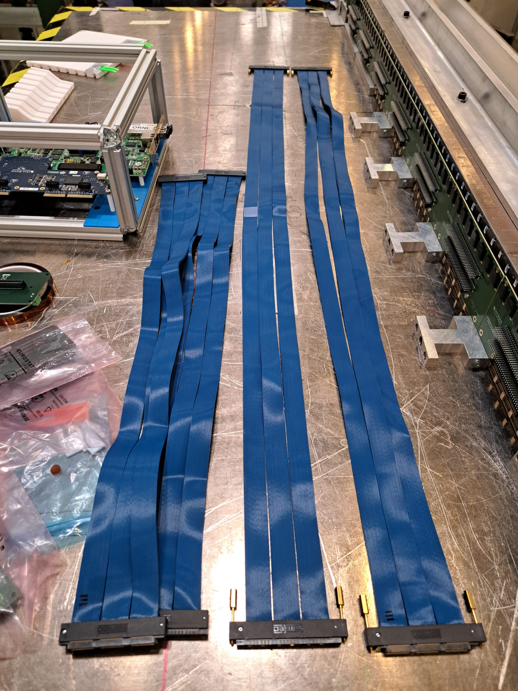

# Creating a Mapping File

## From read-out level to proper geometry- TB 2024-CAEN example&#x20;

In order to translate the different channels in one (or multiple) CAEN readout unit(s) into physical space i.e. layer, column, row and module within our detector, we need to define a mapping file. For the 2024 TB each assembly was connected to an 8 layer connector board, which was then connected to either a CAEN DT5202 or one HGCROC on the KCU.&#x20;

<div><figure><figcaption><p>Connector board for 2024 test beam campaign to connect 8 assembles to one readout unit</p></figcaption></figure> <figure><figcaption><p>Ribbon cables to connect connector board (for 8 assemblies) and 1 readout unit (i.e. CAEN DT5202).</p></figcaption></figure></div>

A picture of the mapping of one CAEN unit to 8 physical layers can be seen below and the full picture of the mapping for the TB is displayed below as well.&#x20;

<figure><figcaption><p>Mapping of individual channels within the assemblies (black text) to the corresponding channels within one CAEN DT5202 readout unit (blue text) using the ribbon cables and 8 layer connector boards. </p></figcaption></figure>

<figure><figcaption><p>Mapping of all layers and channels to the 8 CAEN DT5202 readout unit used in the August 2024 PS TB.</p></figcaption></figure>

To ease the generation of the necessary mapping text file (i.e [2024TB-file](https://github.com/eic/epic-lfhcal-tbana/blob/main/configs/mappingFile_202409_CAEN.txt)) you can use the [CreateMapping.C](https://github.com/eic/epic-lfhcal-tbana/blob/main/NewStructure/CreateMapping.C) macro, as follows:

```
root -b -x -q -l 'CreateMapping.C+("../configs/mappingSingleCAENUnit_simple.txt","../configs/layersCAEN_PSTB_2024.txt","Mapping_output.txt")'
```

Where the first input is the mapping within the one CAEN module and the second the layer to CAEN RU assignment.

In order to analyse any data you need to know which channel in the respective read out unit belongs to which specific channel in the physical space. As an example below the association of a single CAEN unit with the ribbon cable and the full TB using the CAEN units.&#x20;

<figure><figcaption><p>Mapping of the individual channels within one assembly (black text) to one CAEN DT5202 (blue text) unit using the ribbon cables and the 8 layer connector boards from the TB in 2024.</p></figcaption></figure>

