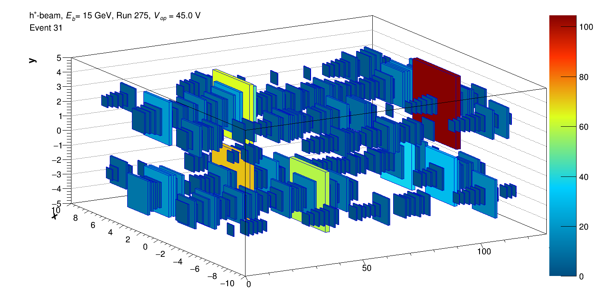
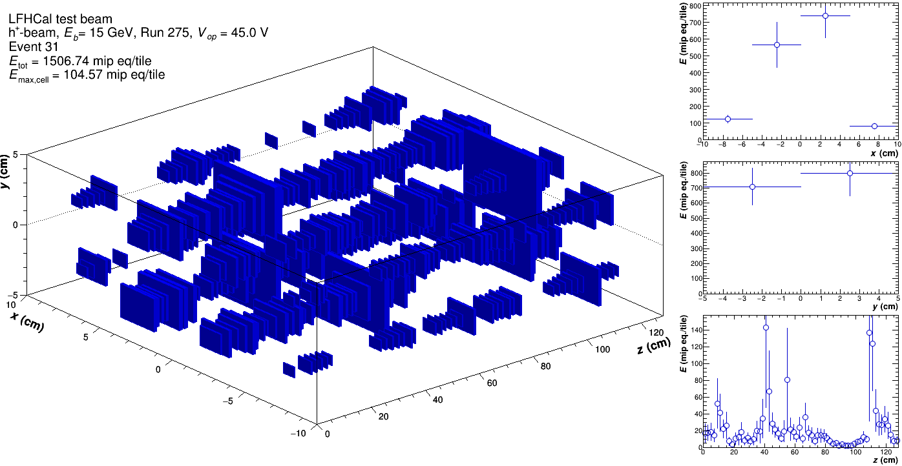
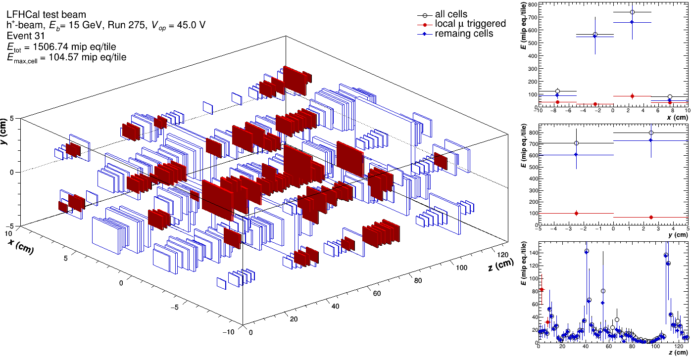

# Simple Event display

## How it works

The main program to run a basic event diplay is the `./Display`. It produces a 3D plot showing the energy depositions in the 2024 test beam geometry, with the sizes and colors corresponding to the bins' contents. It can be run be run either over a particular event in the given run, or a range. It can only be run on calibrated data, otherwise all bins will be filled with `0`.

Sometimes, if run over more than 100 events, the colors are not assigned - to be debugged, the problem doesn't appear when run over a signle event.

Following options are implemented:

* common with the rest of the macros:
  * \`-d\` : switch to debug info with debug level 0 to n
  * \`-F\` : set plot extention expliticly, default is pdf
  * \`-i\` : input file in root format,
  * \`-P\` : plots directory path,
  * \`-r\` : name of run list file,
  * \`-y\` : setting year externally,
* specific for the event display:
  * &#x20;\`-e\` : setting event number to plot, default 0,
  * \`-N\` : setting number of events to plot, default 1,
  * \`-M\` : plot only muon triggered events (in the given range)

Example of how to run it:

```
./Display -d 1 -i $INPUT_FILE -r $RUN_LIST -P $PLOT_DIR -e 5 [-N 10 -M]
```

<figure><figcaption></figcaption></figure>

<figure><figcaption></figcaption></figure>

<figure><figcaption></figcaption></figure>

<figure><figcaption></figcaption></figure>

<figure><figcaption></figcaption></figure>

Alternative views with projections in `X,Y` and `Z` are also provided:

<div><figure><figcaption></figcaption></figure> <figure><figcaption></figcaption></figure> <figure><figcaption></figcaption></figure></div>

## CAEN data

### August 2024 data

The primary script implemented for the event display is `runEventDisplay_2024.sh`:

```bash
bash runEventDisplay_2024.sh $USERNAME $BEAM_TYPE $EVENT_NUMBER $HOW_MANY_EVENTS [muonTrig]
```

where: `$BEAM_TYPE` can be `muon`, `electron`, `hadron.`

## HGCROC data

### November 2025 data

The primary script implemented for the event display to run it on the 2025 data is `runEventDisplay_TB2025.sh` .

```shellscript
bash runEventDisplay_TB2025.sh $USERNAME [tot,adc,full,ped] $NEVT
```

The 2nd option defines which of the information of the HGCROC data should be filled:

* `tot` shows only the ToT values
* `adc` shows the GetIntegratedADC() value after waveform building (i.e. max-ADC so far)
* `full` shows the energy in mip equivalent coming from the calibrated output
* `ped` shows the pedestal subtracted ADC

The last argument defines for how many events you'll be creating the event displays.
