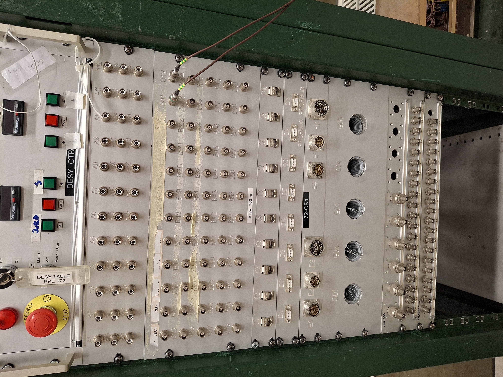
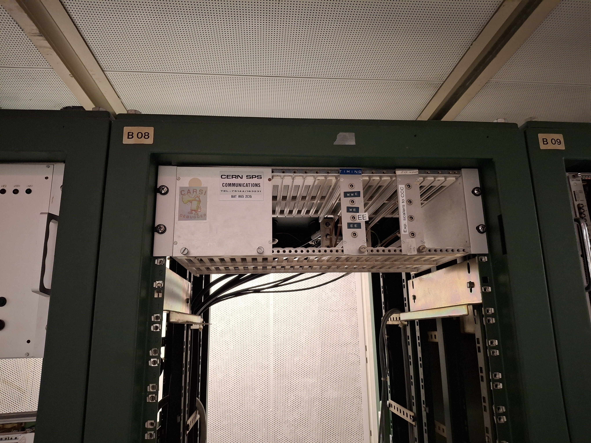

# Beam line specifics

## SPS H2 beam line

<div><figure><figcaption><p>Patch-panel location in H2 area.</p></figcaption></figure> <figure><figcaption><p>Patch-panel in H2 control room (HN383) to TB area.</p></figcaption></figure> <figure><figcaption><p>Patch-panel to CCC (for beam tuning)</p></figcaption></figure></div>

See above for patch panel locations, left most patch panel picture shows patch-panel to CCC for Bastien/Nicos.&#x20;

### Nikhef stage

Nikhef stage can only be steered from down stairs moving panel, locations can be retrieved via raspberry-Pi `ssh -Y pi@h2raspitablepos` (ask Fredi/Oskar for password).&#x20;

Go to `~/H2_LaserDisto`  there are several scripts. Oskar wrote a new version of the position display for us which takes the offsets into account. This can be run with:&#x20;


```bash
#Center position for 2026 LFHCal TB : offset x (horizontal) = 1.298, offset Y (vertical) = 0.853
python3 laser_monitor_dual_mod.py --offsetH 1.298 --offsetV 0.853
```


Then move the stage and watch were it goes.
