# Getting Started HGCROC & Calibrations

## Programming KCU

First of all you need to open source the environment for `vivado` and open it (see commands on ORNL-DAQ computer below).&#x20;

```
// sourcing vivado environment
source Xiling/2025.1/Vivado_Lab/setting64.sh
// open vivado lab
vivado_lab
```

This should bring you to the home screen of vivado. There you should follow the steps listed below

* Open the hardware manager
* Switch on KCU (if not yet done)
* Open target -> auto connect
* program xckcu - firmware version for 1G & 1 HGCROC proto board (v2)
* press play to check setup for each ASIC

## Configuring the HGCROC

The software to configure the HGCROC is called `H2GConfig` (see [link](setting-up-daq-pc.md#software-installation) for details where to find it).  This can be started as follows:

```
// starting HGCROC configuration program
python3 H2GConfig.py
```

<figure>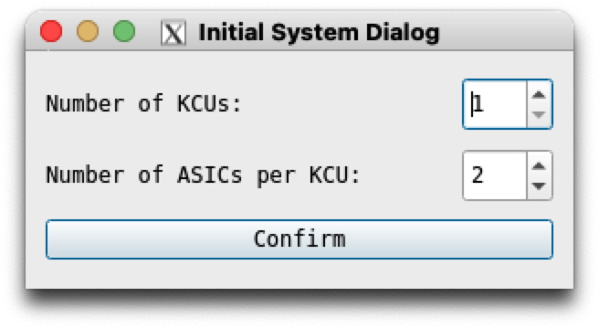<figcaption></figcaption></figure>

This brings up the initial start window make sure you choose the appropriate number of KCU's and Asics (HGCROCs) per KCU. Which should bring you to the main window.&#x20;

<figure>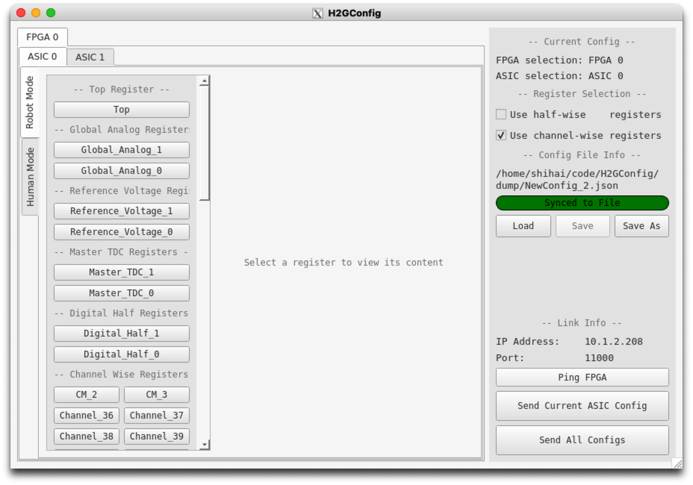<figcaption></figcaption></figure>

To test whether the KCUs are reachable use the `Ping FPGA` button, if that does not work check your network configuration and follow the steps laid out in [link](setting-up-daq-pc.md#setup-network).&#x20;

### Configuration Files

In the `config` folder, you can find the configuration files for the different configurations. Several configurations are provided as examples.

* `udp_config.json`: Configuration for the UDP communication. Including the IP addresses and ports for the different KCUs and the PC.
* `h2gcroc_1v4_r1.json`: Configuration for the H2GCROC registers. **Users should not modify this file**.
* `Example_config.json`: Example I2C configuration for testing the application.

After the first run, a `config.ini` file will be created in the same folder as the application. This file stores the last configuration used by the user. Deleting this file will reset the configuration to the default one.

For a brand new start of the setup please load the configurations&#x20;

* `config_a0.json` for `asic 0`
* `config_a1.json` for `asic 1`&#x20;

You can either do this by pressing `Send Current ASIC Config`  for a single asic or by `Send All Config` for all asics. After reconfiguring the asic using the configuration tool it should be checked that the the data lines and trigger lines have reasonable values using `vivado` for every asic (press `play` and check the values).

<figure><figcaption></figcaption></figure>

### Manual modifications of Configuration values <a href="#user-content-license" id="user-content-license"></a>

The HGCROC has a very large number of configuration parameters and consequently registers which can and/or have to be set. A detailed description of those to the best current knowledge can be found in:



Nearly all of them can be adjusted using the H2GConfig gui in its various tabs which can be accessed via the side panel.

<figure>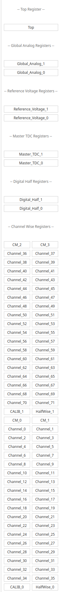<figcaption></figcaption></figure>

Below you find examples of each of the individual register panels, clicking on any of the bit fields will change the bit (0->1 or vice versa) so be careful when clicking randomly in the various positions.&#x20;

<div data-full-width="false"><figure><figcaption></figcaption></figure> <figure>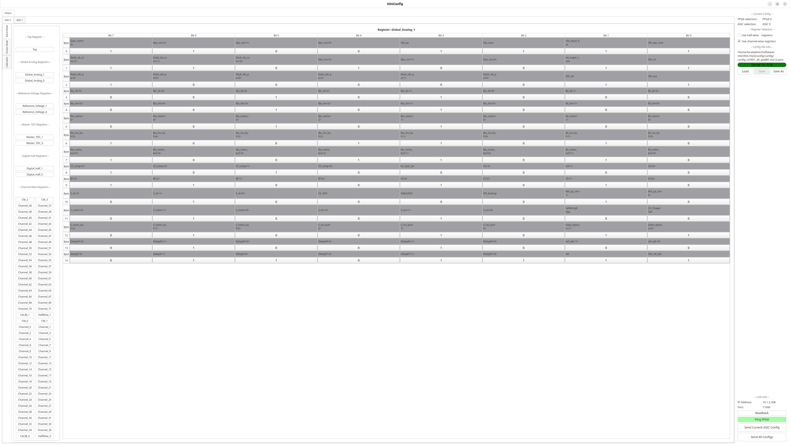<figcaption></figcaption></figure> <figure>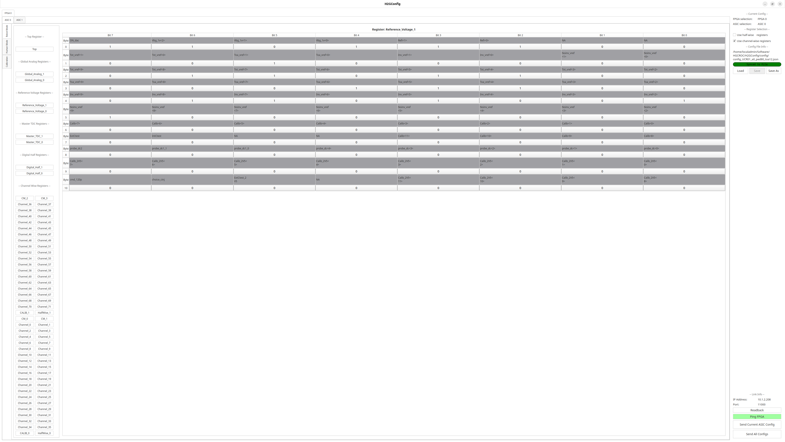<figcaption></figcaption></figure> <figure>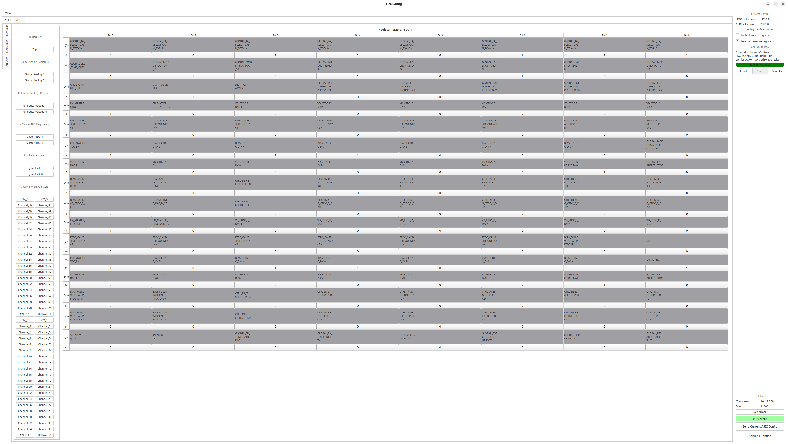<figcaption></figcaption></figure> <figure>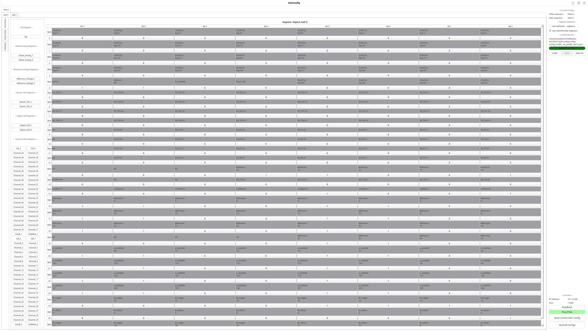<figcaption></figcaption></figure> <figure>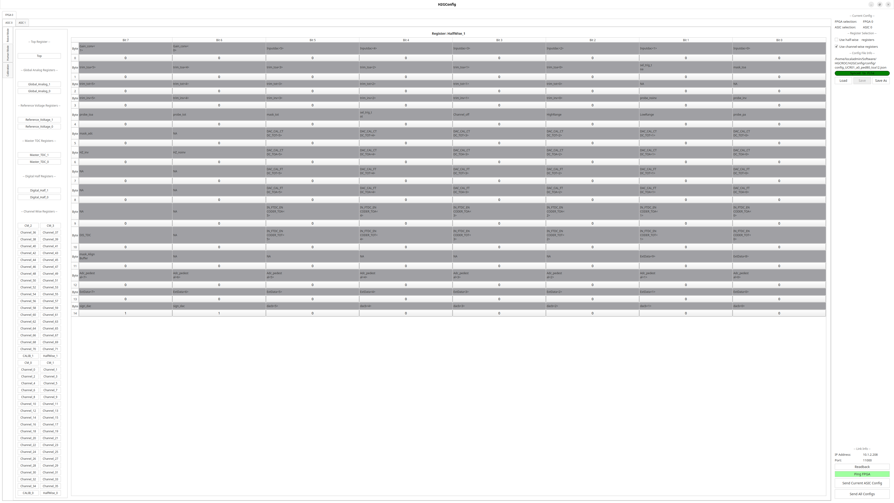<figcaption></figcaption></figure> <figure><figcaption></figcaption></figure> <figure><figcaption></figcaption></figure> <figure><figcaption></figcaption></figure></div>

In order to correctly position the maximum of the signal with respect to the trigger signal you might need to touch the `L1_offset` bits, they can be found under `Digital_Half_0` & `Digital_Half_1`  remember to change them for all necessary ½ chips. The `L1_offset` is an 8bit number increasing the least  significant bit by 1 will shift the waveform to the right by 1 sample.&#x20;

## HGCROC calibration procedure

For the HGCROC there are 4 main calibration steps:

1. **IODelay scan:** Although this isn't really a calibration you'll need to run it everytime you reconfigured the asic (otherwise you data might be nonesense)
2. **Pedestal Calibration:** Determines where the minimum `ADC` value without any signal should be situated (recommended value `80`)
3. **ToA Calibration:** Determines at which threshold value equivalent the _Time of Arrival (ToA)_ is fired (rising edge). ATTENTION: The value we are setting here is given as `injection DAC` (Digital-to-Analog-Converter) which is not equivalent to the `ADC` value referred to during the pedestal calibration. The actual conversion factor between those depends on the SiPM type.&#x20;
4. **ToT Calibration:** Determines at which threshold value equivalent the _Time over Threshold (ToT)_ is fired (falling edge). Once more the settable value is  the `injection DAC` value no the `ADC` value.&#x20;

<div><figure><figcaption></figcaption></figure> <figure><figcaption></figcaption></figure></div>

After these calibrations have been run the **2.5V Internal Injection** test should be run ideally for all channels to validate the thresholds also in `ADC` equivalent. These test however take very long (\~8min/4 channels) and it might not be advisable to run during a test beam setting.

The calibration is handled and steered using `H2GCalib_3B`  package ([link](setting-up-daq-pc.md#software-installation)). Its workflow is as follows.&#x20;

<figure><figcaption></figcaption></figure>

### Calibration Gui

It is highly recommended to run the `100_UI.py` script first. This script provides a user interface for selecting the calibration files and setting various parameters for the calibration process. Once more it will ask in the beginning to select how many KCU's and ASICs per KCU are connected.

<div><figure><figcaption></figcaption></figure> <figure>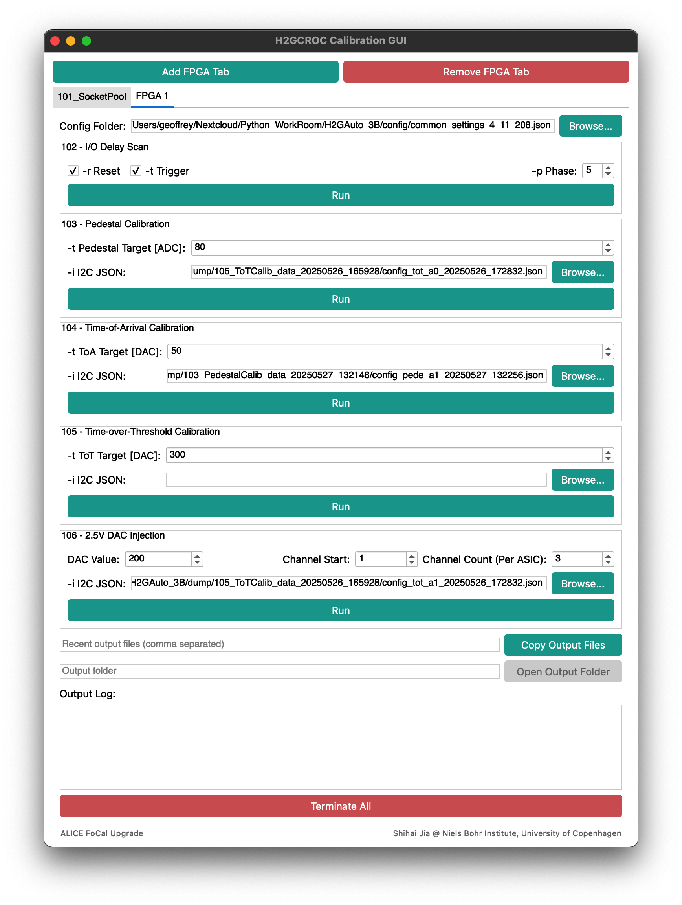<figcaption></figcaption></figure></div>

**Always start 101\_SocketPool before running any other script.** This script will forward the UDP packets from the H2GCROC-3B to the calibration scripts. It is essential for the calibration process to function correctly. Don't forget to terminate the socket before starting any other data taking process.

In the FPGA tab, you can do the IODelay setting, pedestal calibration, ToA calibration, and ToT calibration.

* Config Folder: This is the json file that specifies the UDP address and port of the KCU system.
* The current default configuration: `config/h2gcroc_1v4_r1.json`

### IO-delay scan <a href="#user-content-calibration-scripts-overview" id="user-content-calibration-scripts-overview"></a>

(Estimated running time: < 1 minute)

The IO Delay Scan is used to adjust the timing of the signals received by the FPGA. This is crucial for ensuring that the signals are correctly aligned and processed. **Run this every time you do a power cycle / reprogram the FPGA.**

* -r Reset: If checked, the H2GCROC3B will be hard-reset before starting the scan.
* -t Trigger: If checked, the trigger lines (T0, T1, T2, T3) will also be aligned.
* -p Phase: This is the clock phase setting for the ASICs, make sure it **matches the -i I2C JSON files in the following calibration steps**.

You can find the results of the IO Delay Scan in the `./dump/102_IO_Delay_data_YYYYMMDD_HHMMSS` folder. There will be pdf files for how the IO Delay values are set. The dashed red line indicates the optimal IO Delay value, which should be in the middle of the widest locked region.

<figure>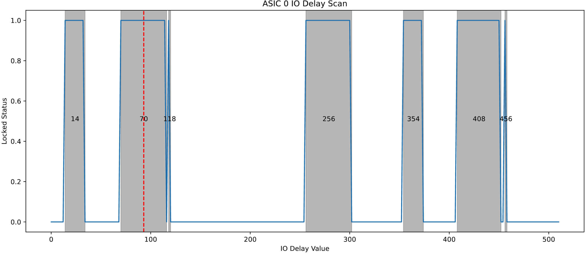<figcaption></figcaption></figure>

After the IO-delay scan finished one should check in `vivado` that the data lines in case of a valid data flag are set to `accccc` , while the trigger lines should be should show a different value.&#x20;

#### Pedestal Calibration

(Estimated running time: \~ 3 minutes)

* -t Pedestal Target \[ADC]: This is the target pedestal value for all the channels. The script will adjust the pedestal values to achieve this target. **Recommended value range: 50-150 ADC.**
* -i I2C JSON: This is the base I2C register configuration file for the H2GCROC-3B. The output register configuration will be based on this file.&#x20;

The output of the pedestal calibration will be new I2C JSON files. And the file paths will be automatically updated into the -i field in the ToA calibration section. The output files will be saved in the `./dump/103_PedestalCalib_data_YYYYMMDD_HHMMSS` folder. The result pdf file will show how the pedestal values are set.&#x20;

As current default configuration `config/default_2024Aug_config.json`  should be used. Make sure the fine channel calibration looks reasonable and no large outliers can be found. If the results aren't satisfactory reset the IO-delays and retry. If after a second attempt the calibration still hasn't succeeded. It could be tried to load a valid calibration from a different proto-board, primarily the `Noinv_vref` and `Inv_vref` bits in the Reference Voltage Register should be adjusted in that case.&#x20;

<div><figure><figcaption></figcaption></figure> <figure><figcaption></figcaption></figure></div>

A good calibration should have the final pedestal values nicely aligned around the target value, with a small spread across all channels.

<div><figure><figcaption></figcaption></figure> <figure><figcaption></figcaption></figure></div>

#### Time-of-Arrivel(ToA) Calibration

(Estimated running time: \~ 45 minutes)

* -t ToA Target \[DAC]: **(NOTE: it is by the unit of injection DAC, not ADC!)** This is the target ToA value for all the channels. The script will adjust the ToA values to achieve this target. **Recommended value range: 20-140 DAC.**
* -i I2C JSON: This is the base I2C register configuration file for the H2GCROC-3B. The output register configuration will be based on this file.

The output files will be updated in the -i field in the ToT calibration section. The output files will be saved in the `./dump/104_ToACalib_data_YYYYMMDD_HHMMSS` folder.&#x20;

The ToA-calibration is currently being executed in 5 steps, starting with a very coarse scanning window to estimate the first `ToA_vRef` values for the different half chips and then decreasing the stepping size an window size successively.  The red line indicated in each vertical column indicated the edge at which the ToA starts firing. These need to be adjusted such that they correspond to the same value (or similar) value for all channels.

<figure><figcaption><p>Typical initial ToA calibration plot. X axis values represent the different channel numbers, while the y-axis values indicate the 12b-internal injection value being evaluated in each 2D bin. The z-axis represents the actual ToA-value. Different colors in different regions indicate a timing offset between the different HGCROC half chips. </p></figcaption></figure>

A good calibration should have the final ToA values like, however the timing alignment of the different halfs (color scale) is currently not performed.&#x20;

<figure><figcaption><p>Result of a good ToA calibration with a target value of 50 DAC as turn on value. </p></figcaption></figure>

#### Time-over-Threshold(ToT) Calibration

(Estimated running time: \~ 30 minutes)

* -t ToT Target \[DAC]: **(NOTE: it is by the unit of injection DAC, not ADC!)** This is the target ToT value for all the channels. The script will adjust the ToT values to achieve this target. **Recommended value range: 200-700 DAC.**
* -i I2C JSON: This is the base I2C register configuration file for the H2GCROC3B. The output register configuration will be based on this file.

The output folder is `./dump/105_ToTCalib_data_YYYYMMDD_HHMMSS`. The result pdf file is in the same format as the ToA calibration. Similarly as for the ToA calibration the calibration is run in 5 steps.&#x20;

<figure><figcaption><p>Typical initial ToT calibration plot. X axis values represent the different channel numbers, while the y-axis values indicate the 12b-internal injection value being evaluated in each 2D bin. The z-axis represents the actual ToT-value. Different colors in different regions indicate a timing offset between the different HGCROC half chips. </p></figcaption></figure>

&#x20;An example of a good ToT calibration result is shown below:

<figure>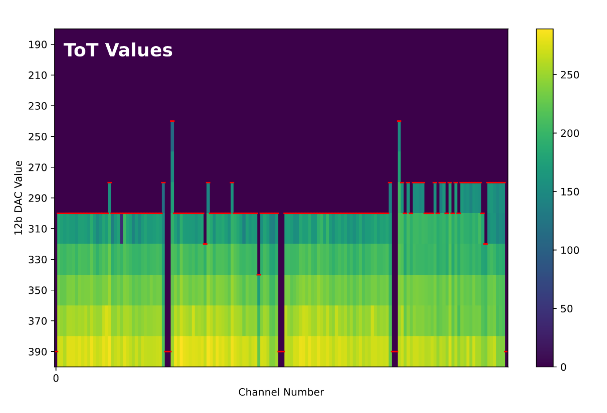<figcaption><p>Result of a good ToT calibration with a target value of 300 DAC as turn on value. </p></figcaption></figure>

#### 2.5V DAC Internal Injection

(Estimated running time: \~ 50 minutes for all channels and all phases)

This script is used to inject a 2.5V DAC signal into the H2GCROC3B channels for calibration purposes. It is not part of the main calibration flow but can be used for additional testing and verification.

* DAC Value: This is the 12-bit DAC value to be injected into the channels.
* Channel Start: the starting channel number for the injection.
* Channel Count: the number of channels to be injected for each ASIC.
* -i I2C JSON: This is the base I2C register configuration file for the H2GCROC3B. The output register configuration will be based on this file.

The output files will be saved in the `./dump/106_Injection2V5_data_YYYYMMDD_HHMMSS` folder. The result pdf file will show the injected signal and the response of the channels. This can be used to verify the calibration results and the performance of the H2GCROC3B.

<figure><figcaption></figcaption></figure>

