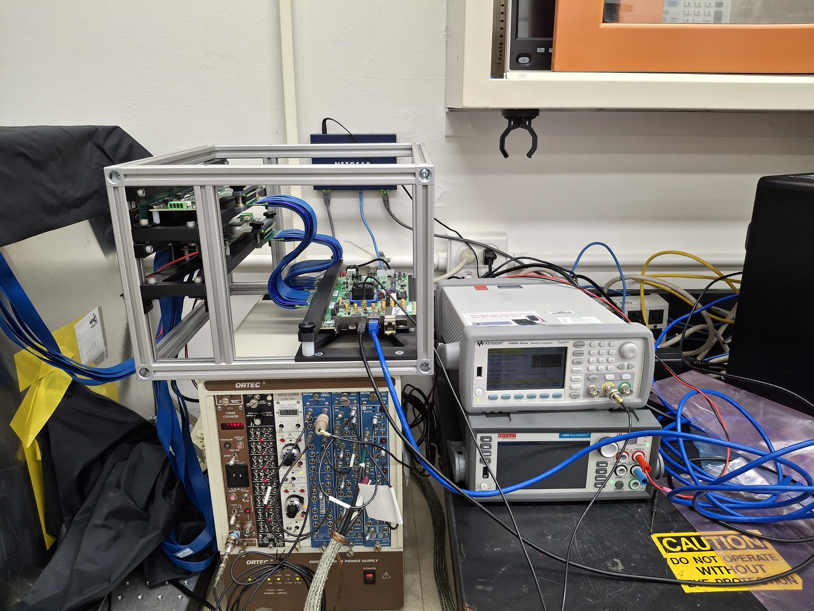
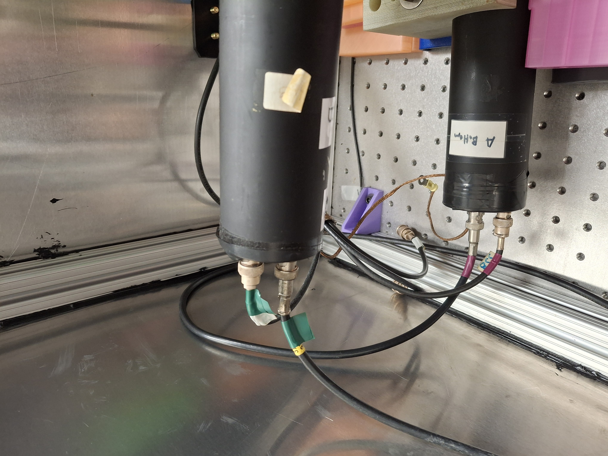
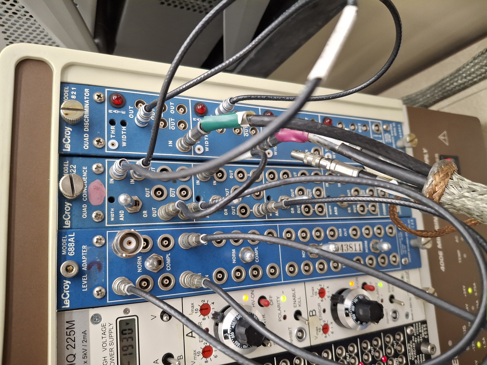
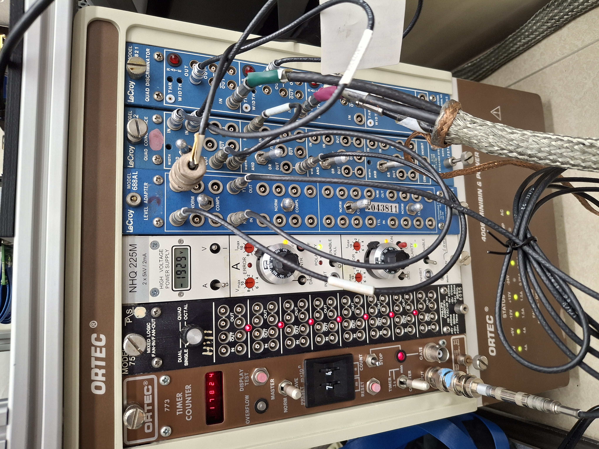
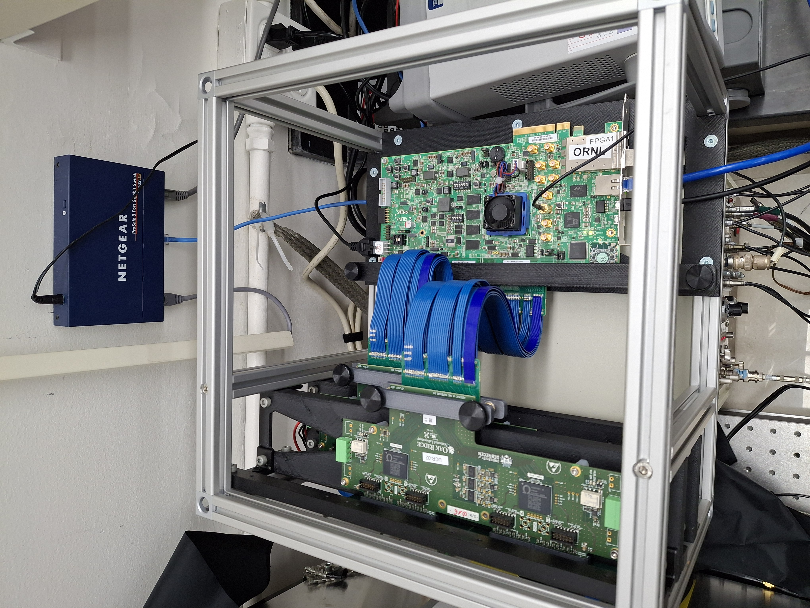
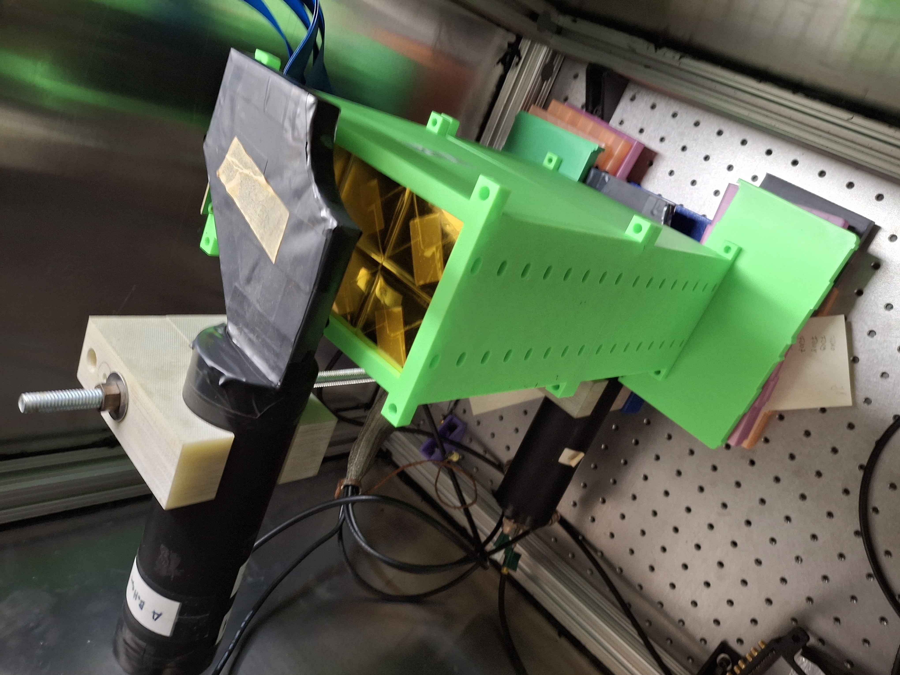
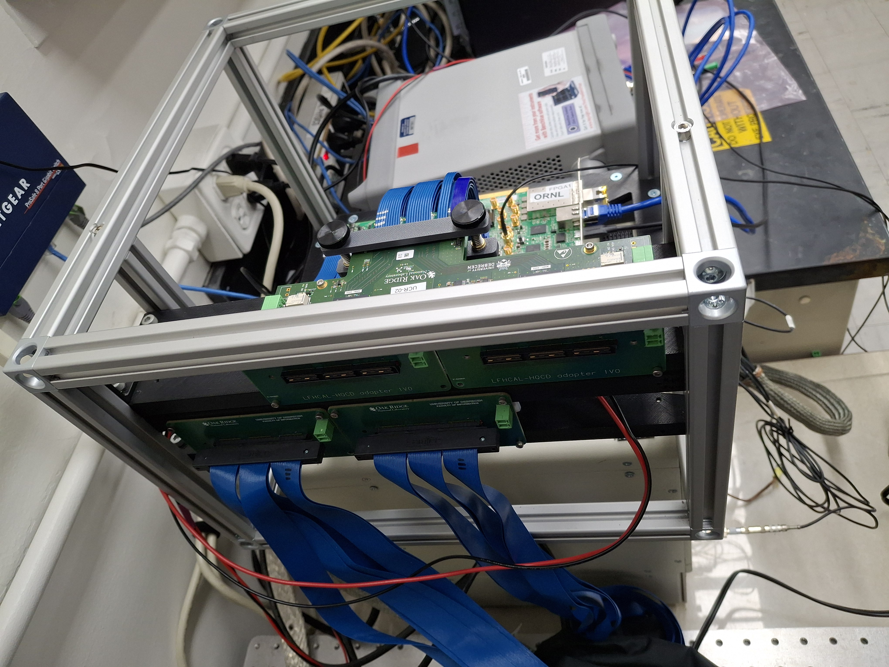

# Setting up the HGCROC board

<figure><figcaption></figcaption></figure>

The following cables need to be connected in order to setup the HGCROC for local testing:

* ethernet (either 1GbE or 10GbE connections) - make sure to use CAT7 ethernet cables if you choose 10GBase-T SFP + copper ethernet cables. Otherwise fiber connection with appropriate network card and apaters would work too.
* Power ([replacement](https://www.digikey.fr/en/products/detail/sl-power-advanced-energy/TE90A1251N01/6580452))
* programming cable (micro USB to USB-A) from DAQ computer
* HV cables to HGCROC proto boards - individually for each HGCROC ([connectors](https://www.digikey.com/en/products/detail/phoenix-contact/1803594/260531))
* SMA inputs for external triggering and syncronization. **ATTENTION:** these should only be provided with 1.8 V (step down from classical 5V NIM signal needed).

Details on where each cable goes can be found in the picture above. Don't forget to also set the jumper ti provide only 1.2 V after boot (right side red box in picture).

### ORNL test stand setup

<figure><figcaption></figcaption></figure>

In the darkbox 2 PMT are arranged in a vertical coincidence stack.&#x20;

* top: green labels - should be operated at 1771 V, \~330 muA
* bottom: pink labels - should be operated at 1940V, \~300 muA

<figure><figcaption></figcaption></figure> <figure><figcaption></figcaption></figure> <figure><figcaption></figcaption></figure>

Use waveform generator as level converter with external trigger BC entering in the back. Settings of waveform generator should be:

* Trigger setup: external
* Burst setup: set level correctly to 1.8V&#x20;

<figure><figcaption></figcaption></figure>

The ORNL setup is setup with 2 HGCROC proto-boards with 2 FMC cables as extensions of the on board FMC connectors (160 pin version -[HDR-169468-02](https://www.digikey.com/en/products/detail/samtec-inc/HDR-169468-02/6678215)) to which in principle a total of 4x 8 layers of the 8M scintillators layers can be connected.&#x20;

<figure><figcaption></figcaption></figure> <figure><figcaption></figcaption></figure> <figure><figcaption></figcaption></figure> <figure><figcaption></figcaption></figure>

