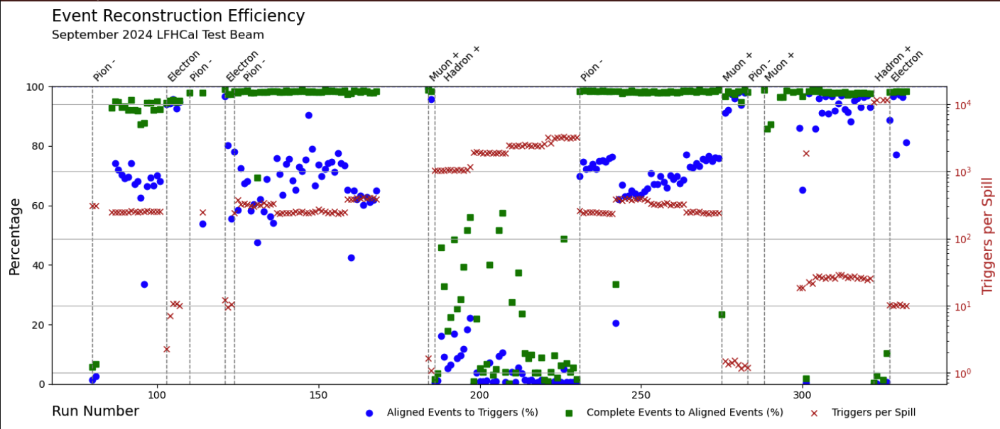
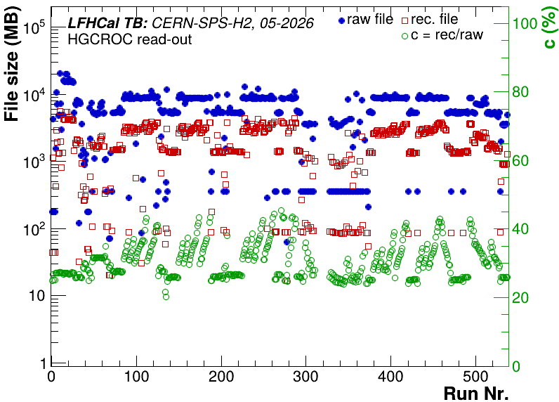
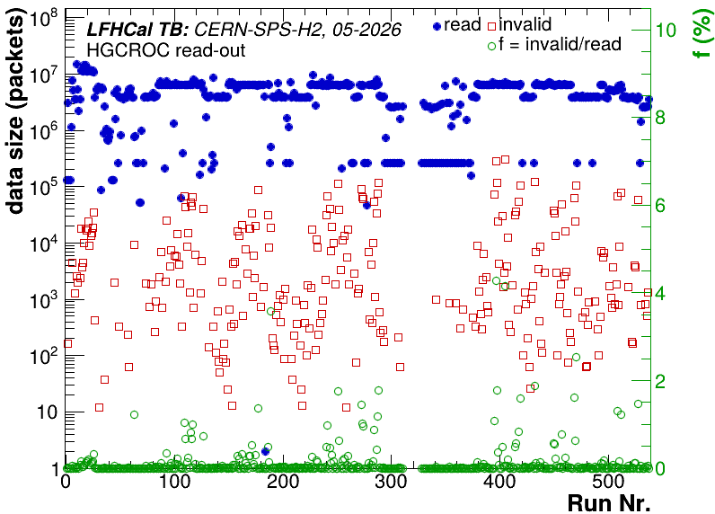
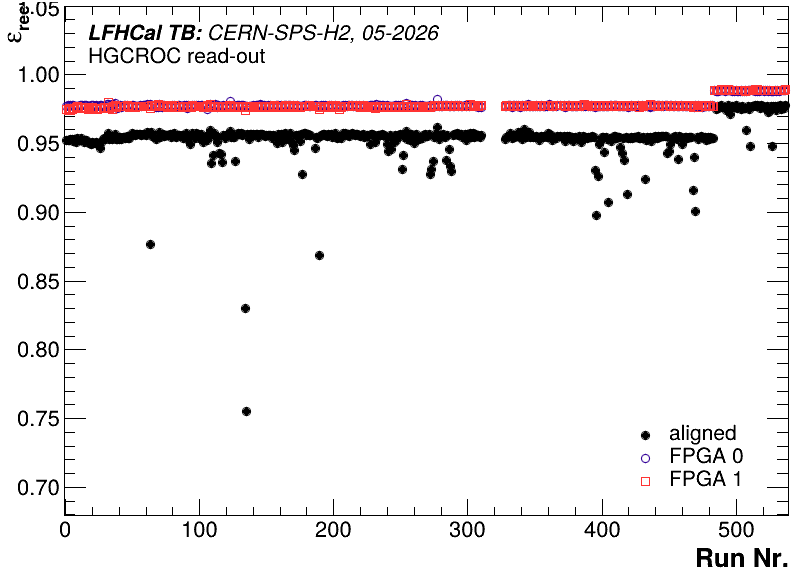
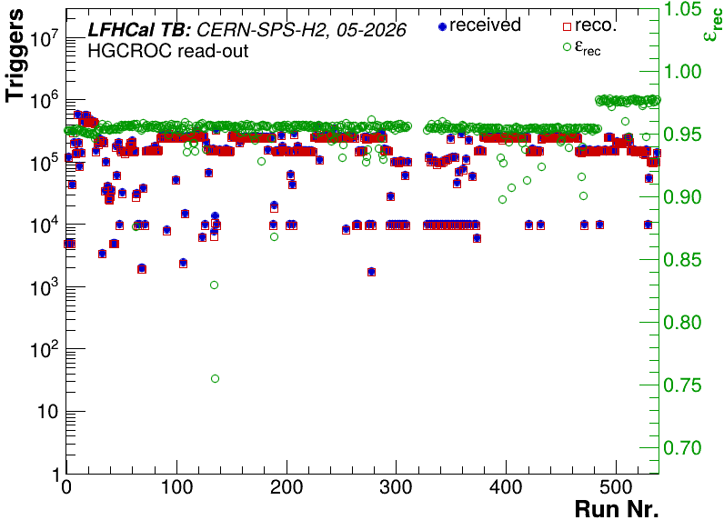
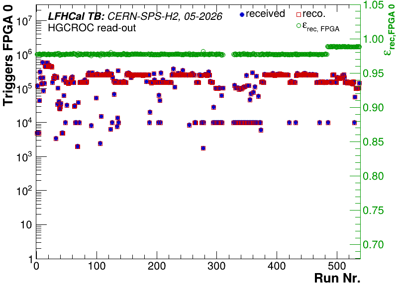
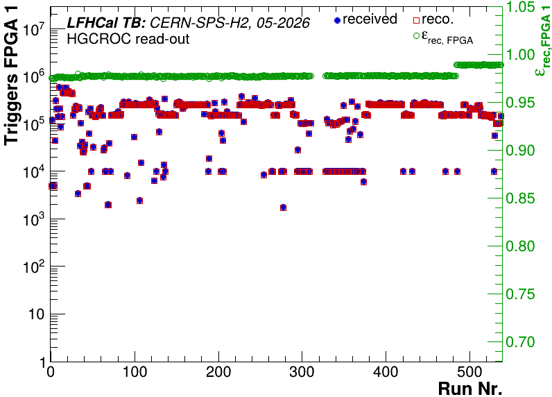
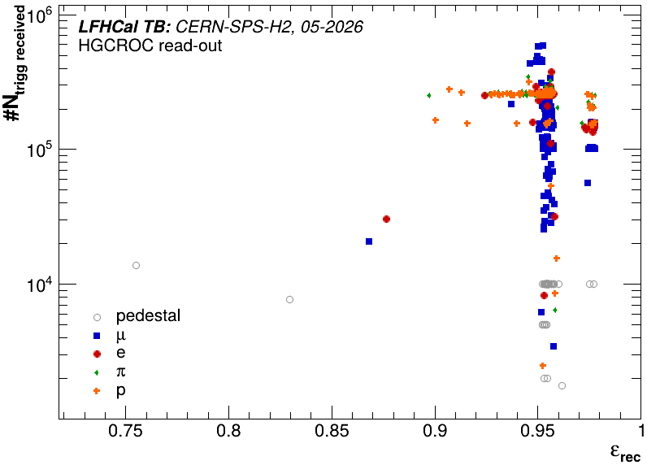

# Converting the data

## CAEN data conversion

### Single file

Running the data conversion for a single file can be done as follows for the 2024 data:

```sh
# enter the NewStructure directory ()
cd NewStructure
# make sure latest version of Convert is compiled (run make in your original software directory)
# run program
./Convert -d 1 -f -c $RAWDataFile.txt -o $CONVERTEDFILE.root -m $MAPPINGFILE -r $RUNLISTFILE
```

The primary option here is `"-c $RAWDataFile.txt"` which tells the program to convert the data based on the data format we used in August 2024, with the input being a txt file (originally named: RunXXX\_list.txt, where XXX is the run number) and the option `-o $CONVERTEDFILE.root` tells it to store the output in `$CONVERTEDFILE.root`. The `-m $MAPPINGFILE & -r $RUNLISTFILE` give the configurations for the setup of the readout and are mandatory. For the 2024 data these are:

```bash
$MAPPINGFILE='../configs/mappingFile_202409_CAEN.txt'
$RUNLISTFILE='../configs/DataTakingDB_202409_CAEN.csv'
```

They are located in the same git repository. How to create a different mapping file is explained [here](../calibration/other-useful-function-during-calibration.md#creating-a-mapping-file). The option `-f`, enforces the overwriting of the output files in case they existed already. Option `-d 1` enables basic debugging output. This debug flag can be increased allowing you to see a bit better what's going on in case something goes wrong.

Should the data format of the Janus software used for the data taking with the CAEN DT5202 have changed (currently implemented versions: 3.3 & 3.1) for the files you would like to convert, you will have add the corresponding parser in `bool Analyses::ConvertASCII2Root(void)` of [Analysis.cc](https://github.com/eic/epic-lfhcal-tbana/blob/main/NewStructure/Analyses.cc).

_For the September 2023 data unfortunately the majority of the raw txt-files has been lost and only a previous version of the converted data into a root format remains. For those you can provide the file_ `"-c $RAWDataFile.root"` _which should automatically trigger the data conversion based on the old root format. DO NOT TRY THIS WITH A CONVERTED FILE IN THE NEW FORMAT!_

For convenience we prepared several scripts which already contain basic setups with the run numbers options needed to convert the data in the correct way. We recommend using those for the massive conversion of data (see below).

### **September 2023 data**

The data taken in September 2023 at the SPS-H4 beam line, was taken without absorber plates present. The logbook can be found [here](https://docs.google.com/spreadsheets/d/1GBmztS66Cagwr1mpXuaDmIfSKAuhBm1gmhhpk7qSgbg/edit?usp=sharing), if you don't have access please ask Friederike for it.\
The raw data for this campaign was unfortunately partially lost and thus a separate routine had to be introduced reading the data from the initially converted root files. The conversion can be done with:

```sh
bash convertData_Sept2023.sh $USERNAME [single/all]
```

As for the `prepareAnalysisDirectory.sh`, please add your username and the path to the data. The script is under construction and even under all might only have few runs commented in, feel free to uncomment the rest.

### **October 2023 data**

The data taken in October 2023 at the PS-T09 beam line, was taken with only 14 layers, parasitic to the FOCal-E with various number of thin tungsten plates infront of the mini-LFHCal module. The logbook can be found [here](https://docs.google.com/spreadsheets/d/1oRI3KlPyHouo5P4J70wLrGlaFaeNuLCGMCwyNxyNMf4/edit?usp=sharing), if you don't have access please ask Friederike for it.\
This data was taken with a previous version of the Janus software, as such the reading works a little differently. So far only the data converter has been tested and adapted

```sh
bash convertData_Oct2023.sh $USERNAME [single/all]
```

As for the `prepareAnalysisDirectory.sh`, please add your username and the path to the data. The script is under construction and even under all might only have few runs commented in, feel free to uncomment the rest.\
Attention for a few runs (201,202,203,204,205), the converter will fail as a few channels were accidentally masked breaking the conversion. This data will have to be discarded. As we further develop the code more functionality will become available.

### **August 2024 data**

The data taken in August/September 2024 at the PS-T09 beam line is the first data available for a full module. The logbook can be found [here](https://docs.google.com/spreadsheets/d/1XaiSmG4jBaBOyjbjdiNuSeehjeZC03_2A7Ccoq0nIbI/edit?usp=sharing), if you don't have access please ask Friederike for it. A summary of the CAEN data taking campaign can be found on our [wiki](https://wiki.bnl.gov/EPIC/index.php?title=LFHCal_Fall_2024_Test_Beam).\
The data conversion can be done using the script

```sh
bash convertData_2024.sh $USERNAME [single/all/electrons[A-H]/hadrons[A-C]/...]
```

As for the `prepareAnalysisDirectory.sh`, please add your username and the path to the data. This script so far contains all pedestal and muon runs under the flag `all`. Further runs will be added in the future, so please check frequently what options you have for the 2nd argument.

## HGCROC data conversion

For the HGCROC data conversion also takes care of the event building and synchronization checks of the KCUs.

The HGCROC data in general is structured in a 10bit ADC, a 10 bit Time-of-Arrival (ToA) with 25 ps resolution and a 12 bit Time-over-Threshold (ToT) value with 50 ps resolution. The signals from ADC and ToT by default don't overlap (switchable range) and have different processing times, which have to be aligned during data taking. For every trigger we operate the HGCROC in a mode where it takes multiple samples (machine gun setting). A detailed presentation on the data-format and the status of the DAQ-software during the 2024 test beam can be found[ here](https://indico.phy.ornl.gov/event/680/contributions/2673/attachments/2043/4563/protzman_HGCROC.pdf).

### Single file

A single file can be converted as follows:

```sh
# as recorded
./Convert -d [0-5] -f -w -c $RAWDataFile.h2g -o $CONVERTEDFILE.root -m $MAPPINGFILE -r $RUNLISTFILE
# with truncation of ADC to leading 8 bits
./Convert -d [0-5] -t -f -w -c $RAWDataFile.h2g -o $CONVERTEDFILE.root -m $MAPPINGFILE -r $RUNLISTFILE
```

The crucial option, which allows us to decode the HGCROC data is given by `"-w"`. If this option is not provided the program will crash trying to read the hgcroc file-format. The option `-f`, enforces the overwriting of the output files in case they existed already. Option `-d 1` enables basic debugging output. This debug flag can be increased allowing you to see a bit better whats going on in case something goes wrong.

Similarly as for the CAEN-data conversion the input is defined after the `"-c"` option as `$RAWDataFile.h2g` this file is a packaged file provided by the HGCROC-daq and is rather complex to read in plain text. The converted file will be written to the file name after the `"-o"` option `$CONVERTEDFILE.root` . The geometry and run dependent setup setting are given by the mapping file `$MAPPINGFILE` and the `$RUNLISTFILE`. Please be aware that we changed the order of KCUs and some layers during the data taking. Hence 3 different mapping files re provided, which should only be applied to the listed runs.

```sh
#*********************************************************************
# 2024 Data taking campaign
#*********************************************************************
# Runs 5-67
$MAPPINGFILE='../configs/TB2024/mapping_HGCROC_PSTB2024_Run5-67_alternate.txt'
# Runs 68-117
$MAPPINGFILE='../configs/TB2024/mapping_HGCROC_PSTB2024_Run68-117_alternate.txt'
# Runs 118-337
$MAPPINGFILE='../configs/TB2024/mapping_HGCROC_PSTB2024_Run118-337_alternate.txt'
$RUNLISTFILE='../configs/TB2024/DataTakingDB_202409_HGCROC.csv'

#*********************************************************************
# 2025 Data taking campaign
#*********************************************************************
# layers 0-32 equipped - FullScan A & B + HV scan + electron Scan + Hadron configuration 1 
$MAPPINGFILE='../configs/TB2025/mapping_HGCROC_PSTB2025_default.txt'  
# layers 0-24, 33-40 equipped - Hadron configuration 2 
$MAPPINGFILE='../configs/TB2025/mapping_HGCROC_PSTB2025_config2.txt'    
# layers 0-16, 25-32, 41-49 - Hadron configuration 3 
$MAPPINGFILE='../configs/TB2025/mapping_HGCROC_PSTB2025_config3.txt'    
# layers 0-16, 33-40, 50-58 - Hadron configuration 4
$MAPPINGFILE='../configs/TB2025/mapping_HGCROC_PSTB2025_config4.txt'
# full list of runs
$RUNLISTFILE='../configs/TB2025/DataTakingDB_202511_HGCROC.csv'

#*********************************************************************
# 2026 - PS Data taking campaign
#*********************************************************************
# V2 summing bpard - mapping file - Runs 1- 378
$MAPPINGFILE='../configs/TB2026/mapping_HGCROC_PST10TB_sumV2_default_inv.csv'
# V1 summing board - mapping file - Runs 379-468
$MAPPINGFILE='../configs/TB2026/mapping_HGCROC_PST10TB_sumV1_default_inv.csv'
# full list of runs
$RUNLISTFILE='../configs/TB2026/DataTakingDB_TBPST10_202604_HGCROC.csv'
#*********************************************************************
# 2026 - SPS Data taking campaign
#*********************************************************************
# V2 summing board - mapping file - Runs 1- 483 
$MAPPINGFILE='../configs/TB2026/mapping_HGCROC_SPSH2TB_sumV2_default.csv'
# V1 summing board - mapping file - Runs 484 - 537
$MAPPINGFILE='../configs/TB2026/mapping_HGCROC_SPSH2TB_sumV1_default.csv'
# full list of runs
$RUNLISTFILE='../configs/TB2026/DataTakingDB_TBSPSH2_202605_HGCROC.csv'
```

You can find the code which is actually executed in [HGCROC\_Convert.cc](https://github.com/eic/epic-lfhcal-tbana/blob/main/NewStructure/HGCROC_Convert.cc)

`int run_hgcroc_conversion(Analyses *analysis, waveform_fit_base *waveform_builder)`

This code depends on the external submodule-package h2g\_decode which originally can be found [here](https://github.com/tlprotzman/h2g_decode/) and is used for decoding the HGCROC data more generally also from other test beams. A simple description on how to run the standalone code for the data decoding can be found [here](../hgcroc-setup-test-beam/data-decoding-10g.md), which offers more debug output, which is currently suppressed during the normal running.

### Data decoding procedure

In its current state the data conversion (also called decoding) takes care to only take events with full waveforms in each ASIC and fully synced events among the different KCU's (FPGAs). The syncronization routines are handled as followed for the different data formats:

* **2024:**
  * <mark style="background-color:$danger;">Needs to be described.</mark>
* **2025/2026:**
  * The synchronization for these data sets takes as primary variable the event counters (Internal (random generated events) and External). They are aligned with the primary trigger case for the respective run: pedestals (Internal) and normal data taking (external). This routine is implmented in: [event\_aligner::align\_v013()](https://github.com/tlprotzman/h2g_decode/blob/abda9e609b6f4d7928bd9bca27ae1b76106393a4/src/event_aligner.cxx#L225). However due to various reasons there can be an initial offset among the various FPGA counters. Hence the time stamp difference to the next event is also considered. If the time stamp difference is `< 20` among all successive events in the various FPGAs (KCUs) an event is considered aligned. Which then also allows to determine the initial counter offset.
  * After that the recalculated trigger counters have to be the same and the time stamp difference to the next event among all FPGA's can not exceed `20` in order to be considered as an aligned event.
  * The current event which has been newly determined to be aligned among all FPGAs is written to file and the next event flag as aligned. Any potential counter offset for the next event is corrected.
  * Should it not be possible to align at least 1 event within `maxFailedAttempts = 20` the entire stack of correctly assembled KCU events is deleted, except the last event in the list. Further cleaning of the lists is done to remove already aligned events and stale KCUevents which could not be assembled previously. These features are implemented in [hgc\_decoder::process\_v013\_packet()](https://github.com/tlprotzman/h2g_decode/blob/abda9e609b6f4d7928bd9bca27ae1b76106393a4/src/hgc_decoder.cxx#L234).

So far no CRC or hamming validation has been imposed during the decoding stage and hence some of the data might show odd features. These check, however, need to be implemented in the future.

If you can would like to evaluate the successrate yourself on your computer you can give a list of runs to the macro: [EvaluateRecoEffi.cc](https://github.com/eic/epic-lfhcal-tbana/blob/main/NewStructure/EvaluateRecoEffi.cc)


```bash
./EvaluateRecoEffi -i $LISTRECFILES -r $RunList -o $OutputDirectory -u $PathToRawData
```


### August 2024 data

The data taken in August/September 2024 at the PS-T09 beam line is the first data available for a full module. The logbook can be found [here](https://docs.google.com/spreadsheets/d/1XaiSmG4jBaBOyjbjdiNuSeehjeZC03_2A7Ccoq0nIbI/edit?usp=sharing), if you don't have access please ask Friederike for it. A summary of the HGCROC data taking campaign can be found on our [wiki](https://wiki.bnl.gov/EPIC/index.php?title=LFHCal_Fall_2024_Test_Beam).\
A first version of a script for the data conversion is provided within the repository and can be operated with the following options:

```sh
bash convertDataHGCROC_2024.sh $USERNAME $OPTION [convert|merge]
```

As for the `prepareAnalysisDirectory.sh`, please add your username and the path to the data. Currently the following options are supported for `$OPTION`:

* `muons` This options contains all muon runs and can be run with the additional options `convert` to convert the files and afterwards with the `merge` option to combine the muon data in one file.
* `electrons` Contains all currently processible electron runs, only the `convert` option is implemented.
* `hadrons` Contains all currently processible hadron runs, only the `convert` option is implemented.
* `muonsTruncated` This options contains all muon runs and can be run with the additional options `convert` to convert the files and afterwards with the `merge` option to combine the muon data in one file. <mark style="color:$danger;">This is a developper option!</mark> It masks the 2 least significant bits of the `ADC` during the conversion already, as those might be corrupted.

Before running please check the options and adapt your file locations under the $USERNAME switch.

Unfortunately the HGCROCs for the 2024 data taking campaign where slightly miscalibrated and consequently the 2 least significant bits of the ADC arrive at random time and thus are not usable and might be needed to be masked as a result.

<figure><figcaption><p>Current event reconstruction and alignment efficiency for 2024 August data set.</p></figcaption></figure>

### November 2025 data

The data taken in November 2025 at the PS-T09 beam line is the first data available for two partially equipped modules. The logbook can be found [here](https://docs.google.com/spreadsheets/d/1tc_KLUMhwJrBogFjsjBnNOpXBwK5WI-F_jRqebx8ZgQ/edit?usp=sharing), if you don't have access please ask Friederike for it. A summary of the HGCROC data taking campaign can be found on our [wiki](https://wiki.bnl.gov/EPIC/index.php?title=LFHCal_Fall_2025_Test_Beam).\
A script for the data conversion can be found and run as follows:

```bash
bash convertDataHGCROC_2025.sh $USERNAME $OPTION convert
```

As for the `prepareAnalysisDirectory.sh`, please add your username and the path to the data. The script contains all useful physics or calibration data, however you need to check whether those you would like to analyse are commented in the committed version. Implemented options right now are:

* `FullSetA` - All runs belonging to the set taken at HV = 44 V
* `FullSetB` - All runs belonging to the set taken at HV = 45 V
* `DepthScan1` - All runs belonging to the configuration 1 hadron depth scan
* `DepthScan2` - All runs belonging to the configuration 2 hadron depth scan
* `DepthScan3` - All runs belonging to the configuration 3 hadron depth scan
* `DepthScan4` - All runs belonging to the configuration 4 hadron depth scan
* `ElectronScan` - All runs belonging to the electron set taken at HV = 42.5 V
* `MuonHVScans` - All runs belonging to both HV scans

A merge option has been implemented for all the above options that can be run after the converter. This will merge all the runs of a set (e.g., pedestals, muon sets, runs of a given species at a specific bias voltage or beam energy, etc.) into one file.

### April 2026 data

The data taken in April 2026 at the PS-T09 beam line is the first data available for two fully equipped modules with summing. The logbook can be found [here](https://docs.google.com/spreadsheets/d/1329ze8jV5zhjJB1bgE1k_apoWSrbqoO32WS-uWdnI-4/edit?usp=sharing), if you don't have access please ask Friederike for it. A summary of the HGCROC data taking campaign can be found on our [wiki](https://wiki.bnl.gov/EPIC/index.php?title=LFHCal_Fall_2026_Test_Beam).\
A script for the data conversion can be found and run as follows:

```bash
bash convertDataHGCROC_TBPST10_2026.sh $USERNAME $OPTION convert
```

As for the `prepareAnalysisDirectory.sh`, please add your username and the path to the data. The script contains all useful physics or calibration data, however you need to check whether those you would like to analyse are commented in the committed version. Implemented options right now are:

* `HVScan1` - all runs belonging to the first full HV scan, summing board V2
* `FirstPosScanMuons` - all runs belonging to the first muon position scan, summing board V2
* `SetA-PosScanMuons` - all runs belonging to the position scan at the beginning of Set A, summing board V2
* `FullSetA` - all runs belonging to the set taken at 43V, with the original pream setting, summing board V2
* `FullSetB` - all runs belonging to the set taken at 42.5V, with the original pream setting, summing board V2
* `FullSetC` - all runs belonging to the set taken at 44V, with the original pream setting, summing board V2
* `FullSetD` - all runs belonging to the set taken at 44V, with the optimized pream setting, summing board V2
* `FullSetE` - all runs belonging to the set taken at 43V, with the optimized pream setting, summing board V2
* `FullSetG` - all runs belonging to the set taken at 43V, with the optimized pream setting, summing board V1
* `FullSetH` - all runs belonging to the set taken at 44V, with the optimized pream setting, summing board V1, hadrons/electrons large scint
* `PartSetI` - all runs belonging to the set taken at 44V, with the optimized pream setting, summing board V1

Similar as for the previous scripts also a merge option has been implemented. This will merge all necessary runs of a set, i.e all muon runs into one file. However, the converter has to have been run a priori for this to work.

```bash
bash convertDataHGCROC_TBPST10_2026.sh $USERNAME $OPTION merge
```

### May 2026 data

The data taken in May 2026 at the PS-T09 beam line is the first data available for two fully equipped modules with summing. The logbook can be found [here](https://docs.google.com/spreadsheets/d/1329ze8jV5zhjJB1bgE1k_apoWSrbqoO32WS-uWdnI-4/edit?usp=sharing), if you don't have access please ask Friederike for it. A summary of the HGCROC data taking campaign can be found on our [wiki](https://wiki.bnl.gov/EPIC/index.php?title=LFHCal_Fall_2026_Test_Beam).\
A script for the data conversion can be found and run as follows:

```bash
bash convertDataHGCROC_TBSPSH2_2026.sh $USERNAME $OPTION convert
```

As for the `prepareAnalysisDirectory.sh`, please add your username and the path to the data. The script contains all useful physics or calibration data, however you need to check whether those you would like to analyse are commented in the committed version. Implemented options right now are:

* `InitMuon` - all runs belonging to the Initial muon scan
* `FullSetA` : Full scan of muons, electrons & hadrons, HV = 43 V, summing board V2, Preamp settings 9 7 10 1? - aborted due to wrong pedestals
* `FullSetB` : Full scan of muons, electrons & hadrons, HV = 43 V, summing board V2, Preamp settings 9 7 10 1?
* `FullSetC` : Full scan of muons, electrons & hadrons, HV = 44 V, summing board V2, Preamp settings 9 7 10 5
* `FullSetD` : Full scan of muons, electrons & hadrons, HV = 45 V, summing board V2, Preamp settings 9 7 10 4?
* `FullSetE` : Full scan of muons, electrons & hadrons, HV = 44 V, summing board V2, Preamp settings 12 7 3 1
* `FullSetF` :Full scan of muons, electrons & hadrons, HV = 45 V, summing board V2, Preamp settings 12 7 3 1
* `FullSetG` : Full scan of muons, electrons & hadrons, HV = 45 V, summing board V1, Preamp settings 12 7 3 1
* `ParameterScan` : Scan of preamplification setting using muons, V2 summing board
* `HVScan` : HV scan with default preamplification settings using muons & V2 summing board

Similar as for the previous scripts also a merge option has been implemented. This will merge all necessary runs of a set, i.e all muon runs into one file. However, the converter has to have been run a priori for this to work.

```bash
bash convertDataHGCROC_TBPST10_2026.sh $USERNAME $OPTION merge
```

Below you find various QA plots for the conversion.

<div><figure><figcaption></figcaption></figure> <figure><figcaption></figcaption></figure></div>

<div><figure><figcaption></figcaption></figure> <figure><figcaption></figcaption></figure> <figure><figcaption></figcaption></figure> <figure><figcaption></figcaption></figure></div>


<div><figure><figcaption></figcaption></figure> <figure><figcaption></figcaption></figure> <figure><figcaption></figcaption></figure></div>

<div><figure><figcaption></figcaption></figure> <figure><figcaption></figcaption></figure></div>
