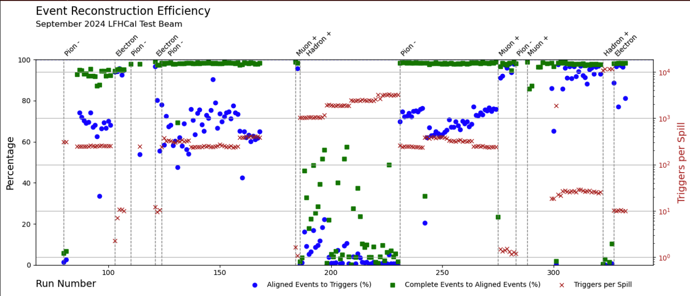

# Converting the data

## CAEN data conversion

### Single file

Running the data conversion for a single file can be done as follows for the 2024 data:&#x20;

```sh
# enter the NewStructure directory ()
cd NewStructure
# make sure latest version of Convert is compiled (run make in your original software directory)
# run program
./Convert -d 1 -f -c $RAWDataFile.txt -o $CONVERTEDFILE.root -m $MAPPINGFILE -r $RUNLISTFILE
```

The option primary option here is `"-c` $RAWDataFile.txt`"`  which tells the program to convert the data based on the data format we used in August 2024, with the input being a txt file (originally named: RunXXX\_list.txt, where XXX is the run number) and the option `-o $CONVERTEDFILE.root` tells it to store the output in `$CONVERTEDFILE.root`. The `-m $MAPPINGFILE & -r $RUNLISTFILE` give the configurations for the setup of the readout and are mandatory. For the 2024 data these  are:&#x20;

```bash
$MAPPINGFILE=../configs/mappingFile_202409_CAEN.txt
$RUNLISTFILE=../configs/DataTakingDB_202409_CAEN.csv
```

Located in the same git repository. How to create a different mapping file is explained [here](../calibration/other-useful-function-during-calibration.md#creating-a-mapping-file). The option `-f`, enforces the overwriting of the output files in case they existed already. Option `-d 1` enables basic debugging output. This debug flag can be increased allowing you to see a bit better whats going on in case something goes wrong.

Should the data format of the Janus software used for the data taking with the CAEN DT5202 have  changed  (currently implemented versions: 3.3 & 3.1) for the files you would like to convert, you will have  add the corresponding parser in `bool Analyses::ConvertASCII2Root(void)` of [Analysis.cc](https://github.com/eic/epic-lfhcal-tbana/blob/main/NewStructure/Analyses.cc).

_For the September 2023 data unfortunately the majority of the raw txt-files has been lost and only a previous version of the converted data into a root format remains. For those you can provide the file_ `"-c` $RAWDataFile.root`"` _which should automatically trigger the data conversion based on the old root format. DO NOT TRY THIS WITH A CONVERTED FILE IN THE NEW FORMAT!_

For convenience we prepared several scripts which already contain basic setups with the run numbers options needed to convert the data in the correct way. We recommend using those for the massive conversion of data (see below).

### **September 2023 data**

The data taken in September 2023 at the SPS-H4 beam line, was taken without absorber plates presents. The logbook can be found [here](https://docs.google.com/spreadsheets/d/1GBmztS66Cagwr1mpXuaDmIfSKAuhBm1gmhhpk7qSgbg/edit?usp=sharing), if you don't have access please ask Friederike for it.\
The raw data for this campaign was unfortunately partially lost and thus a separate routine had to be introduced reading the data from the initially converted root files. The conversion can be done with:

```sh
bash convertData_Sept2023.sh $USERNAME [single/all]
```

As for the `prepareAnalysisDirectory.sh`, please add your username and the path to the data. The script is under construction and even under all might only have few runs commented in, feel free to uncomment the rest.

### **October 2023 data**

The data taken in October 2023 at the PS-T09 beam line, was taken with only 14 layers, parasitic to the FOCal-E with various number of thin tungsten plates infront of the mini-LFHCal module. The logbook can be found [here](https://docs.google.com/spreadsheets/d/1oRI3KlPyHouo5P4J70wLrGlaFaeNuLCGMCwyNxyNMf4/edit?usp=sharing), if you don't have access please ask Friederike for it.\
This data was taken with a previous version of the Janus software, as such the reading works a little differently. So far only the data converter has been tested and adapted

```sh
bash convertData_Oct2023.sh $USERNAME [single/all]
```

As for the `prepareAnalysisDirectory.sh`, please add your username and the path to the data. The script is under construction and even under all might only have few runs commented in, feel free to uncomment the rest.\
Attention for a few runs (201,202,203,204,205), the converter will fail as a few channels were accidentally masked breaking the conversion. This data will have to be discarded. As we further develop the code more functionality will become available.

### **August 2024 data**

The data taken in August/September 2024 at the PS-T09 beam line is the first data available for a full module. The logbook can be found [here](https://docs.google.com/spreadsheets/d/1XaiSmG4jBaBOyjbjdiNuSeehjeZC03_2A7Ccoq0nIbI/edit?usp=sharing), if you don't have access please ask Friederike for it. A summary of the CAEN data taking campaign can be found on our [wiki](https://wiki.bnl.gov/EPIC/index.php?title=LFHCal_Fall_2024_Test_Beam).\
The data conversion can be done using the script

```sh
bash convertData_2024.sh $USERNAME [single/all/electrons[A-H]/hadrons[A-C]/...]
```

As for the `prepareAnalysisDirectory.sh`, please add your username and the path to the data. This script so far contains all pedestal and muon runs under the flag `all`. Further runs will be added in the future, so please check frequently what options you have for the 2nd argument.

## HGCROC data conversion

For the HGCROC data conversion also takes care of the event building and synchronization checks of the KCUs.&#x20;

The HGCROC data in general is structured in a 10bit ADC, a 10 bit Time-of-Arrival (ToA) with 25 ps resolution and a 12 bit Time-over-Threshold (ToT) value with 50 ps resolution. The signals from ADC and ToT by default don't overlap (switchable range) and have different processing times, which have to be aligned during data taking. For every trigger we operate the HGCROC in a mode where it takes multiple samples (machine gun setting).  A detailed presentation on the data-format and the status of the DAQ-software during the 2024 test beam can be found[ here](https://indico.phy.ornl.gov/event/680/contributions/2673/attachments/2043/4563/protzman_HGCROC.pdf).

### Single file

A single file can be converted as follows:&#x20;

```sh
# as recorded
./Convert -d [0-5] -f -w -c $RAWDataFile.h2g -o $CONVERTEDFILE.root -m $MAPPINGFILE -r $RUNLISTFILE
# with truncation of ADC to leading 8 bits
./Convert -d [0-5] -t -f -w -c $RAWDataFile.h2g -o $CONVERTEDFILE.root -m $MAPPINGFILE -r $RUNLISTFILE
```

The crucial option, which allows us to decode the HGCROC data is given by `"-w".` If this option is not provided the program will crash trying to read the hgcroc file-format. The option `-f`, enforces the overwriting of the output files in case they existed already. Option `-d 1` enables basic debugging output. This debug flag can be increased allowing you to see a bit better whats going on in case something goes wrong.

Similarly as for the CAEN-data conversion the input is defined after the `"-c"`  option as `$RAWDataFile.h2g`  this file is a packaged file provided by the HGCROC-daq and is rather complex to read in plain text. The converted file will be written to the file name after the `"-o"`  option `$CONVERTEDFILE.root` .  The geometry and run dependent setup setting are given by the mapping file `$MAPPINGFILE` and the `$RUNLISTFILE`. Please be aware that we changed the order of KCUs and some layers during the data taking. Hence 3 different mapping files re provided, which should only be applied to the listed runs.&#x20;

```sh
# Runs 5-67
$MAPPINGFILE=../configs/mapping_HGCROC_PSTB2024_Run5-67_alternate.txt
# Runs 68-117
$MAPPINGFILE=../configs/mapping_HGCROC_PSTB2024_Run68-117_alternate.txt
# Runs 118-337
$MAPPINGFILE=../configs/mapping_HGCROC_PSTB2024_Run118-337_alternate.txt
$RUNLISTFILE=../configs/DataTakingDB_202409_HGCROC.csv
```

You can find the code which is actually executed in [HGCROC\_Convert.cc](https://github.com/eic/epic-lfhcal-tbana/blob/main/NewStructure/HGCROC_Convert.cc)

&#x20;`int run_hgcroc_conversion(Analyses *analysis, waveform_fit_base *waveform_builder)`

This code depends on the external submodule-package h2g\_decode which originally can be found [here](https://github.com/tlprotzman/h2g_decode/) and is used for decoding the HGCROC data more generally also from other test beams.

### August 2024 data

The data taken in August/September 2024 at the PS-T09 beam line is the first data available for a full module. The logbook can be found [here](https://docs.google.com/spreadsheets/d/1XaiSmG4jBaBOyjbjdiNuSeehjeZC03_2A7Ccoq0nIbI/edit?usp=sharing), if you don't have access please ask Friederike for it. A summary of the HGCROC data taking campaign can be found on our [wiki](https://wiki.bnl.gov/EPIC/index.php?title=LFHCal_Fall_2024_Test_Beam).\
A script for the data conversion is currently under construction

```sh
bash convertDataHGCROC_2024.sh $USERNAME $OPTION
```

As for the `prepareAnalysisDirectory.sh`, please add your username and the path to the data. This script so far contains all muon runs under the `$OPTION` `muon`. Further runs will be added in the future, so please check frequently what options you have for the 2nd argument.

Unfortunately the HGCROCs for the 2024 data taking campaign where slightly miscalibrated and consequently the 2 least significant bits of the ADC arrive at random time and thus are not usable and were masked as a result.&#x20;

<figure><figcaption><p>Current event reconstruction and alignment efficiency for 2024 August data set.</p></figcaption></figure>

If you'd like to merge all muon runs or just the left and right side respectively, please run:

```bash
bash convertDataHGCROC_2024.sh $USERNAME MergeMuons
```
