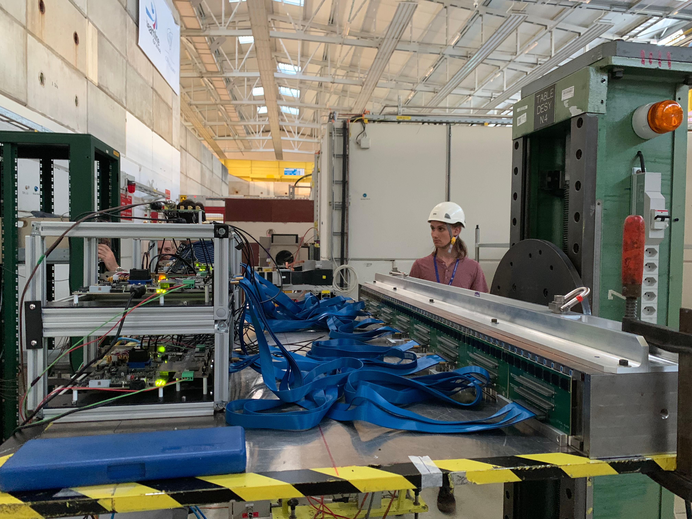

# LFHCal geometry in the epic-dd4hep

## Full LFHCal geometry implementation&#x20;

<div><figure><figcaption></figcaption></figure> <figure><figcaption></figcaption></figure> <figure><figcaption></figcaption></figure></div>

The full LFHCal geometry is implemented in `src/LFHCal_geo.cpp`  of the dd4hep epic directory. Its steering file can be found in `compact/hcal/lfhcal.xml`  which includes also general definitions `compact/hcal/lfhcal/module_definitions.xml` common to multiple setups (i.e. also the TB geometries). The full running configuration can then be found under `configurations/lfhcal_only.yml`  (here LFHCal only). In the latter files the enabled detectors and magnetic fields are defined.&#x20;

The LFHCal geometrie construction goes in units of 8M and 4M modules, supplemented by the insert modules. Which are defined in a separate class. The main function for the LFHCal full detector creation can be found in `src/LFHCal_geo.cpp`  and is called:

```cpp
static Ref_t createDetector(Detector& desc, xml_h handle, SensitiveDetector sens)
```

Its configured using the  `compact/hcal/lfhcal.xml`  which defines the exact modular setup of each 8M and 4M module in the respective `<eightmodule>` and `<fourmodule>` environments, regarding size and outer boundaries.&#x20;

The individual segments within the LFHCal are defined as follows:&#x20;

```xml
<layer repeat="LFHCALLayer_NSteelRepeatSFirst" vis="InvisibleWithDaughters" readoutlayer="0">
 <slice material="Polystyrene" thickness="LFHCALPolystyreneThickness" vis="LFHCALLayerScintVis" sensitive="yes" limits="cal_limits" type="3" />
 <slice material="Kapton" thickness="LFHCALKaptonThickness" vis="LFHCALLayerKaptonVis" type="2" offset="LFHCALAirOffset"/>
 <slice material="Steel235" thickness="LFHCALAbsorberThickness" vis="LFHCALLayerSteelVis" type="1"/>
</layer>
```

In this structure each layer is constructed of 3 different materials "`Polystyrene`", "`Kapton`" and "`Steel235`" each with their own thicknesses. Only the Polystyrene is set as a sensitive material. This structure is then repeated `LFHCALLayer_NSteelRepeatSFirst`  times and their summed signals are defined as readout-layer `0`, representing one segment of the LFHCal.&#x20;

The creation of the individual modules is handled in&#x20;

```cpp
// 8M module creation
Volume createEightMModule(Detector& desc, moduleParamsStrct mod_params,
                          std::vector<sliceParamsStrct> sl_params,
                          //                               int modID,
                          double length, SensitiveDetector sens, bool renderComp, bool allSen,
                          bool testbeam, int orientation)
// 4M module creation
Volume createFourMModule(Detector& desc, moduleParamsStrct mod_params,
                         std::vector<sliceParamsStrct> sl_params,
                         //                               int modID,
                         double length, SensitiveDetector sens, bool renderComp, bool allSen)
```

The positions of the individual modules are contained in the `<eightmodulepositions>`  and  `<fourmodulepositions>`  environments. According to these positions duplicates of the LFHCal modules will be placed within the LFHCal mother volume.&#x20;

The readout is defined within the respective xml files and each active element is assigned a different cell ID, which identifies its possition within the full geometry in x, y and x and also to which readout segment it belongs. _These bit assignments may vary for different test beam geometries._&#x20;

```xml
// Example here from compact/hcal/lfhcal.xml
<!--  Definition of the readout segmentation/definition  -->
  <readouts>
    <readout name="LFHCALHits">
      <documentation>
        Explanation of CellIDs total 64 bits
        first 8 bits system ID: 116 for LFHCal
        followed by: 
          6 bits [0-63] ModuleID X
          6 bits [0-63] ModuleID Y
          1 bit [0-1] Module type 0 - 8M , 1 - 4M
          2 bit [0-3] tower X 
          1 bit [0-1] tower Y
          4 bit [0-15] readout layer z
          4 bit [0-15] layer z in readout layer
      </documentation>  
      <segmentation type="NoSegmentation"/>      
      <id>system:8,moduleIDx:6,moduleIDy:6,moduletype:1,passive:1,towerx:2,towery:1,rlayerz:4,layerz:4</id>
    </readout>
  </readouts>
```

### Testing for overlaps

To test whether the current geometry will work it is important to check for overlaps at first within the detector setup (LFHCal standalone):&#x20;

```shellscript
python scripts/checkOverlaps.py -c install/share/epic/epic_lfhcal_only.xml -t 0.001
checkOverlaps -c install/share/epic/epic_lfhcal_only.xml 
```

If both of these don't show overlaps, the same can be repeated with the full epic geometry.&#x20;

### Geometry visualizations options

#### Simple Geom Visualization

The geometry can be visualized using online webbrowser after creating the geometry root files following this command.

```bash
dd_web_display --export install/share/epic/epic_lfhcal_only.xml 
```

Use [https://eic.phy.anl.gov/geoviewer/ ](https://eic.phy.anl.gov/geoviewer/)to load and view detector\_geometry.root'

* use right click on default and Draw >  this will not show full details.&#x20;
* draw individual detectors for full details

#### Simple Geom Visualization 2

Open file in TBrowser and right click on part you want to draw e.g. Master Volume and right click Draw. use option "ogl" if you want the GL viewer\
<mark style="background-color:red;">ATTENTION!!!! eic-shell cannot show the file with OGL, use your own standalone root install!!!</mark>

#### Simple Geom Visualization 3

Use the following root macro provided by Shyam Kumar to visualize the geometry with Eve.&#x20;



#### Geant View for Visualization

Copy the following into a shell script and only enable the one you would like to run.&#x20;


```bash
##bash
## script name plot_geo_wGun.sh
# example running 
# bash plot_geo_wGun.sh 1.0 50.0 lfhcal_only pi- 4. 25. 

# input definitions
PTMOMLOW=$1
PTMOMHIGH=$2
DETXML=$3
SLCTPART=$4
THETALOW=$5
THETAHIGH=$6
PATHEPICINST=/WHEREEVER/YOUR/EPIC/INSTALL/IS

ddsim --runType vis --compactFile $DETECTOR_PATH/epic_${DETXML}.xml --macro macro/vis_vertical.mac --outputFile test.edm4hep.root -G --gun.position "(0.,0.,3000)" --gun.direction "(1.,1.,1.)" --gun.particle "$SLCTPART" -N 1

ddsim --runType vis --compactFile $DETECTOR_PATH/epic_${DETXML}.xml --macro $PATHEPICINST/macro/vis.mac --outputFile test.edm4hep.root -G --gun.position "(0.,0.,-2000)" --gun.direction "(0.,0.,1.)" --gun.momentumMin "$PTMOMLOW*GeV" --gun.momentumMax "$PTMOMHIGH*GeV" --gun.particle "$SLCTPART" -N 100

ddsim --runType vis --compactFile $DETECTOR_PATH/epic_${DETXML}.xml --macro $PATHEPICINST/macro/vis.mac --outputFile test.edm4hep.root -G --gun.distribution "pseudorapidity" --gun.thetaMin 10*deg --gun.thetaMax 30*deg --gun.momentumMin "$PTMOMLOW*GeV" --gun.momentumMax "$PTMOMHIGH*GeV" --gun.particle "$SLCTPART" -N 100

ddsim --printLevel DEBUG --runType vis --compactFile $DETECTOR_PATH/epic_${DETXML}.xml --macro $PATHEPICINST/macro/vis.mac --outputFile test.edm4hep.root -G --gun.position "(0.,0.,0)" --gun.direction "(0.,0.,1.)" --gun.momentumMin "$PTMOMLOW*GeV" --gun.momentumMax "$PTMOMHIGH*GeV" --gun.particle "$SLCTPART" -N 100

ddsim --runType vis --compactFile $DETECTOR_PATH/epic_${DETXML}.xml --macro macro/vis.mac --outputFile test.edm4hep.root -G --gun.thetaMin "$THETALOW*deg" --gun.thetaMax "$THETAHIGH*deg" --gun.phiMin 1. --gun.phiMax 2 --gun.distribution "uniform" --gun.momentumMin "$PTMOMLOW*GeV" --gun.momentumMax "$PTMOMHIGH*GeV" --gun.particle "$SLCTPART" -N 1
```


Once you started running this you can change the views with the standard geant viewer commands and switch on the particle generation using the command `/run/beamOn`  in the root shell. The initially exectued commands if not otherwise defined can be found in `macro/vis.mac` . More information for the GEANT viewer can be found [here](https://indico.cern.ch/event/1419928/contributions/5970006/attachments/2938723/5183937/VisUI-1B%20Vis%20Concepts%20and%20Commands.pdf).

## LFHCal TB geometry implementations

The test beam geometries are implemented in the same class as the main LFHCal as they primarily consist of 8M modules in various configurations. Due to the different outer volume the geometry building is handeled by the function:


```cpp
static Ref_t createTestBeam(Detector& desc, xml_h handle, SensitiveDetector sens)
```


Each of the TB geometries then has their own xml file which defines the readout configuation as well as the physical setup. The follow the naming scheme: `compact/hcal/lfhcal_YEAR_TB.xml`  and may contain and `_optX`  to indicate different readout options. Similarly the full running configurations are defined in `configurations/lfhcal_YEAR_TB.yml`  following the same naming scheme.&#x20;

The visualization of the geometry can be done in the same manner as described above [link](lfhcal-geometry-in-the-epic-dd4hep.md#geometry-visualizations-options).

### 2023 SPS-H4 TB geometry

Doesn't exist yet!

### 2023 PS-T09 TB geometry

Doesn't exist yet

### 2024 PS-T09 TB geometry

<div><figure><figcaption></figcaption></figure> <figure><figcaption></figcaption></figure> <figure><figcaption></figcaption></figure></div>


```
# Configuration files
compact/hcal/lfhcal_2024_TB.xml
configurations/lfhcal_2024_TB.yml
```


For 2024 every single layer was read out using two different read out electronics. All 64 layers where equipped of the first prototype module.&#x20;

### 2025 PS-T09 TB geometry

<div><figure><figcaption></figcaption></figure> <figure><figcaption></figcaption></figure> <figure><figcaption></figcaption></figure></div>

A basic configuration for the 2025 TB geometry with all layers equipped has been build as in the following configuration files:


```
# Configuration files
compact/hcal/lfhcal_2025_TB.xml
configurations/lfhcal_2025_TB.yml
```


In order to reproduce the actual beam geometries as documented in [link](https://wiki.bnl.gov/EPIC/index.php?title=LFHCal_Fall_2025_Test_Beam), additional configurations taking into account the partial layer equipment will need to be provided.&#x20;

### 2026 PS-T10 TB geometry


<div><figure><figcaption></figcaption></figure> <figure><figcaption></figcaption></figure></div>

A basic configuration for the 2025 TB geometry with all layers equipped has been build as in the following configuration files:


```
# Configuration files
compact/hcal/lfhcal_2025_TB.xml
configurations/lfhcal_2025_TB.yml
```


This should be adapted to correctly reflect the TB geometry present in the 2026 PS-T10 TB.&#x20;

### 2026 SPS-H2 TB geometry

<div><figure><figcaption></figcaption></figure> <figure><figcaption></figcaption></figure> <figure><figcaption></figcaption></figure></div>

A basic configuration for the 2026 SPS TB geometry with all layers equipped has been build as in the following configuration files:


```
# Configuration files
compact/hcal/lfhcal_2026_TB_opt[1|2].xml
configurations/lfhcal_2026_TB_opt[1|2].yml
```


This should be adapted to correctly reflect the TB geometry present in the 2026 SPS H2 TB. The two different options reflect the possible different summing options for the 2026 TB.

<div><figure><figcaption></figcaption></figure> <figure><figcaption></figcaption></figure></div>
